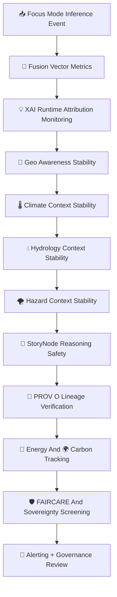

<div align="center">

# 📡🎯🧠 **Focus Mode Monitoring — KFM v11.2.2 (MAX MODE)**  
`docs/pipelines/ai/models/focus-mode/mlops/monitoring.md`

**Purpose**  
Define the **continuous monitoring subsystem** for **Focus Mode contextual intelligence**,  
ensuring stable, safe, sovereign-respectful behavior across:

🧭 Geo-awareness  
🌡️ Climate interpretation  
💧 Hydrology interpretation  
🌪️ Hazard interpretation  
🔡 Fusion vector generation  
📖 Story Node v3 narratives  
💡 XAI attribution  
🛡️ FAIR+CARE & sovereignty boundaries  

This monitoring pipeline is essential for governance, safety, CI/CD checks, and rollover controls.

</div>

---

## 🧬📡🎯 **Monitoring Architecture (Mermaid-Safe)**



---

# 🔍 **Monitoring Components**

---

## 🔡 **1. Fusion Vector Monitoring**

Tracks:

- 2048D vector stability  
- Domain-weight consistency  
- Sensitivity to climate/hydro/hazard/narrative context  
- Cross-domain contamination risk  
- Fusion collapse detection  

Metrics:

```json
{
  "fusion": {
    "variance": 0.019,
    "weight_shift": {
      "spatial": +0.01,
      "climate": -0.01
    }
  }
}
```

---

## 💡 **2. XAI Runtime Attribution Monitoring**

Monitors:

- Importance vector drift  
- CAM displacement  
- Attention entropy drift  
- Narrative XAI stability  
- Hazard/climate/hydro relevance drift  

---

## 🧭 **3. Geo-Awareness Stability**

Tracks:

- H3 region alignment  
- Terrain/landcover/watershed relevance  
- Sovereignty-region generalization  
- Spatial CAM stability  

---

## 🌡️ **4. Climate Context Stability**

Monitors:

- CAPE/CIN/LLJ/Shear updates  
- Climate-driver attribution stability  
- Relevance-score consistency  
- Temperature/dewpoint gradient stability  

---

## 💧 **5. Hydrology Context Stability**

Monitors:

- Soil moisture signals  
- Runoff relevance  
- Streamflow stability  
- Drought-index dynamics  

---

## 🌪️ **6. Hazard Context Stability**

Tracks:

- Tornado/hail/fire/winter/heat dynamics  
- Hazard coupling to climate/anomalies  
- Sovereignty-masked hazard patterns  

---

## 📖 **7. Story Node Reasoning Safety**

Monitors:

- Narrative drift  
- Attention to environmental cues  
- Cultural-sensitivity checks  
- Sovereignty-sensitive narrative redaction  

---

## 📜 **8. PROV-O Lineage Verification**

Ensures:

- Correct model weights  
- STAC references intact  
- Provenance chain unbroken  
- Deterministic model lineage  

---

## 🔋🌍 **9. Sustainability Telemetry**

Track:

- Wh energy  
- gCO₂e  
- Compute cost  
- CI telemetry  
- Carbon budget over time  

---

## 🛡️⚖️ **10. FAIR+CARE + Sovereignty Screening**

Ensure:

- No cultural leakage  
- No hazardous overspecification in protected zones  
- Sovereignty boundary respect  
- Correct H3 masking  
- CARE metadata presence  

Example:

```json
{
  "care": {
    "masking": "h3-focus-generalized",
    "scope": "public-generalized"
  }
}
```

---

## 🚨 **11. Alerting + Governance Review**

Alerts triggered by:

- Fusion vector anomaly  
- Narrative or cultural drift  
- Hazard/climate misinterpretation  
- Sovereignty violation  
- XAI drift  
- Telemetry irregularities  

Alerts escalate to:

- Focus Mode Working Group  
- FAIR+CARE Council  
- Sovereignty Review Board  

---

# 🧪📏🔬 **CI Validation Requirements**

CI MUST validate:

- Deterministic monitoring signals  
- Fusion stability  
- XAI correctness  
- FAIR+CARE governance  
- Sovereignty-enforcement correctness  
- STAC + PROV lineage  
- Telemetry-schema correctness  
- No sensitive-region leakage  

Failure → ❌ CI BLOCK.

---

# 🕰️📜 Version History

| Version | Date       | Notes                                               |
|---------|------------|-----------------------------------------------------|
| v11.2.2 | 2025-11-28 | Initial Focus Mode Monitoring (MAX MODE)            |

---

<div align="center">

### 🔗 Footer  
[🎯 Back to Focus Mode MLOps](../README.md) ·  
[🌀 Drift Detection](./drift-detection.md) ·  
[🏛 Governance](../../../../../standards/governance/ROOT-GOVERNANCE.md)

</div>

