<div align="center">

# ⏪🎯🧠 **Focus Mode Rollbacks — KFM v11.2.2 (MAX MODE)**  
`docs/pipelines/ai/models/focus-mode/mlops/rollbacks.md`

**Purpose**  
Define the **safe rollback system** for Focus Mode models when contextual intelligence becomes  
unsafe, unstable, or violates governance constraints.

Rollbacks protect:

🔡 **Fusion vector logic**  
📖 **Narrative cultural safety**  
🌪️ **Hazard interpretation**  
🌡️ **Climate context reasoning**  
💧 **Hydrology context reasoning**  
🧭 **Geo-awareness stability**  
💡 **XAI interpretability**  
🛡️ **FAIR+CARE + sovereignty compliance**

Rollbacks guarantee a **reversion to a known-good, deterministic, sovereign-safe release**.

</div>

---

## 🧬⏪🎯 **Rollback Architecture (Mermaid-Safe)**

```mermaid
flowchart TD
    A[🚨 Drift Or Violation Alert] --> B[📊 Governance Evidence Review]
    B --> C[🔐 Validate Prior Stable Model Integrity]
    C --> D[📦 Restore Stable Focus Mode Artifact Set]
    D --> E[📜 Regenerate STAC And PROV Rollback Metadata]
    E --> F[📡 Post Rollback Monitoring]
    F --> G[🛡️ CARE And Sovereignty Enforcement Check]
    G --> H[🎯 Re-Activate Stable Model In Registry]
```



---

# 🔍 **Rollback Triggers**

Rollback should occur when **any** of the following are detected:

---

## 🔡 **1. Fusion Vector Instability**
- Centroid drift  
- Domain-weight instability  
- Fusion collapse  
- Cross-domain contamination  

---

## 📖 **2. Narrative Safety Violation**
- Cultural-sensitivity drift  
- Narrative–hazard coupling  
- Attention instability  
- Story Node containing unsafe or sovereignty-sensitive implications  

---

## 🌡️💧🌪️ **3. Climate/Hydro/Hazard Drift**
- CAPE/CIN/LLJ/shear interpretation drift  
- Soil-moisture / runoff / streamflow drift  
- Flood/hail/tornado/fire/winter hazard mis-alignment  
- Climate-driver coupling errors  

---

## 🧭 **4. Geo-Awareness Drift**
- Spatial CAM region mismatch  
- H3 tag drift in sovereignty zones  
- Terrain/landcover/watershed logic misalignment  

---

## 💡 **5. XAI Drift Or Failure**
- Importance vector instability  
- CAM displacement  
- Narrative-attention entropy spike  
- Cross-domain attribution anomalies  

---

## 🛡️ **6. FAIR+CARE or Sovereignty Violation**
- Hazard over-localization in tribal regions  
- Narrative cues tied to protected cultural spaces  
- Unmasked sensitive geospatial signatures  
- Failure of sovereignty-bound generalization logic  

---

# 📦 **Rollback Process**

---

## 📁 **1. Evidence Collection**
All evidence is gathered into:

```
drift_report.json
fusion_drift.json
narrative_drift.json
climate_drift.json
hydrology_drift.json
hazard_drift.json
geo_drift.json
xai_drift.json
sovereignty_drift.json
telemetry_snapshot.json
```

---

## 🏛️ **2. Governance Review**
Approval required from:

- Focus Mode Working Group  
- FAIR+CARE Council  
- Sovereignty Review Board  

Decision stored in:

```
rollback_decision.json
```

---

## 🔐 **3. Stable Model Integrity Verification**
Registry steps MUST confirm:

- SHA-256 hash match  
- Deterministic STAC and PROV history  
- Model-card correctness  
- XAI availability  
- Telemetry bundle presence  

---

## 📦 **4. Restore Prior Stable Model**
The restore includes the full artifact bundle:

```
focus_model.pt
fusion_weights.json
context_router.pt
storynode_v3.pt
xai/
provenance/
telemetry/
stac/focusmodel-item.json
```

Partial rollbacks are forbidden.

---

## 📜 **5. Regenerate Rollback Metadata**
Rollback STAC + PROV metadata MUST include:

```json
{
  "rollback": {
    "reason": "fusion_drift_exceeded",
    "restored_version": "v11.2.1",
    "seed": 42
  }
}
```

Also includes CARE + sovereignty metadata.

---

## 📡 **6. Post-Rollback Monitoring**
Immediate re-monitoring MUST confirm:

- Fusion vector stability  
- Narrative safety  
- Hazard/climate/hydro reasoning stability  
- All XAI outputs align  
- Sovereignty compliance intact  
- Telemetry normalized  

---

## 🛡️ **7. CARE + Sovereignty Verification**
Rollback outputs MUST embed:

```json
{
  "care": {
    "masking": "h3-focus-generalized",
    "scope": "public-generalized",
    "notes": ["Rollback applied due to sovereignty-region drift"]
  }
}
```

---

## 🎯 **8. Re-activate Stable Model**
Registry flags:

```
active = v11.2.1
rollback_of = v11.2.2
```

Enhanced monitoring runs for 48 hours.

---

# 🔒⚙️ **Determinism Requirements**

Rollback MUST:

- Restore deterministic seeds  
- Match prior STAC metadata  
- Recreate identical fusion vectors  
- Maintain XAI consistency  
- Preserve PROV lineage  
- Use reproducible, ordered serialization  

---

# 🧪📏🔬 **CI Validation Requirements**

CI MUST validate:

- Correct rollback metadata  
- CARE + sovereignty enforcement  
- Fusion stability  
- Narrative safety  
- XAI consistency  
- Environmental context correctness  
- Telemetry integrity  
- STAC + PROV chains intact  

Failure → ❌ CI BLOCK.

---

# 🕰️📜 Version History

| Version | Date       | Notes                                           |
|---------|------------|-------------------------------------------------|
| v11.2.2 | 2025-11-28 | Initial Focus Mode Rollback System (MAX MODE)   |

---

<div align="center">

### 🔗 Footer  
[🎯 Back to Focus Mode MLOps](../README.md) ·  
[📡 Monitoring](./monitoring.md) ·  
[🏛 Governance](../../../../../standards/governance/ROOT-GOVERNANCE.md)

</div>

