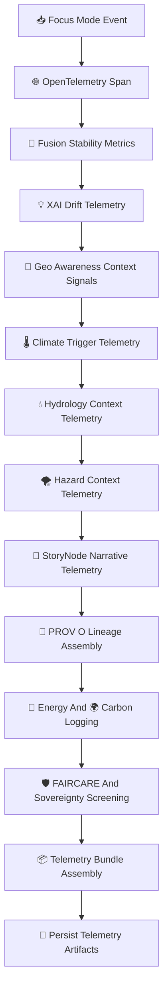

<div align="center">

# 📡🎯🧠 **Focus Mode Telemetry — KFM v11.2.2 (MAX MODE)**  
`docs/pipelines/ai/models/focus-mode/mlops/telemetry/README.md`

**Purpose**  
Define the **telemetry subsystem** that monitors Focus Mode contextual intelligence across  
spatial, climate, hydrology, hazard, narrative, and fusion domains.

Focus Mode telemetry provides:

🌐 **OpenTelemetry spans**  
💡 **XAI drift insights**  
🔡 **Fusion vector stability metrics**  
🧭 **Geo-awareness signals**  
🌡️ **Climate trigger metadata**  
💧 **Hydrology state relevance**  
🌪️ **Hazard precursor signals**  
📖 **Story Node semantic activity**  
🛡️ **FAIR+CARE + sovereignty protections**  
📜 **PROV-O lineage**  
🔋 **Energy + carbon telemetry**

This subsystem is foundational for **CI/CD gates**, **governance audits**, and **Focus Mode safety**.

</div>

---

## 🗂️📁📡 **Directory Layout (MAX MODE)**

```
docs/pipelines/ai/models/focus-mode/mlops/telemetry/
    📄 README.md
    📄 example-span.json
    📄 example-fusion-telemetry.json
    📄 example-xai-drift.json
    📄 example-storynode-telemetry.json
    📄 example-energy.json
    📄 example-carbon.json
    📄 example-provenance.json
```

---

## 🧬📡🎯 **Telemetry Architecture (Mermaid-Safe)**



---

# 🔍 **Telemetry Components**

---

## 🌐 **1. OpenTelemetry Spans**

Records:

- Inference latency  
- Context-routing path  
- Active domains (spatial/climate/hydro/hazard/narrative)  
- Model versions  
- STAC references  
- Seeds for deterministic replay  

---

## 🔡 **2. Fusion Stability Metrics**

Monitors:

- Fusion vector variance  
- Cross-domain weight drift  
- Domain-coherence scores  
- Hazard/hydro/climate contamination checks  
- Sovereignty-zone drift signals  

Example:

```json
{
  "fusion": {
    "variance": 0.017,
    "domain_weights": {
      "spatial": 0.28,
      "climate": 0.21,
      "hydrology": 0.19,
      "hazards": 0.17,
      "narrative": 0.15
    }
  }
}
```

---

## 💡 **3. XAI Drift Telemetry**

Tracks:

- Attribution vector drift  
- CAM stability  
- Attention entropy drift  
- Cross-domain mixing anomalies  

Example:

```json
{
  "xai_drift": {
    "importance_shift": {
      "spatial": +0.02,
      "climate": -0.01,
      "hydrology": +0.01,
      "hazards": -0.01,
      "narrative": -0.01
    },
    "cam_shift": 0.21
  }
}
```

---

## 🧭 **4. Geo-Awareness Telemetry**

Logs:

- H3 region assignments  
- Terrain relevance scores  
- Sovereignty-region generalization triggers  
- Watershed cues  
- Landcover context alignment  

---

## 🌡️ **5. Climate Trigger Telemetry**

Monitors:

- CAPE/CIN relevance  
- Temperature/dewpoint gradients  
- LLJ or shear signals  
- Climate anomaly triggers  

---

## 💧 **6. Hydrology Telemetry**

Tracks:

- Soil-moisture context  
- Runoff triggers  
- Streamflow relevance  
- Drought-state cues  

---

## 🌪️ **7. Hazard Context Telemetry**

Monitors:

- Tornado, hail, fire-weather indicators  
- Hazard-driver contributions  
- Climate-hazard coupling  
- Sovereignty-related hazard masking  

---

## 📖 **8. Story Node Telemetry**

Tracks:

- Active narrative channels  
- Context embedding matches  
- Story node reasoning safety  
- Sovereignty-sensitive narrative smoothing  

---

## 📜 **9. PROV-O Telemetry**

Every event MUST include:

```json
{
  "prov": {
    "wasGeneratedBy": "urn:kfm:activity:focus_inference",
    "used": [
      "urn:kfm:model:focus_v11_2_2",
      "urn:kfm:model:embeddings_v11_2_2"
    ],
    "agent": "urn:kfm:service:focus-engine"
  }
}
```

---

## 🔋🌍 **10. Energy + Carbon Telemetry**

Logs:

- Wh energy use  
- gCO₂e  
- Hardware utilization  
- Telemetry cost over time  

---

## 🛡️⚖️ **11. Sovereignty + FAIR+CARE Screening**

Triggers:

- Hazard overspecification in tribal areas  
- Culturally sensitive narrative associations  
- Spatial over-localization  
- Sensitive water features  

CARE metadata:

```json
{
  "care": {
    "masking": "h3-focus-generalized",
    "scope": "public-generalized"
  }
}
```

---

# 🧪📏🔬 **CI Validation Requirements**

CI MUST validate:

- Telemetry schema correctness  
- Deterministic telemetry  
- FAIR+CARE enforcement  
- Sovereignty-safety rules  
- XAI drift signals  
- Fusion stability invariants  
- STAC + PROV linkage integrity  
- No sensitive-region leakage  

Failure → ❌ CI BLOCK.

---

# 🕰️📜 **Version History**

| Version | Date       | Notes                                           |
|---------|------------|-------------------------------------------------|
| v11.2.2 | 2025-11-28 | Initial Focus Mode Telemetry (MAX MODE)         |

---

<div align="center">

### 🔗 Footer  
[🎯 Back to Focus Mode MLOps](../README.md) ·  
[💡 XAI](../xai/README.md) ·  
[🏛 Governance](../../../../../standards/governance/ROOT-GOVERNANCE.md)

</div>

