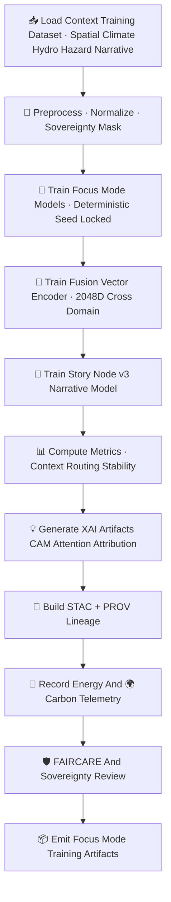

<div align="center">

# 🧠🎯🚀 **Focus Mode Model Training — KFM v11.2.2 (MAX MODE)**  
`docs/pipelines/ai/models/focus-mode/mlops/training.md`

**Purpose**  
Define the **deterministic, sovereignty-safe, FAIR+CARE–governed training pipeline** used to build  
all Focus Mode models:

🧭 Geo-awareness  
🌡️ Climate contextual reasoning  
💧 Hydrology contextual reasoning  
🌪️ Hazard contextual reasoning  
🔡 Fusion vector generator (2048D cross-domain embedding)  
📖 Story Node v3 narrative engine  
💡 XAI explainability modules  

Focus Mode training integrates **environmental science, geospatial intelligence, and cultural governance**  
to produce models that are stable, ethical, and auditable.

</div>

---

## 🧬🧠🎯 **Training Architecture (Mermaid-Safe)**



---

# 🔍 **Training Components**

---

## 📥 **1. Training Dataset Requirements**

Training MUST draw from many domains, each with strict governance:

### Required STAC sources:
- Spatial → H3, terrain, landcover, watershed  
- Climate → temp, dewpoint, wind, pressure, CAPE/CIN  
- Hydrology → soil moisture, runoff, RRHI, streamflow  
- Hazards → tornado/hail/fire-weather/heat/winter indicators  
- Narrative → Story Node v3 curated corpus  
- Sovereignty → Tribal boundaries, protected geographies  

All training data MUST be:

- STAC-indexed  
- PROV-tracked  
- FAIR+CARE labeled  
- Sovereignty-screened  
- Version-pinned  
- Normalization metadata included  

Forbidden inputs:

❌ Raw sensitive geographical coordinates  
❌ Cultural sites without generalization  
❌ Third-party non-governed corpora  

---

## 🧽 **2. Preprocessing & Sovereignty Masking**

Preprocessing MUST perform:

- Spatial → H3 generalization  
- Terrain/landcover normalization  
- Climate/hydro/hazard normalization  
- Narrative safety filtering  
- Sovereignty-based redaction + downweighting  
- Consistent variable naming per KFM-OP v11  

Outputs:

```
preprocessing_summary.json
normalization_params.json
sovereignty_mask_log.json
```

---

## 🧠 **3. Deterministic Focus Mode Model Training**

Focus Mode training includes:

- Geo-awareness model (terrain, slope, landcover, watershed)  
- Climate-context model (CAPE/CIN/LLJ/shear, anomalies)  
- Hydrology-context model (soil moisture/runoff/streamflow/drought)  
- Hazard-awareness model (tornado/hail/flood/fire-weather/heat/winter)  
- Fusion vector encoder (2048D transformer)  
- Story Node v3 narrative engine  

Training MUST be:

- Fully seed-locked (`seed: 42` or equivalent constant)  
- Hardware-invariant  
- Floating-point stable  
- Deterministic batch ordering  

Example metadata block:

```json
{
  "training": {
    "seed": 42,
    "fusion_dim": 2048,
    "architecture": "transformer",
    "epochs": 60,
    "batch_size": 32,
    "lr": 0.00015
  }
}
```

---

## 🔡 **4. Fusion Vector Training**

Training MUST:

- Align embeddings across spatial/climate/hydro/hazard/narrative  
- Produce stable cross-domain attention  
- Reflect physical + contextual relationships  
- Support Story Node narrative logic  
- Remain sovereignty-safe  

Outputs:

```
fusion_weights.json
fusion_encoder.pt
fusion_metrics.json
```

---

## 📖 **5. Story Node v3 Training**

Narrative training MUST:

- Use curated, sovereignty-safe text  
- Link narrative cues to environmental context tokens  
- Maintain cultural-safety rules  
- Avoid speculation or culturally sensitive genealogical inference  
- Be explainable via attention maps  

Outputs:

```
storynode_v3.pt
storynode_xai.json
```

---

## 📊 **6. Metrics, Routing, Stability Tests**

Training MUST compute:

- Fusion vector norm stability  
- Cross-domain weight distribution  
- Narrative attention entropy  
- Climate–hazard–hydro alignment  
- Geo-awareness correctness  
- Story Node activation correctness  
- Sovereignty masking confidence  

All stored in:

```
training_metrics.json
fusion_alignment.json
narrative_alignment.json
```

---

## 💡 **7. XAI Artifact Generation**

Focus Mode MUST produce:

- Domain importance vectors  
- Fusion attribution breakdown  
- CAM layers for spatial features  
- Narrative attention maps  
- Hazard/climate/hydro attribution maps  

All XAI outputs MUST be:

- Deterministic  
- CARE-screened  
- Sovereignty-safe  
- STAC-XAI compatible  

---

## 📜 **8. STAC + PROV Lineage Assembly**

Required:

```json
{
  "prov": {
    "wasGeneratedBy": "urn:kfm:activity:training:focusmode_v11_2_2",
    "used": [
      "urn:kfm:data:terrain_item",
      "urn:kfm:data:climate_item",
      "urn:kfm:data:hydrology_item",
      "urn:kfm:data:hazard_item"
    ],
    "agent": "urn:kfm:service:focus-training-engine"
  }
}
```

STAC entries MUST include:

- Training metadata  
- Domain identifiers  
- CARE metadata  
- Telemetry pointers  

---

## 🔋🌍 **9. Sustainability Telemetry**

Training MUST log:

- Wh energy  
- gCO₂e emissions  
- GPU/CPU time  
- FLOPs  
- Sustainability checkpoints  

Example:

```json
{
  "energy": {
    "wh": 5.33,
    "carbon_gco2e": 0.52
  }
}
```

---

## 🛡️⚖️ **10. FAIR+CARE + Sovereignty Review**

Every model MUST pass:

- Tribal sovereignty screening  
- Cultural-safety narrative checks  
- Hazard-overlocalization screening  
- Sensitive region masking  
- Context-safety guidelines  
- Data Contract v3 compliance  

---

## 📦 **11. Training Artifacts Emitted**

Final artifacts:

```
focus_model.pt
fusion_encoder.pt
storynode_v3.pt
fusion_weights.json
training_metrics.json
normalization_params.json
preprocessing_summary.json
xai/
provenance/
telemetry/
stac/focusmodel-item.json
model-card.json
```

All MUST be deterministic and CI-stable.

---

# 🧪📏🔬 CI Validation Requirements

CI MUST validate:

- Deterministic training reproducibility  
- Proper sovereignty masking  
- FAIR+CARE compliance  
- XAI integrity  
- STAC + PROV correctness  
- No sensitive-region leakage  
- Fusion and narrative stability  
- Telemetry metrics correctness  

Failure → ❌ CI BLOCK.

---

# 🕰️📜 Version History

| Version | Date       | Notes                                                |
|---------|------------|------------------------------------------------------|
| v11.2.2 | 2025-11-28 | Initial Focus Mode Training Documentation (MAX MODE) |

---

<div align="center">

### 🔗 Footer  
[🎯 Back to Focus Mode MLOps](../README.md) ·  
[📊 Validation](./validation.md) ·  
[🏛 Governance](../../../../../standards/governance/ROOT-GOVERNANCE.md)

</div>

