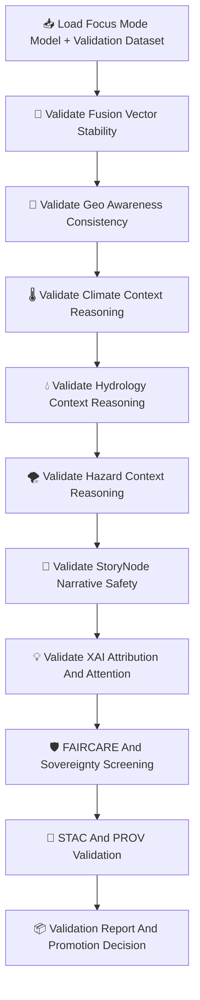

<div align="center">

# 📊🎯🧠 **Focus Mode Validation — KFM v11.2.2 (MAX MODE)**  
`docs/pipelines/ai/models/focus-mode/mlops/validation.md`

**Purpose**  
Define the end-to-end **validation subsystem** for Focus Mode contextual intelligence.  
Validation ensures that geo-awareness, climate/hydrology/hazard interpretation, fusion logic,  
and Story Node v3 narrative reasoning behave safely, deterministically, and sovereignty-compliantly.

</div>

---

## 🧬📊🎯 **Validation Architecture (Mermaid-Safe)**



---

# 🔍 **Validation Steps**

---

## 🔡 **1. Fusion Vector Stability Validation**

Validate:

- Fusion centroid distance from baseline  
- Norm and variance checks  
- Domain-weight stability  
- Cross-domain contamination guardrails  
- Sovereignty-region stability  

Example:

```json
{
  "fusion_validation": {
    "centroid_ok": true,
    "domain_weights_ok": true
  }
}
```

---

## 🧭 **2. Geo-Awareness Validation**

Check:

- H3 region fidelity  
- Terrain/landcover/watershed consistency  
- Sovereignty-mask alignment  
- Spatial CAM plausibility  

---

## 🌡️ **3. Climate Context Validation**

Check stability of:

- CAPE  
- CIN  
- Shear  
- LLJ  
- Temp/dewpoint gradients  
- Climate regime attribution  

---

## 💧 **4. Hydrology Context Validation**

Validate:

- Runoff/soil moist alignment  
- Streamflow impact interpretation  
- Drought-index reasoning  
- Hydrology-coupled drift  

---

## 🌪️🔥🌊❄️ **5. Hazard Context Validation**

Check:

- Hazard-driver reasoning (tornado/hail/flood/fire/winter/heat)  
- Over-localization in sovereignty regions  
- Hazard-climate coupling correctness  
- Hazard-hydrology coupling correctness  

---

## 📖 **6. Story Node Narrative Safety Validation**

Ensure:

- Cultural neutrality  
- No sovereignty-sensitive inference  
- No culturally risky topic migration  
- Stable narrative activation patterns  
- Proper environmental grounding  

---

## 💡 **7. XAI Attribution & Attention Validation**

Validate:

- Importance vector correctness  
- CAM stability  
- Transformer attention entropy  
- Narrative-attention consistency  
- Sovereignty-safe attribution  

---

## 🛡️ **8. FAIR+CARE + Sovereignty Screening**

All validation MUST enforce:

- Culturally safe narrative associations  
- Sensitive-region spatial masking  
- Hazard suppression in tribal geographies  
- CARE metadata present  
- Sovereignty policy inheritance  

Example CARE block:

```json
{
  "care": {
    "masking": "h3-focus-generalized",
    "scope": "public-generalized"
  }
}
```

---

## 📜 **9. STAC + PROV Validation**

Check:

- STAC Item correctness  
- PROV lineage completeness  
- Model-card linkage  
- Telemetry bundle correctness  
- Domain metadata alignment  

---

## 📦 **10. Final Validation Report & Promotion Decision**

Outputs:

```
validation_report.json
promotion_decision.json
```

Promotion requires:

- All domains pass thresholds  
- XAI stable  
- Sovereignty safe  
- No hazard over-localization  
- Telemetry complete  
- STAC+PROV complete  

---

# 🧪📏🔬 **CI Validation Requirements**

CI MUST verify:

- Determinism  
- Fusion/XAI correctness  
- Cultural safety  
- Climate/hydro/hazard consistency  
- FAIR+CARE compliance  
- Sovereignty enforcement  
- Telemetry correctness  
- STAC integrity  
- No sensitive-region leakage  

Failure → ❌ CI BLOCK.

---

# 🕰️📜 Version History

| Version | Date       | Notes                                             |
|---------|------------|---------------------------------------------------|
| v11.2.2 | 2025-11-28 | Initial Focus Mode Validation (MAX MODE)          |

---

<div align="center">

### 🔗 Footer  
[🎯 Back to Focus Mode MLOps](../README.md) ·  
[🚀 Deployment](./deployment.md) ·  
[🏛 Governance](../../../../../standards/governance/ROOT-GOVERNANCE.md)

</div>

