<div align="center">

# 💡🎯🧠 **Focus Mode XAI Subsystem — KFM v11.2.2 (MAX MODE)**  
`docs/pipelines/ai/models/focus-mode/mlops/xai/README.md`

**Purpose**  
Define the **Explainability (XAI) subsystem** governing Focus Mode’s  
cross-domain contextual intelligence:

🧭 Geo-awareness attribution (H3 · terrain · landcover · watershed)  
🌡️ Climate-driver attribution (CAPE · CIN · shear · LLJ · anomalies)  
💧 Hydrology attribution (soil moisture · runoff · streamflow · drought)  
🌪️ Hazard attribution (tornado · hail · flood · fire · heat · winter)  
📚 Narrative attribution (Story Node v3 attention)  
🔡 Fusion vector explainability across all domains  
🛡️ FAIR+CARE sovereign-safety constraints  
📜 STAC-XAI + PROV lineage for all outputs  

</div>

---

## 🗂️📁💡 **Directory Layout (MAX MODE)**

```
docs/pipelines/ai/models/focus-mode/mlops/xai/
    📄 README.md
    📄 example_fusion_xai.json
    📄 example_cam_spatial.json
    📄 example_attention_storynode.json
    📄 example_cross_domain_importance.json
    📄 example_provenance.json
```

---

## 🧬💡🎯 **Focus Mode XAI Architecture (Mermaid-Safe)**

```mermaid
flowchart TD
    A[🔡 Fusion Vector Output] --> B[📊 Cross Domain Attribution]
    B --> C[🗺️ Spatial CAM Generation]
    B --> D[📖 Story Node Attention Weights]
    C --> E[💡 XAI Importance Vector Build]
    D --> E
    E --> F[📜 STAC XAI Metadata Build]
    F --> G[🛡️ CARE And Sovereignty Filtering]
    G --> H[📁 XAI Artifact Emission + PROV]
```



---

# 🔍 **XAI Components**

---

## 🔡 **1. Cross-Domain Attribution Layer**

Compute deterministic importance weights for:

- Spatial  
- Climate  
- Hydrology  
- Hazards  
- Narrative  
- Fusion residual  

Example:

```json
{
  "xai": {
    "importance": {
      "spatial": 0.27,
      "climate": 0.21,
      "hydrology": 0.18,
      "hazards": 0.17,
      "narrative": 0.17
    },
    "seed": 42
  }
}
```

---

## 🗺️ **2. Spatial CAM Generation**

For H3 + terrain + landcover + watershed:

- Deterministic CAM overlays  
- H3 generalized for sovereignty safety  
- Terrain-weighted relevance  
- Hydrology-aware spatial attribution  

Output: GeoTIFF CAM layer (STAC-XAI asset).

---

## 📖 **3. Narrative Attention (Story Node v3)**

Transformer attention vectors MUST be:

- Deterministic  
- Sovereignty-safe (mask culturally restricted narrative cues)  
- Linked to input narrative tokens  
- Integrated with environmental attribution  

Example:

```json
{
  "attention": {
    "entropy": 0.84,
    "top_tokens": ["terrain", "shear", "valley", "moisture"]
  }
}
```

---

## 🌪️🌡️💧 **4. Environmental Domain Attribution**

Focus Mode XAI MUST explain how environmental domains impacted context:

- Climate driver influence (CAPE · CIN · shear · LCL · LLJ)  
- Hydrology driver influence (soil moisture · runoff · streamflow)  
- Hazard-linked influence (tornado/hail/flood/fire/heat/winter)  

Produces per-domain attribution vectors.

---

## 🎯 **5. Fusion Vector Explainability**

Fusion (2048D) attribution MUST:

- Break contributions into domain components  
- Show cross-domain mixing weights  
- Remain seed-locked  
- Be STAC-XAI compatible  

Example:

```json
{
  "fusion": {
    "weights": {
      "spatial": 0.28,
      "climate": 0.21,
      "hydrology": 0.19,
      "hazards": 0.17,
      "narrative": 0.15
    }
  }
}
```

---

## 🛡️⚖️ **6. FAIR+CARE + Sovereignty XAI Enforcement**

XAI MUST:

- Mask hazardous or cultural signals in tribal territories  
- Apply H3 generalization  
- Downweight narrative attribution in sovereignty zones  
- Remove hyperlocal spatial relevance  

CARE block example:

```json
{
  "care": {
    "masking": "h3-focus-generalized",
    "scope": "public-generalized",
    "notes": ["XAI generalized due to sovereignty protection"]
  }
}
```

---

## 📜🌐 **7. PROV-O Lineage**

Every XAI output MUST document:

```json
{
  "prov": {
    "wasGeneratedBy": "urn:kfm:activity:xai:focus_v11_2_2",
    "used": [
      "focus_model.pt",
      "fusion_weights.json",
      "context_stack.json"
    ],
    "agent": "urn:kfm:service:focus-xai-engine"
  }
}
```

---

## 🔒⚙️ **8. Determinism Requirements**

All XAI outputs MUST be:

- Seed-locked  
- Hardware-invariant  
- Stable across runs  
- Order-preserving in vector outputs  
- CI-reproducible  

---

## 🧪📏🔬 **CI Validation Requirements**

CI MUST verify:

- XAI schema validity  
- Attribution consistency  
- Sovereignty masking correctness  
- STAC-XAI compliance  
- PROV lineage correctness  
- Telemetry linkage  
- CAM safety  
- Deterministic reproduction  

Failure → ❌ CI BLOCK.

---

## 🕰️📜 **Version History**

| Version | Date       | Notes                                                |
|---------|------------|------------------------------------------------------|
| v11.2.2 | 2025-11-28 | Initial Focus Mode XAI Subsystem (MAX MODE)          |

---

<div align="center">

### 🔗 Footer  
[🎯 Back to Focus Mode MLOps](../README.md) ·  
[📡 Telemetry](../telemetry/README.md) ·  
[🏛 Governance](../../../../../standards/governance/ROOT-GOVERNANCE.md)

</div>

