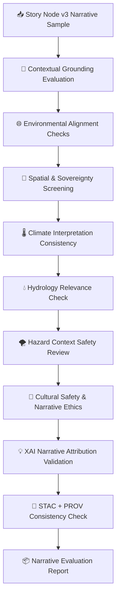

<div align="center">

# 📖🎯🧠 **Focus Mode Narrative Evaluation — KFM v11.2.2 (MAX MODE)**  
`docs/pipelines/ai/models/focus-mode/narrative-evaluation.md`

**Purpose**  
Perform a **governance-grade evaluation** of Narrative Reasoning components in Focus Mode,  
involving Story Node v3 generation, contextual grounding (spatial/climate/hydro/hazard),  
cultural safety, sovereignty protections, and explainability (XAI) integrity.

This ensures that all narrative outputs remain:

🧭 **Spatially accurate**  
🌡️ **Climate-grounded**  
💧 **Hydrology-consistent**  
🌪️ **Hazard-safe**  
📖 **Culturally safe & sovereignty-compliant**  
💡 **Explainable and deterministic**  
🔡 **Fusion-aligned**  
🛡️ **FAIR+CARE-approved**  

</div>

---

## 🧬📚🎯 **Narrative Evaluation Architecture (Mermaid-Safe)**



---

# 🔍 **Evaluation Components**

---

## 📘 **1. Contextual Grounding Evaluation**

Story Node v3 outputs MUST demonstrate:

- Coherent references to environmental inputs  
- Stability under repeated inference  
- Deterministic context interpretation  
- Non-speculative reasoning  
- Respect for environmental uncertainty  

Example PASS:

```json
{
  "context_grounding": {
    "spatial_ok": true,
    "climate_ok": true,
    "hazard_ok": true,
    "hydrology_ok": true
  }
}
```

---

## 🌐 **2. Environmental Alignment Checks**

Evaluates whether narrative statements align with:

- Climate drivers (CAPE/CIN/shear/LLJ/etc.)  
- Hydrology state (soil moisture/runoff/drought/streamflow)  
- Hazard context (tornado/hail/flood/fire/heat/winter)  
- Spatial ground truth (terrain/landcover/watershed/H3 region)  

Example Evaluated Statement:

> “Moisture pooling along the valley floor suggests increasing instability.”

---

## 🧭 **3. Spatial & Sovereignty Screening**

Narratives MUST:

- Properly anonymize sovereignty-protected locations  
- Avoid hyper-specific geographic claims  
- Use H3-generalized spatial references  
- NEVER reference protected cultural sites  

Example FAIL:

> “Just west of the tribal ceremonial grounds…”

→ ❌ Blocked automatically; flagged for governance.

---

## 🌡️ **4. Climate Interpretation Consistency**

Climate narratives MUST:

- Correctly reference environmental drivers  
- Avoid deterministic weather forecasts  
- Avoid exaggerated severity  
- Maintain physical consistency  

Example Allowed:

> “Wind shear aloft may organize storms later if moisture remains high.”

Example NOT Allowed:

> “A violent tornado will strike this location tonight.”

---

## 💧 **5. Hydrology Relevance Check**

Hydrology descriptions MUST:

- Reflect REAL environmental drivers  
- Avoid overprecision (e.g., streamflow at exact cfs in restricted watersheds)  
- Avoid culturally or ecologically sensitive implications  

Example:

```json
{
  "hydrology_evaluation": {
    "soil_moisture_consistent": true,
    "runoff_consistent": true,
    "ecological_safety_ok": true
  }
}
```

---

## 🌪️ **6. Hazard Context Safety Review**

Hazard narratives MUST:

- Avoid attributing intent or human impacts  
- Avoid precise hazard localization in sovereignty regions  
- Avoid deterministic future hazard claims  
- Stick to physically plausible contextual signals  

Example Allowed:

> “Enhanced wind shear may support organized storms.”

Example NOT Allowed:

> “A tornado is forming over the tribal lands now.”

---

## 📖 **7. Cultural Safety & Narrative Ethics**

The Story Node MUST:

- Respect cultural sovereignty  
- Avoid speculation about tribal identity, history, genealogy  
- Avoid sensitive sociocultural claims  
- Not derive unsafe inferences from environmental data  

Example cultural-safety block:

```json
{
  "cultural_safety": {
    "safe": true,
    "notes": []
  }
}
```

---

## 💡 **8. XAI Narrative Attribution Validation**

XAI MUST include:

- Attention entropy  
- Token-level attribution  
- Environmental cue weights  
- Cross-domain influence scores  
- CAM overlays (if spatial references present)  

Example:

```json
{
  "xai_narrative": {
    "attention_entropy": 0.81,
    "top_tokens": ["slope", "moisture", "evening_wind"],
    "domain_weights": {
      "spatial": 0.28,
      "climate": 0.22,
      "hydrology": 0.18,
      "hazards": 0.17,
      "narrative": 0.15
    }
  }
}
```

---

## 📜 **9. STAC + PROV Consistency Check**

Evaluates whether:

- STAC metadata for the narrative aligns with model version  
- PROV lineage is intact  
- Fusion vectors match the STAC Item  
- Narrative-XAI provenance is present  

Example:

```json
{
  "stac_consistency": {
    "valid": true,
    "missing_links": []
  }
}
```

---

## 📦 **10. Narrative Evaluation Report Assembly**

Final artifacts MUST include:

```
narrative_eval_report.json
narrative_context_alignment.json
narrative_xai_eval.json
narrative_sov_safety.json
narrative_environmental_alignment.json
narrative_storynode_validation.json
```

All MUST be sovereignty-safe and CI-valid.

---

# 🧪📏🔬 **CI Validation Requirements**

CI MUST validate:

- Cultural safety  
- Sovereignty masking  
- XAI attribution stability  
- StoryNode safety and context correctness  
- No sensitive-region leakage  
- STAC + PROV correctness  
- Environmental alignment logic  
- Deterministic output  

Failure → ❌ CI BLOCK.

---

# 🕰️📜 **Version History**

| Version | Date       | Notes                                                         |
|---------|------------|--------------------------------------------------------------|
| v11.2.2 | 2025-11-28 | Initial Focus Mode Narrative Evaluation (MAX MODE)           |

---

<div align="center">

### 🔗 Footer  
[🎯 Back to Focus Mode Models](./README.md) ·  
[📡 Telemetry](./mlops/telemetry/README.md) ·  
[🏛 Governance](../../../standards/governance/ROOT-GOVERNANCE.md)

</div>

