<div align="center">

# 🌐🎯🔡 **Focus Mode STAC Catalog — KFM v11.2.2 (MAX MODE)**  
`docs/pipelines/ai/models/focus-mode/stac/README.md`

**Purpose**  
Define the **STAC Catalog system** governing all Focus Mode contextual intelligence models:

🧭 Geo-awareness models  
🌡️ Climate-context interpreters  
💧 Hydrology-context interpreters  
🌪️ Hazard-context interpreters  
🔡 Fusion vector generators (2048D)  
📖 Story Node v3 narrative engines  
💡 XAI explainability layers  
📦 Telemetry, sustainability, and governance metadata  

The Focus Mode STAC Catalog ensures **discoverability**, **traceability**, **FAIR+CARE compliance**,  
**sovereignty-safe metadata**, **STAC/PROV lineage**, and **CI-ready determinism**.

</div>

---

## 🗂️📁🌐 **Directory Layout (MAX MODE)**

```
docs/pipelines/ai/models/focus-mode/stac/
    📄 README.md
    📁 collections/
        📄 focusmode.json
        📄 geo-awareness.json
        📄 climate.json
        📄 hydrology.json
        📄 hazards.json
        📄 narrative.json
        📄 fusion.json
    📁 items/
        📄 focusmodel_v11.2.2.json
        📄 focusmodel_v11.2.1.json
        📄 item_template.json
    📁 model-cards/
        📄 focusmodel-card_v11.2.2.json
        📄 focusmodel-card_v11.2.1.json
        📄 focusmodel-card_template.json
    📁 provenance/
        📄 prov_focusmodel_v11.2.2.json
        📄 prov_focusmodel_template.json
    📁 telemetry/
        📄 telemetry_focusmodel_v11.2.2.json
        📄 telemetry_template.json
```

---

## 🧬🌐🎯 **Focus Mode STAC Architecture (Mermaid-Safe)**

```mermaid
flowchart TD
    A[🌐 STAC Collection Focus Mode Domain] --> B[📦 STAC Items Per Model Version]
    B --> C[📄 Model Cards · Metrics · XAI]
    B --> D[📜 PROV O Lineage Chains]
    B --> E[🛡️ CARE And Sovereignty Metadata]
    B --> F[🔋 Energy And 🌍 Carbon Sustainability]
    C --> G[🎯 Downstream Workflows Focus Mode StoryNode Hazard Hydro Climate]
```



---

# 🔍 **STAC Components**

---

## 🗂️ **1. STAC Collections (Domain-Level)**

Focus Mode includes **7 governed STAC Collections**:

- **focusmode.json** — primary catalog  
- **geo-awareness.json**  
- **climate.json**  
- **hydrology.json**  
- **hazards.json**  
- **narrative.json**  
- **fusion.json**  

Each Collection MUST define:

- STAC core fields  
- Spatial + temporal extents  
- Domain variable definitions  
- FAIR+CARE constraints  
- Sovereignty safety notes  
- XAI inheritance rules  
- Energy + carbon expectations  
- Links to child Items  

Example:

```json
{
  "type": "Collection",
  "stac_version": "1.0.0",
  "id": "focusmode",
  "description": "KFM Focus Mode contextual intelligence models"
}
```

---

## 📦 **2. STAC Items (Per Model Version)**

Each Focus Mode model version MUST produce a STAC Item including:

```json
{
  "type": "Feature",
  "id": "focusmodel_v11_2_2",
  "stac_version": "1.0.0",
  "collection": "focusmode",
  "properties": {
    "focus:version": "v11.2.2",
    "fusion:dimension": 2048,
    "model:seed": 42
  }
}
```

Required STAC assets:

- `weights`
- `fusion_weights`
- `context_router`
- `storynode_v3`
- `xai`
- `telemetry`
- `provenance`
- `model-card`
- `metrics`

---

## 📄 **3. Model Cards (FAIR+CARE Certified)**

Every Focus Mode model MUST include a full model card:

- Domain roles  
- Training metadata  
- Hyperparameters  
- Stability metrics  
- Hazard/hydro/climate consistency  
- XAI explainability  
- Narrative safety checks  
- CARE + sovereignty metadata  
- Energy + carbon usage  
- STAC references  
- PROV lineage  

Stored under:

```
model-cards/focusmodel-card_v11.2.2.json
```

---

## 📜 **4. PROV-O Lineage (Mandatory)**

Every Focus Mode STAC Item MUST include PROV:

```json
{
  "prov": {
    "wasGeneratedBy": "urn:kfm:activity:training:focusmode_v11_2_2",
    "used": [
      "urn:kfm:data:terrain_item",
      "urn:kfm:data:climate_item",
      "urn:kfm:data:hydrology_item",
      "urn:kfm:data:hazard_item"
    ],
    "agent": "urn:kfm:service:focus-training-engine"
  }
}
```

---

## 💡 **5. XAI (Explainability) Requirements**

STAC MUST document XAI assets:

- Domain importance vectors  
- Fusion attribution  
- CAM spatial overlays  
- Story Node attention maps  
- XAI drift baseline  
- Seed-lock metadata  
- XAI provenance  

---

## 🔋🌍 **6. Sustainability Requirements**

Each STAC Item MUST include sustainability telemetry:

- Watt-hours  
- gCO₂e  
- FLOPs  
- Compute backend metadata  

These inform governance energy/carbon budgets.

---

## 🛡️⚖️ **7. FAIR+CARE + Sovereignty Metadata**

ALL Focus Mode STAC items MUST include:

```json
{
  "care": {
    "masking": "h3-focus-generalized",
    "scope": "public-generalized",
    "notes": ["Metadata generalized in sovereignty-sensitive regions"]
  }
}
```

Sovereignty protection MUST ensure:

- No cultural signatures  
- No hyperlocal hazard interpretation  
- No sensitive tribal-region narrative cues  
- H3 anonymization/generalization  

---

# 🧪📏🔬 **CI Validation Requirements**

CI MUST validate:

- STAC schema correctness  
- XAI + PROV completeness  
- FAIR+CARE + sovereignty compliance  
- Telemetry presence  
- Deterministic metadata generation  
- Drift-stability linkage correctness  
- Model-card alignment  
- No sensitive-region leakage  

Failure → ❌ CI BLOCK.

---

# 🕰️📜 **Version History**

| Version | Date       | Notes                                        |
|---------|------------|----------------------------------------------|
| v11.2.2 | 2025-11-28 | Initial Focus Mode STAC Catalog (MAX MODE)   |

---

<div align="center">

### 🔗 Footer  
[🎯 Back to Focus Mode Models](../README.md) ·  
[📦 Collections](./collections/README.md) ·  
[🏛 Governance](../../../../standards/governance/ROOT-GOVERNANCE.md)

</div>

