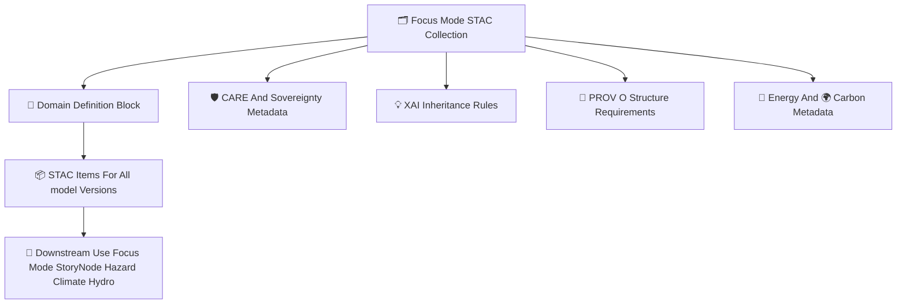

<div align="center">

# 🗂️🌐🎯 **Focus Mode STAC Collections — KFM v11.2.2 (MAX MODE)**  
`docs/pipelines/ai/models/focus-mode/stac/collections/README.md`

**Purpose**  
Define the **STAC Collections** that organize Focus Mode’s contextual intelligence metadata across:  

🧭 **Geo-awareness**  
🌡️ **Climate interpretation**  
💧 **Hydrology interpretation**  
🌪️ **Hazard interpretation**  
📖 **Narrative (Story Node v3)**  
🔡 **Fusion vectors (2048D)**  
🎯 **Complete Focus Mode AI stack**

Collections enforce **FAIR+CARE ethics**, **sovereignty protection**, **STAC-spec alignment**, and  
**cross-domain metadata governance**.

</div>

---

## 🗂️📁🌐 **Directory Layout (MAX MODE)**

```
docs/pipelines/ai/models/focus-mode/stac/collections/
    📄 README.md
    📄 focusmode.json
    📄 geo-awareness.json
    📄 climate.json
    📄 hydrology.json
    📄 hazards.json
    📄 narrative.json
    📄 fusion.json
```

---

## 🧬🌐🎯 **Focus Mode Collections Architecture (Mermaid-Safe)**



---

# 🔍 **Collection Definitions**

Each Focus Mode domain has its own STAC Collection.  
Below are the mandatory requirements for each.

---

## 🎯 **1. focusmode.json (Primary Collection)**  
Represents the **unified Focus Mode intelligence artifact**, integrating all domains.  
Must define:

- Purpose of Focus Mode  
- Fusion dimension  
- Supported domains  
- FAIR+CARE & sovereignty policy  
- XAI inheritance  
- Link relation templates  

---

## 🧭 **2. geo-awareness.json**  
Defines metadata for:

- H3 indices  
- Terrain  
- Landcover  
- Watersheds  
- Sovereignty-boundary masking  
- Spatial CAM inheritance  

---

## 🌡️ **3. climate.json**  
Defines metadata for climate-domain reasoning:

- Temperature, dewpoint, pressure  
- CAPE/CIN/LLJ/shear  
- Anomaly state metadata  
- Hazard coupling  
- Climate XAI inheritance  

---

## 💧 **4. hydrology.json**  
Includes metadata for hydrology context:

- Soil moisture  
- Runoff  
- Streamflow  
- Drought index  
- Hydrologic CAM inheritance  

---

## 🌪️🔥🌊❄️ **5. hazards.json**  
Domains:

- Tornado  
- Hail  
- Flood  
- Fire-weather  
- Winter-weather  
- Heat stress  

Includes:

- Hazard-driver attribution  
- Climate coupling metadata  
- Hazard suppression in sovereignty zones  

---

## 📖 **6. narrative.json (Story Node v3)**  
Defines:

- Narrative-domain metadata  
- Attention-map inheritance  
- Cultural-safety markers  
- Story Node semantic anchors  
- Sovereignty masking for narrative content  

---

## 🔡 **7. fusion.json**  
Defines the critical **2048D fusion embedding layer**, with fields for:

- Cross-domain mixing rules  
- Weight distribution  
- Drift baselines  
- XAI cross-domain vectors  
- Sovereignty-compliant fusion behavior  

---

# 🛡️⚖️ **FAIR+CARE + Sovereignty Requirements**

Every Collection MUST include:

```json
{
  "care": {
    "masking": "h3-focus-generalized",
    "scope": "public-generalized",
    "notes": [
      "Collection metadata generalized to protect sovereignty-sensitive contexts"
    ]
  }
}
```

Protections MUST cover:

- Tribal territories  
- Cultural features  
- Sensitive hydrological / ecological regions  
- Narrative content referencing cultural or historical material  

---

# 🔋🌍 **Energy + Carbon Metadata Requirements**

Each Collection MUST contain:

- Energy expectations  
- Sustainability constraints  
- gCO₂e tracking fields  
- Telemetry inheritance hooks  

Used for governance & carbon-budget auditing.

---

# 🧪📏🔬 **CI Validation Requirements**

CI MUST verify:

- STAC v1.x compliance  
- Deterministic serialization  
- Fair+CARE metadata  
- Sovereignty masking  
- XAI inheritance rules  
- PROV structure  
- Valid linking to STAC Items  
- No sensitive-region leakage  

Failure → ❌ CI BLOCK.

---

# 🕰️📜 **Version History**

| Version | Date       | Notes                                           |
|---------|------------|-------------------------------------------------|
| v11.2.2 | 2025-11-28 | Initial Focus Mode STAC Collections (MAX MODE)  |

---

<div align="center">

### 🔗 Footer  
[🌐 Back to Focus Mode STAC Root](../README.md) ·  
[📦 STAC Items](../items/README.md) ·  
[🏛 Governance](../../../../../standards/governance/ROOT-GOVERNANCE.md)

</div>

