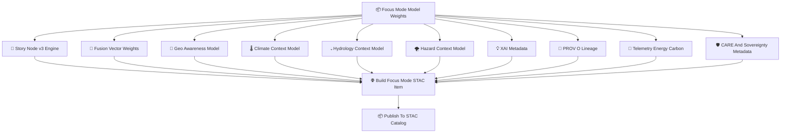

<div align="center">

# 📦🎯🌐 **Focus Mode STAC Items — KFM v11.2.2 (MAX MODE)**  
`docs/pipelines/ai/models/focus-mode/stac/items/README.md`

**Purpose**  
Define the **STAC Items** representing each version of Focus Mode contextual intelligence models:

🧭 Geo-awareness model  
🌡️ Climate context interpreter  
💧 Hydrology interpreter  
🌪️ Hazard interpreter  
📖 Story Node v3 engine  
🔡 Fusion vector generator (2048D)  
💡 XAI subsystem  
📡 Telemetry  
📜 PROV lineage  
🛡️ FAIR+CARE + sovereignty metadata  

These items ensure **deterministic discoverability**, **governance auditing**, **cross-domain integrity**,  
and **version-pinned contextual AI reasoning**.

</div>

---

## 🗂️📁📦 **Directory Layout (MAX MODE)**

```
docs/pipelines/ai/models/focus-mode/stac/items/
    📄 README.md
    📄 focusmodel_v11.2.2.json
    📄 focusmodel_v11.2.1.json
    📄 item_template.json
```

---

## 🧬🌐🎯 **Focus Mode STAC Item Architecture (Mermaid-Safe)**



---

# 🔍 **Required STAC Item Fields**

---

## 🧩 **1. Core STAC Fields**

```json
{
  "type": "Feature",
  "id": "focusmodel_v11_2_2",
  "stac_version": "1.0.0",
  "collection": "focusmode"
}
```

---

## 🔡 **2. Model Properties**

Required:

- `focus:version`  
- `fusion:dimension`  
- `model:seed`  
- `model:domains` (geo, climate, hydrology, hazard, narrative)  
- `model:architecture` (e.g., transformer, hybrid)  

---

## 📦 **3. Assets Block**

Each STAC Item MUST include:

```json
{
  "assets": {
    "weights": {"href": "focus_model.pt"},
    "fusion_weights": {"href": "fusion_weights.json"},
    "context_router": {"href": "context_router.pt"},
    "storynode_v3": {"href": "storynode_v3.pt"},
    "xai": {"href": "xai/"},
    "telemetry": {"href": "telemetry/"},
    "provenance": {"href": "prov_focusmodel_v11_2_2.json"},
    "model-card": {"href": "../model-cards/focusmodel-card_v11.2.2.json"},
    "metrics": {"href": "focus_metrics.json"}
  }
}
```

---

## 🛡️ **4. CARE + Sovereignty Metadata**

```json
{
  "care": {
    "masking": "h3-focus-generalized",
    "scope": "public-generalized",
    "notes": ["Focus Mode metadata generalized in sovereignty-sensitive regions"]
  }
}
```

---

## 🌀 **5. Drift + Stability Fields**

Must include drift baselines:

```json
{
  "stability": {
    "fusion_centroid": 0.002,
    "fusion_variance": 0.019,
    "narrative_entropy": 0.83,
    "hazard_alignment": 0.92,
    "climate_alignment": 0.9,
    "hydrology_alignment": 0.89
  }
}
```

---

## 🔋🌍 **6. Energy + Carbon Telemetry**

```json
{
  "energy": {"wh": 4.92},
  "carbon": {"gco2e": 0.47}
}
```

---

## 📜 **7. PROV-O Lineage**

Must include:

```json
{
  "prov": {
    "wasGeneratedBy": "urn:kfm:activity:training:focusmode_v11_2_2",
    "used": [
      "urn:kfm:data:terrain_item",
      "urn:kfm:data:climate_item",
      "urn:kfm:data:hydrology_item",
      "urn:kfm:data:hazard_item"
    ],
    "agent": "urn:kfm:service:focus-training-engine"
  }
}
```

---

## 💡 **8. XAI Metadata**

Must include references to:

- XAI feature importance  
- Narrative attention maps  
- Spatial CAM overlays  
- Hazard/hydro/climate attribution  
- XAI provenance metadata  

---

## 🌐 **9. STAC Relations**

```
"links": [
  {"rel": "collection", "href": "../collections/focusmode.json"},
  {"rel": "model-card", "href": "../model-cards/focusmodel-card_v11.2.2.json"}
]
```

---

# 🧪📏🔬 **CI Validation Requirements**

CI MUST confirm:

- Deterministic STAC formation  
- FAIR+CARE compliance  
- Sovereignty-safety metadata applied  
- Drift/stability metrics valid  
- Telemetry schema correct  
- XAI assets present  
- STAC–modelcard–provenance linkage correct  
- No sensitive-region leakage  
- Reproducibility across runs  

Failure → ❌ CI BLOCK.

---

# 🕰️📜 **Version History**

| Version | Date       | Notes                                          |
|---------|------------|------------------------------------------------|
| v11.2.2 | 2025-11-28 | Initial Focus Mode STAC Items (MAX MODE)       |

---

<div align="center">

### 🔗 Footer  
[🌐 Back to Focus Mode STAC Root](../README.md) ·  
[📄 Model Cards](../model-cards/README.md) ·  
[🏛 Governance](../../../../../../../standards/governance/ROOT-GOVERNANCE.md)

</div>

