<div align="center">

# 📄🎯🧠 **Focus Mode Model Cards Catalog — KFM v11.2.2 (MAX MODE)**  
`docs/pipelines/ai/models/focus-mode/stac/model-cards/README.md`

**Purpose**  
Define the **Model Card Catalog** governing Focus Mode contextual intelligence models:  

🧭 Geo-awareness  
🌡️ Climate reasoning  
💧 Hydrology reasoning  
🌪️ Hazard reasoning  
📖 Story Node v3  
🔡 Fusion vector generator (2048D)  
💡 XAI subsystem  
📜 Provenance  
🔋 Sustainability  
🛡️ Sovereignty & FAIR+CARE metadata  

Each Focus Mode model card provides **transparent, governance-audited insight** into model behavior.

</div>

---

## 🗂️📁📄 **Directory Layout (MAX MODE)**

```
docs/pipelines/ai/models/focus-mode/stac/model-cards/
    📄 README.md
    📄 focusmodel-card_v11.2.2.json
    📄 focusmodel-card_v11.2.1.json
    📄 focusmodel-card_template.json
```

---

## 🧬📄🎯 **Model Card Architecture (Mermaid-Safe)**

```mermaid
flowchart TD
    A[🎯 Focus Mode Model] --> B[📊 Metrics Fusion Stability Context Consistency]
    A --> C[💡 XAI Attribution CAM Attention]
    A --> D[📜 PROV O Lineage]
    A --> E[🛡️ CARE And Sovereignty Metadata]
    A --> F[📦 Build STAC Model Card JSON]
    F --> G[📁 Publish To Model Cards Catalog]
```



---

# 🔍 **Required Model Card Sections**

---

## 1️⃣ **Model Overview**

Includes:

```json
{
  "model:version": "v11.2.2",
  "model:domains": ["geo", "climate", "hydrology", "hazards", "narrative", "fusion"],
  "model:architecture": "transformer",
  "fusion:dimension": 2048,
  "model:seed": 42
}
```

---

## 2️⃣ **Training Metadata**

Must include:

- Training epochs  
- LR  
- Batch size  
- Normalization constants  
- Preprocessing logs  
- Sovereignty mask logs  
- Environmental dataset STAC refs  
- Narrative dataset refs  

---

## 3️⃣ **Metrics & Stability**

Must include:

- Fusion vector stability metrics  
- Story Node narrative correctness  
- Climate/hydro/hazard alignment metrics  
- Geo-awareness correctness  
- Sovereignty-safety scores  

Example:

```json
{
  "metrics": {
    "fusion_variance": 0.018,
    "narrative_entropy": 0.82,
    "hazard_alignment": 0.93
  }
}
```

---

## 4️⃣ **Drift Baselines**

Must include:

```json
{
  "stability": {
    "fusion_centroid": 0.002,
    "fusion_variance": 0.019,
    "narrative_entropy": 0.83,
    "hazard_alignment": 0.92,
    "climate_alignment": 0.90,
    "hydrology_alignment": 0.89
  }
}
```

---

## 5️⃣ **XAI Explainability**

Includes:

- Importance vectors  
- CAM maps  
- Story Node attention maps  
- Environmental attribution  
- XAI provenance metadata  

Example:

```json
{
  "xai": {
    "importance": {
      "spatial": 0.27,
      "climate": 0.21,
      "hydrology": 0.18,
      "hazards": 0.17,
      "narrative": 0.17
    }
  }
}
```

---

## 6️⃣ **PROV-O Lineage**

Must include:

```json
{
  "prov": {
    "wasGeneratedBy": "urn:kfm:activity:training:focusmode_v11_2_2",
    "used": [
      "urn:kfm:data:terrain_item",
      "urn:kfm:data:climate_item",
      "urn:kfm:data:hydrology_item",
      "urn:kfm:data:hazard_item"
    ],
    "agent": "urn:kfm:service:focus-training-engine"
  }
}
```

---

## 7️⃣ **FAIR+CARE & Sovereignty Metadata**

Must include:

```json
{
  "care": {
    "masking": "h3-focus-generalized",
    "scope": "public-generalized",
    "notes": ["Model generalized for sovereignty protection"]
  }
}
```

---

## 8️⃣ **Energy + Carbon Sustainability**

Has:

```json
{
  "energy": {"wh": 4.92},
  "carbon": {"gco2e": 0.47}
}
```

---

## 9️⃣ **STAC Relations**

```
"links": [
  {"rel": "collection", "href": "../collections/focusmode.json"},
  {"rel": "model-card", "href": "../model-cards/focusmodel-card_v11.2.2.json"}
]
```

---

# 🧪📏🔬 **CI Validation Requirements**

CI MUST validate:

- Model card schema correctness  
- XAI completeness  
- STAC linkage  
- PROV chain  
- Telemetry completeness  
- Drift baselines  
- Sovereignty-safety metadata  
- Deterministic metadata  
- No sensitive-region leakage  

Failure → ❌ CI BLOCK.

---

# 🕰️📜 **Version History**

| Version | Date       | Notes                                                 |
|---------|------------|-------------------------------------------------------|
| v11.2.2 | 2025-11-28 | Initial Focus Mode Model Card Catalog (MAX MODE)      |

---

<div align="center">

### 🔗 Footer  
[🌐 Back to Focus Mode STAC Root](../README.md) ·  
[📦 STAC Items](../items/README.md) ·  
[🏛 Governance](../../../../../../../standards/governance/ROOT-GOVERNANCE.md)

</div>

