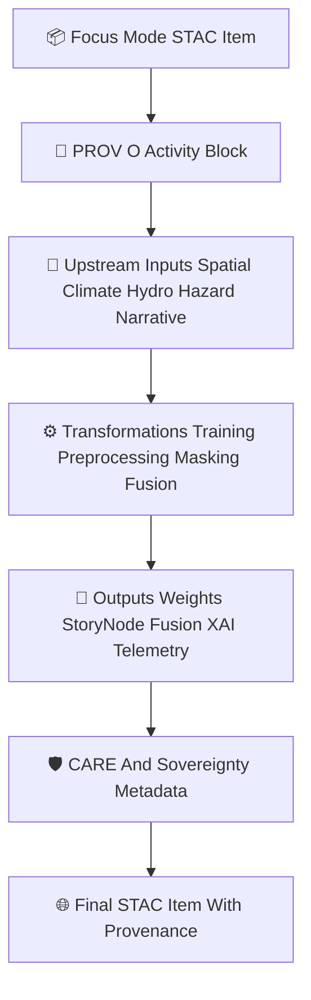

<div align="center">

# 📜🎯🌐 **Focus Mode STAC Provenance Catalog — KFM v11.2.2 (MAX MODE)**  
`docs/pipelines/ai/models/focus-mode/stac/provenance/README.md`

**Purpose**  
Document and govern the **PROV-O lineage system** for all Focus Mode contextual intelligence models:  
🧭 Geo-awareness · 🌡️ Climate reasoning · 💧 Hydrology context · 🌪️ Hazard logic ·  
📖 Story Node v3 · 🔡 Fusion vectors · 💡 XAI explainability · 📡 Telemetry · 🛡️ FAIR+CARE · ⚖️ Sovereignty.

This catalog ensures *full traceability*, *determinism*, *auditability*, and *sovereignty-safe lineage modeling*.

</div>

---

## 🗂️📁📜 **Directory Layout (MAX MODE)**

```
docs/pipelines/ai/models/focus-mode/stac/provenance/
    📄 README.md
    📄 prov_focusmodel_v11.2.2.json
    📄 prov_focusmodel_v11.2.1.json
    📄 prov_focusmodel_template.json
```

---

## 🧬📜🎯 **Provenance Architecture (Mermaid-Safe)**



---

# 🔍 **Required PROV-O Blocks**

---

## 1️⃣ **prov:wasGeneratedBy**

Records the Focus Mode training activity:

```json
{
  "prov": {
    "wasGeneratedBy": "urn:kfm:activity:training:focusmode_v11_2_2"
  }
}
```

---

## 2️⃣ **prov:used**

MUST enumerate *all* upstream dependencies:

```json
{
  "prov": {
    "used": [
      "urn:kfm:data:terrain_item",
      "urn:kfm:data:climate_item",
      "urn:kfm:data:hydrology_item",
      "urn:kfm:data:hazard_item",
      "urn:kfm:data:narrative_item",
      "urn:kfm:model:embeddings_spatial_v11_2_2",
      "urn:kfm:model:embeddings_fusion_v11_2_2",
      "urn:kfm:preprocess:sovereignty_mask_v3",
      "urn:kfm:xai:template_focus_v11_2"
    ]
  }
}
```

---

## 3️⃣ **prov:wasAssociatedWith**

Indicates which service/agent produced the model:

```json
{
  "prov": {
    "agent": "urn:kfm:service:focus-training-engine"
  }
}
```

---

## 4️⃣ **Deterministic Seed Metadata**

Included inside STAC `"properties.model:seed"`.

---

# 🔍 **XAI Provenance Requirements**

Focus Mode MUST produce XAI-specific provenance:

```json
{
  "xai:prov": {
    "wasGeneratedBy": "urn:kfm:activity:xai:focusmode_v11_2_2",
    "used": [
      "focus_model.pt",
      "fusion_weights.json",
      "context_router.pt"
    ],
    "agent": "urn:kfm:service:focus-xai-engine"
  }
}
```

This ensures attribution → model weights → fusion logic are traceable.

---

# 🔍 **Telemetry Provenance Requirements**

All telemetry bundles MUST include:

```json
{
  "prov": {
    "wasGeneratedBy": "urn:kfm:activity:telemetry:focus_inference_v11_2_2",
    "used": [
      "focusmodel_v11_2_2.json",
      "embedding_fusion_v11_2_2.json"
    ],
    "agent": "urn:kfm:service:focus-telemetry-engine"
  }
}
```

Covers OTel spans, XAI drift, sustainability metrics, and geography/hazard context relevance.

---

# 🛡️⚖️ **FAIR+CARE & Sovereignty Provenance Requirements**

Focus Mode provenance MUST document:

- Sovereignty-driven masking  
- Cultural-safety transformations  
- Hazard-overlocalization suppression  
- Narrative content filtering  
- Spatial H3 generalization  
- Care policy inheritance  

Required block:

```json
{
  "care": {
    "masking": "h3-focus-generalized",
    "scope": "public-generalized",
    "notes": ["Sovereignty protections applied in training and STAC assembly"]
  }
}
```

---

# 📦📜🧾 **Provenance Templates**

Template JSON files MUST be provided for:

- Geo-awareness  
- Climate logic  
- Hydrology logic  
- Hazard context  
- Story Node v3  
- Fusion layer  
- Telemetry events  
- XAI provenance  

---

# 🧪📏🔬 **CI Validation Requirements**

CI MUST verify:

- PROV-O schema correctness  
- Deterministic ordering of `"prov:used"`  
- Sovereignty masking metadata  
- CARE metadata correctness  
- STAC → model-card → XAI → PROV linkage  
- No sensitive-region leakage  
- Telemetry-provenance correctness  
- Reproducible provenance across runs  

Failure → ❌ CI BLOCK.

---

# 🕰️📜 **Version History**

| Version | Date       | Notes                                                   |
|---------|------------|---------------------------------------------------------|
| v11.2.2 | 2025-11-28 | Initial Focus Mode STAC Provenance Catalog (MAX MODE)   |

---

<div align="center">

### 🔗 Footer  
[🌐 Back to Focus Mode STAC Root](../README.md) ·  
[📦 STAC Items](../items/README.md) ·  
[🏛 Governance](../../../../../../../standards/governance/ROOT-GOVERNANCE.md)

</div>

