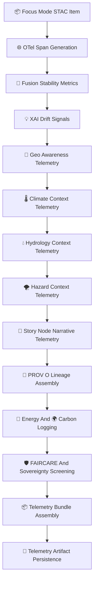

<div align="center">

# 📡🎯🌐 **Focus Mode STAC Telemetry — KFM v11.2.2 (MAX MODE)**  
`docs/pipelines/ai/models/focus-mode/stac/telemetry/README.md`

**Purpose**  
Define the **telemetry subsystem** for Focus Mode STAC Items and Collections.  
Telemetry provides cross-domain observability for:

🔡 Fusion vector stability  
🧭 Geo-awareness  
🌡️ Climate context  
💧 Hydrology context  
🌪️ Hazard context  
📖 Story Node narrative reasoning  
💡 XAI drift  
📜 Provenance lineage  
🔋 Sustainability metrics  
🛡️ FAIR+CARE + sovereignty safety  

</div>

---

## 🗂️📁📡 **Directory Layout (MAX MODE)**

```
docs/pipelines/ai/models/focus-mode/stac/telemetry/
    📄 README.md
    📄 telemetry_focusmodel_v11.2.2.json
    📄 telemetry_focusmodel_v11.2.1.json
    📄 telemetry_template.json
```

---

## 🧬📡🎯 **Telemetry Architecture (Mermaid-Safe)**



---

# 🔍 **Telemetry Requirements**

---

## 🌐 **1. OpenTelemetry Metadata**

STAC telemetry MUST include:

```json
{
  "otel": {
    "operation": "stac_item_create",
    "latency_ms": 15,
    "context_domains": ["geo", "climate", "hydrology", "hazards", "narrative", "fusion"],
    "seed": 42
  }
}
```

---

## 🔡 **2. Fusion Stability Metrics**

Track:

- Vector variance  
- Domain-weight shifts  
- Fusion centroid drift  
- Cross-domain leakage signals  

---

## 💡 **3. XAI Drift Metrics**

Telemetry MUST include:

```json
{
  "xai_drift": {
    "importance_shift": {
      "spatial": +0.02,
      "climate": -0.01,
      "hydrology": +0.01,
      "hazards": -0.01,
      "narrative": -0.01
    },
    "cam_shift": 0.16,
    "attention_entropy": 0.82
  }
}
```

---

## 🧭 **4. Geo Awareness Telemetry**

Monitor:

- H3-region mapping  
- Sovereignty-masked regions  
- Terrain/landcover/watershed fidelity  
- Spatial CAM displacement  

---

## 🌡️ **5. Climate Context Telemetry**

Track:

- CAPE/CIN relevance  
- Temp/dewpoint gradients  
- LLJ/shear cues  
- Climate-anomaly effects  

---

## 💧 **6. Hydrology Telemetry**

Track:

- Soil moisture signals  
- Runoff indicators  
- Streamflow relevance  
- Drought pattern alignment  

---

## 🌪️ **7. Hazard Telemetry**

Monitor:

- Tornado/hail/flood/fire-weather/winter-state indicators  
- Hazard-driver coupling  
- Hazard suppression in sovereignty zones  

---

## 📖 **8. Story Node Telemetry**

Monitor:

- Narrative attention patterns  
- StoryNode safety (cultural + environmental)  
- Sovereignty-sensitive narrative alignment  
- Topic-drift corrections  

---

## 📜 **9. PROV Lineage Requirements**

Telemetry MUST embed PROV:

```json
{
  "prov": {
    "wasGeneratedBy": "urn:kfm:activity:telemetry:focus_inference_v11_2_2",
    "used": [
      "urn:kfm:model:focusmodel_v11_2_2",
      "urn:kfm:model:embedding_fusion_v11_2_2"
    ],
    "agent": "urn:kfm:service:focus-telemetry-engine"
  }
}
```

---

## 🔋🌍 **10. Sustainability Telemetry**

Track:

- Wh energy  
- gCO₂e emitted  
- FLOPs  
- Training vs. inference energy ratio  
- Hardware utilization  

---

## 🛡️⚖️ **11. FAIR+CARE + Sovereignty Screening**

Care block example:

```json
{
  "care": {
    "masking": "h3-focus-generalized",
    "scope": "public-generalized",
    "notes": ["Focus Mode telemetry generalized in sovereignty-sensitive domains"]
  }
}
```

---

## 📦📜 **12. Telemetry Bundle Assembly**

Bundles MUST include:

```
otel/
xai/
fusion/
geo/
climate/
hydrology/
hazards/
narrative/
prov/
energy/
carbon/
```

And be sovereignty-safe and CI-valid.

---

# 🧪📏🔬 **CI Validation Requirements**

CI MUST validate:

- Telemetry JSON schema  
- Deterministic outputs  
- XAI drift correctness  
- Fusion stability metrics  
- FAIR+CARE compliance  
- Sovereignty masking  
- STAC references  
- PROV lineage  
- No sensitive-region leakage  
- Sustainability metadata validity  

Failure → ❌ CI BLOCK.

---

# 🕰️📜 Version History

| Version | Date       | Notes                                                 |
|---------|------------|-------------------------------------------------------|
| v11.2.2 | 2025-11-28 | Initial Focus Mode STAC Telemetry Documentation (MAX MODE) |

---

<div align="center">

### 🔗 Footer  
[🌐 Back to Focus Mode STAC Root](../README.md) ·  
[📦 STAC Items](../items/README.md) ·  
[🏛 Governance](../../../../../../../standards/governance/ROOT-GOVERNANCE.md)

</div>

