<div align="center">

# 🌪️📊🧠 **Hazard Models Evaluation Report — KFM v11.2.2 (MAX MODE)**  
`docs/pipelines/ai/models/hazards/evaluation-report.md`

**Purpose**  
Provide the **governance-grade evaluation report** for all KFM hazard models:

🌪️ Tornado  
🧊 Hail  
🌊 Flood  
🔥 Fire-Weather  
☀️ Heat  
❄️ Winter-Weather  

Evaluation ensures all hazard models are:

- Physically consistent  
- Climate- and hydrology-aware  
- Drift-stable  
- XAI-valid  
- Sovereignty-safe  
- FAIR+CARE compliant  
- STAC + PROV traceable  
- Ready for Focus Mode + Story Node v3 integration  

</div>

---

## 🧬🌪️📊 **Hazard Model Evaluation Architecture (Mermaid-Safe)**

```mermaid
flowchart TD
    A[📥 Load Hazard Model + Validation Dataset] --> B[📊 Compute Core Hazard Metrics]
    B --> C[🌡️ Climate Driver Consistency Check]
    C --> D[💧 Hydrology Influence Consistency]
    D --> E[🌀 Drift And Stability Evaluation]
    E --> F[💡 XAI Attribution Validation]
    F --> G[🛡️ FAIRCARE And Sovereignty Screening]
    G --> H[📜 STAC And PROV Consistency Check]
    H --> I[📦 Hazard Evaluation Report Assembly]
```



---

# 🔍 **Evaluation Components**

---

## 🧪 **1. Core Hazard Metrics**

Each hazard model MUST report:

- RMSE, MAE  
- Bias  
- Probability calibration  
- Spatial distribution integrity  
- Hazard-threshold stability  

Example:

```json
{
  "metrics": {
    "rmse": 1.82,
    "calibration": 0.93,
    "spatial_bias": -0.03
  }
}
```

---

## 🌡️ **2. Climate Driver Consistency**

Hazards must be validated against climate drivers:

- CAPE  
- CIN  
- Shear  
- LLJ  
- LCL  
- Temperature/dewpoint gradients  
- Climate anomalies  

Example:

```json
{
  "climate_alignment": {
    "cape_consistent": true,
    "shear_consistent": true,
    "llj_consistent": true
  }
}
```

---

## 💧 **3. Hydrology Influence Consistency**

Applicable for flood, drought-linked fire-weather, and heat/humidity coupling:

- Soil moisture relevance  
- Runoff → flood-proxy alignment  
- Streamflow consistency  
- Drought index coherence  

Example:

```json
{
  "hydrology_alignment": {
    "streamflow_consistent": true,
    "runoff_consistent": true
  }
}
```

---

## 🌀 **4. Drift & Stability Evaluation**

Hazard drift evaluation MUST include:

- Hazard-field centroid drift  
- Tail-behavior shifts  
- Climate → hazard coupling drift  
- Hydrology → hazard drift  
- Sovereignty-region drift risks  

Outputs:

```
drift_report.json
centroid_drift.json
climate_hazard_drift.json
hydrology_hazard_drift.json
```

---

## 💡 **5. XAI Attribution Validation**

XAI MUST evaluate:

- Climate driver attribution  
- Hydrology relevance  
- Spatial CAM overlays  
- Hazard-driver weight alignment  
- Cross-domain mixing anomalies  

Example:

```json
{
  "xai": {
    "importance": {
      "climate": 0.32,
      "hydrology": 0.19,
      "spatial": 0.17,
      "hazard": 0.32
    }
  }
}
```

---

## 🛡️⚖️ **6. FAIR+CARE + Sovereignty Screening**

Hazard models MUST NOT:

- Reveal hyperlocal hazard signals in tribal areas  
- Produce culturally unsafe or stigmatizing outputs  
- Overlocalize flood/tornado/fire risk  
- Encode sensitive environmental signatures  

CARE block example:

```json
{
  "care": {
    "masking": "h3-hazard-generalized",
    "scope": "public-generalized",
    "notes": ["Hazard model generalized in sovereignty-sensitive zones"]
  }
}
```

---

## 📜🌐 **7. STAC + PROV Consistency**

All hazard outputs MUST:

- Match STAC Item metadata  
- Reference correct model version  
- Maintain PROV lineage  
- Include XAI provenance  
- Include CARE metadata  

Example:

```json
{
  "stac_consistency": {
    "valid": true,
    "missing_links": []
  }
}
```

---

## 📦📝 **8. Evaluation Report Assembly**

Final artifacts MUST include:

```
hazard_eval_report.json
hazard_climate_alignment.json
hazard_hydrology_alignment.json
hazard_xai_eval.json
hazard_drift_report.json
hazard_sovereignty_safety.json
hazard_stac_prov_validation.json
```

All MUST be CI-valid, sovereignty-safe, and version-pinned.

---

# 🧪📏🔬 **CI Validation Requirements**

CI MUST validate:

- Physical consistency with climate + hydrology  
- Drift metrics  
- Cultural/safety compliance  
- Sovereignty protections  
- XAI attribution stability  
- STAC + PROV chain  
- No sensitive-region leakage  
- Deterministic outputs  
- Sustainability telemetry validity  

Failure → ❌ CI BLOCK.

---

# 🕰️📜 Version History

| Version | Date       | Notes                                           |
|---------|------------|-------------------------------------------------|
| v11.2.2 | 2025-11-28 | Initial Hazard Models Evaluation Report (MAX MODE) |

---

<div align="center">

### 🔗 Footer  
[🌪️ Back to Hazard Models](./README.md) ·  
[📡 Hazard Telemetry](./mlops/telemetry/README.md) ·  
[🏛 Governance](../../../standards/governance/ROOT-GOVERNANCE.md)

</div>

