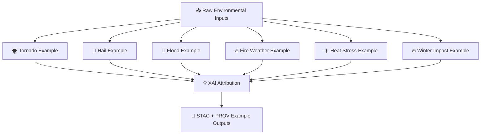

<div align="center">

# 📚🌪️🧠 **Hazard Model Examples — KFM v11.2.2 (MAX MODE)**  
`docs/pipelines/ai/models/hazards/examples/README.md`

**Purpose**  
Provide a curated, sovereignty-safe, FAIR+CARE-compliant library of **environmental hazard examples**  
used for hazard model QA, Focus Mode integration, governance review, UI prototyping,  
and deterministic CI tests.

Domains included:  
🌪️ Tornado • 🧊 Hail • 🌊 Flood • 🔥 Fire-Weather • ☀️ Heat • ❄️ Winter

</div>

---

## 🗂️📁🌪️ **Directory Layout (MAX MODE)**

```
docs/pipelines/ai/models/hazards/examples/
    📄 README.md
    📄 example_tornado.json
    📄 example_hail.json
    📄 example_flood.json
    📄 example_fire_weather.json
    📄 example_heat.json
    📄 example_winter.json
    📄 example_xai_block.json
    📄 example_provenance.json
    📄 example_stac_item.json
```

---

## 🧬🌪️📦 **Hazard Example Architecture (Mermaid-Safe)**



---

# 🔍 **Example Set (MAX MODE)**

---

## 🌪️ **1. Tornado Example**

```json
{
  "tornado": {
    "cape_jkg": 2450,
    "cin_jkg": -32,
    "shear_0_1km": 18,
    "shear_0_6km": 34,
    "srh_0_1km": 132,
    "llj_speed_ms": 22,
    "tornado_potential": 0.37
  }
}
```

---

## 🧊 **2. Hail Example**

```json
{
  "hail": {
    "muhail_proxy": 1.82,
    "freeze_level_m": 2650,
    "shear_0_6km": 26,
    "storm_top_temp_c": -58,
    "hail_severity": 0.41
  }
}
```

---

## 🌊 **3. Flood Example**

```json
{
  "flood": {
    "precip_1h_mm": 21.4,
    "precip_3h_mm": 48.0,
    "runoff_mm": 17.2,
    "soil_moisture": 0.41,
    "streamflow_cms": 13.8,
    "flood_risk": 0.33
  }
}
```

---

## 🔥 **4. Fire-Weather Example**

```json
{
  "fire_weather": {
    "temp_c": 36.4,
    "humidity_pct": 18,
    "wind_speed_ms": 12.8,
    "fuel_moisture": 0.11,
    "drought_index": 0.62,
    "fire_weather_risk": 0.28
  }
}
```

---

## ☀️ **5. Heat Example**

```json
{
  "heat": {
    "temp_c": 39.2,
    "dewpoint_c": 26.1,
    "heat_index_c": 47.3,
    "humidity_pct": 54,
    "synoptic_pattern": "ridge",
    "heat_stress": 0.52
  }
}
```

---

## ❄️ **6. Winter Example**

```json
{
  "winter": {
    "temp_c": -7.8,
    "wind_speed_ms": 14.2,
    "snow_ratio": 12.5,
    "wind_chill_c": -18.1,
    "winter_impact": 0.34
  }
}
```

---

## 💡 **7. XAI Attribution Example**

```json
{
  "xai": {
    "importance": {
      "climate": 0.33,
      "hydrology": 0.18,
      "spatial": 0.15,
      "hazard": 0.34
    },
    "seed": 42
  }
}
```

---

## 📜 **8. PROV Example**

```json
{
  "prov": {
    "wasGeneratedBy": "urn:kfm:activity:hazard_example_v11_2_2",
    "used": [
      "urn:kfm:data:climate_item",
      "urn:kfm:data:hydrology_item"
    ],
    "agent": "urn:kfm:service:hazard-example-engine"
  }
}
```

---

## 🌐 **9. STAC Item Example**

```json
{
  "type": "Feature",
  "stac_version": "1.0.0",
  "id": "hazard_example_tornado_v11_2_2",
  "properties": {
    "hazard:type": "tornado",
    "hazard:version": "v11.2.2",
    "hazard:seed": 42,
    "care:masking": "h3-hazard-generalized"
  }
}
```

---

# 🧪📏🔬 **CI Requirements for Examples**

- Deterministic values  
- No sensitive-region cues  
- CARE metadata present  
- XAI attribution included  
- FAIR+CARE aligned  
- Schema validity  
- Physically realistic environmental values  
- No hyper-local geographies  

---

# 🕰️📜 Version History

| Version | Date       | Notes                                             |
|---------|------------|---------------------------------------------------|
| v11.2.2 | 2025-11-28 | Initial Hazard Model Examples Catalog (MAX MODE)  |

---

<div align="center">

### 🔗 Footer  
[🌪️ Back to Hazard Models](../README.md) ·  
[📊 Evaluation Report](../evaluation-report.md) ·  
[🏛 Governance](../../../../standards/governance/ROOT-GOVERNANCE.md)

</div>

