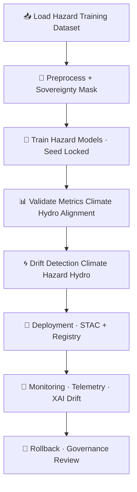

<div align="center">

# 🚀🌪️🧠 **Hazard Models MLOps Pipeline — KFM v11.2.2 (MAX MODE)**  
`docs/pipelines/ai/models/hazards/mlops/README.md`

**Purpose**  
Define the **end-to-end MLOps governance pipeline** for all KFM Hazard AI systems:  

🌪️ Tornado  
🧊 Hail  
🌊 Flood  
🔥 Fire Weather  
☀️ Heat  
❄️ Winter Weather  

The pipeline enforces **deterministic training**, **FAIR+CARE ethics**,  
**sovereignty screening**, **cross-domain environmental consistency**,  
**XAI integrity**, **STAC/PROV lineage**, and **CI-safe reproducibility**.

</div>

---

## 🧬🌪️🚀 **Hazard Model MLOps Architecture (Mermaid-Safe)**



---

## 🗂️📁🌪️ **Directory Layout (MAX MODE)**

```
docs/pipelines/ai/models/hazards/mlops/
    📄 README.md
    📄 training.md
    📄 validation.md
    📄 deployment.md
    📄 monitoring.md
    📄 drift-detection.md
    📄 rollbacks.md
    📁 telemetry/
        📄 README.md
    📁 xai/
        📄 README.md
```

---

# 🔍 **Overview — What Hazard MLOps Governs**

Hazard models must integrate across domains:

🧭 **Spatial grounding** — H3, terrain, landcover, watershed  
🌡️ **Climate drivers** — CAPE, CIN, shear, LLJ, lapse rates  
💧 **Hydrology drivers** — runoff, soil moisture, streamflow, drought  
🌪️🔥🌊❄️ **Hazard fingerprints** — tornado, hail, flood, fire-weather, heat, winter  
🔡 **Embeddings** — cross-domain latent signatures  
📖 **Narrative safety** — Focus Mode + Story Node v3 alignment  

Hazard MLOps ensures:

- Deterministic training  
- Accurate cross-domain coupling  
- Sovereignty-safe hazard reasoning  
- Environmental physical consistency  
- XAI transparency  
- Governance review readiness  

---

# 🧠⚙️ **Training Requirements (Summary)**

Hazard training MUST include:

- Seed-locked determinism  
- Climate + hydrology consistency  
- Physical-law alignment  
- Sovereignty masking  
- FAIR+CARE ethics  
- STAC/PROV lineage  
- Sustainability telemetry  

Models trained:

- Tornado Risk Model  
- Hail Severity Model  
- Flood Risk Model  
- Fire-Weather Model  
- Heat Risk Model  
- Winter Impact Model  

Outputs include:

```
hazard_model.pt
hazard_metadata.json
hazard_metrics.json
xai/
telemetry/
provenance/
stac/hazard-item.json
model-card.json
```

---

# 📊🧪 **Validation Requirements (Summary)**

Validation MUST confirm:

- RMSE / MAE / bias tolerances  
- Climate driver alignment  
- Hydrology coupling consistency  
- XAI correctness  
- Hazard–climate–hydrology physical coupling  
- Sovereignty-safe behavior  
- Telemetry + STAC + PROV correctness  

Outputs:

```
validation_report.json
promotion_decision.json
```

---

# 🌀📉 **Drift Detection Requirements**

Drift detection MUST track:

- Hazard field centroid drift  
- Climate–hazard signal drift  
- Hydrology–hazard signal drift  
- Tail-risk overlocalization  
- Sovereignty-region anomalies  
- XAI drift patterns  
- Sustainability drift  

Triggers:

- Retrain  
- Rollback  
- Governance review  

---

# 🚀🔐 **Deployment Requirements**

Deployment requires:

- Deterministic weights  
- Model-card JSON  
- STAC Item  
- PROV chain  
- CARE metadata  
- XAI assets  
- Telemetry bundles  
- Registry immutability  

Registry path:

```
hazards/models/<hazard_type>/v11.2.2/
```

---

# 📡🧠📈 **Monitoring Requirements**

Monitoring must track:

- Hazard risk output stability  
- Climate/hydro relevance  
- XAI drift  
- Spatial distribution safety  
- Sovereignty constraint adherence  
- Energy/carbon telemetry  

---

# ⏪🛡️ **Rollback Requirements**

Triggers:

- Hazard drift  
- Climate/hydro coupling failures  
- Sovereignty violations  
- XAI instability  
- Telemetry anomalies  
- Governance veto  

Rollback requires restoring:

```
hazard_model.pt
hazard-item.stac.json
xai/
provenance/
telemetry/
```

---

# 🔒⚙️ **Determinism Requirements**

Hazard MLOps MUST ensure:

- Seed-locked training  
- Hardware-invariant inference  
- CI-stable outputs  
- Ordered serialization  
- Deterministic STAC/PROV lineage  

---

# 🧪📏🔬 **CI Validation Requirements**

CI MUST validate:

- Hazard metrics  
- Climate/hydro coupling  
- Sovereignty compliance  
- XAI attribution correctness  
- STAC/PROV lineage  
- Telemetry correctness  
- Drift detection reproducibility  
- No sensitive-region leakage  

Failure → ❌ CI BLOCK.

---

# 🕰️📜 **Version History**

| Version | Date       | Notes                                     |
|---------|------------|-------------------------------------------|
| v11.2.2 | 2025-11-28 | Initial Hazard MLOps Pipeline (MAX MODE)  |

---

<div align="center">

### 🔗 Footer  
[🌪️ Back to Hazard Models](../README.md) ·  
[📊 Evaluation Report](../evaluation-report.md) ·  
[🏛 Governance](../../../../standards/governance/ROOT-GOVERNANCE.md)

</div>

