<div align="center">

# 🚀🌪️🧠 **Hazard Model Deployment — KFM v11.2.2 (MAX MODE)**  
`docs/pipelines/ai/models/hazards/mlops/deployment.md`

**Purpose**  
Define the governed, deterministic deployment process for all Hazard AI models:

🌪️ Tornado  
🧊 Hail  
🌊 Flood  
🔥 Fire-Weather  
☀️ Heat  
❄️ Winter-Weather  

Deployment ensures all hazard models are:  
**FAIR+CARE aligned**, **sovereignty-safe**, **physically consistent**, **version-pinned**,  
**XAI transparent**, and **STAC + PROV traceable**, with immutable registry guarantees.

</div>

---

## 🧬🚀🌪️ **Hazard Deployment Architecture (Mermaid-Safe)**

```mermaid
flowchart TD
    A[📦 Candidate Hazard Model Artifacts] --> B[📊 Validation Climate Hydro Hazard QA]
    B --> C[🔐 Integrity Hash + Signing]
    C --> D[🌐 Build Hazard STAC Item]
    D --> E[🛡️ CARE And Sovereignty Screening]
    E --> F[🚀 Push To Hazard Model Registry]
    F --> G[📡 Monitoring Activation]
    G --> H[🛑 Promotion Gate Or Rollback]
```



---

# 🔍 **Deployment Components**

---

## 📦 **1. Required Deployment Artifacts**

Each hazard deployment MUST include:

```
hazard_model.pt
hazard_metadata.json
hazard_metrics.json
xai/
provenance/
telemetry/
stac/hazard-item.json
model-card.json
```

All files MUST be deterministic and CI-stable.

---

## 📊 **2. Validation Requirements**

Before deployment, validation MUST confirm:

- Hazard metrics (RMSE, MAE, bias, calibration)  
- Climate-driver consistency (CAPE, CIN, LLJ, shear)  
- Hydrology-driver consistency (soil moisture, runoff, streamflow)  
- Physical consistency across domains  
- CAM / attention plausibility  
- Sovereignty-screened outputs  
- STAC & PROV completeness  
- CARE metadata integrity  

Outputs:

```
deployment_validation.json
promotion_decision.json
```

---

## 🔐 **3. Integrity Hash + Signing**

Deployment MUST generate:

- SHA-256 hash for all key artifacts  
- Optional Sigstore signature  
- Immutable registry flag  

Integrity metadata example:

```json
{
  "integrity": {
    "sha256": "<hash>",
    "signature": "<sigstore-signature>",
    "immutable": true
  }
}
```

---

## 🌐 **4. Hazard STAC Item Assembly**

The STAC Item MUST include:

```json
{
  "hazard:type": "tornado",
  "hazard:version": "v11.2.2",
  "fusion:dimension": 2048,
  "care:masking": "h3-hazard-generalized",
  "model:seed": 42
}
```

Required assets:

- `weights`  
- `xai`  
- `telemetry`  
- `provenance`  
- `model-card`  
- `metrics`  

---

## 🛡️ **5. FAIR+CARE + Sovereignty Screening**

Hazard deployment MUST:

- Mask sovereignty-sensitive outputs  
- Avoid hyperlocal hazard signals  
- Avoid cultural or demographic inference  
- Prevent environmental misrepresentation  
- Generalize hazard cues at H3-level in sensitive regions  

CARE block example:

```json
{
  "care": {
    "masking": "h3-hazard-generalized",
    "scope": "public-generalized",
    "notes": ["Deployment generalized for sovereignty protection"]
  }
}
```

---

## 🚀 **6. Push To Hazard Model Registry**

Registry path:

```
hazards/models/<hazard_type>/v11.2.2/
```

Registry entries MUST be immutable.

Deployment MUST update:

- STAC catalog  
- Provenance tree  
- Hazard model index  

---

## 📡 **7. Monitoring Activation**

Triggered immediately post-deployment:

- OTel spans  
- Hazard-XAI drift  
- Climate/hydro coupling checks  
- Spatial distribution safety  
- Sovereignty-zone safety  
- Energy/carbon telemetry  

---

## 🛑 **8. Promotion Gate Or Rollback**

Promotion requires:

- Passed validation  
- No drift detected  
- XAI stable  
- Sovereignty-safe  
- Telemetry sound  
- Provenance intact  

Rollback triggers:

- Drift  
- CARE/sov violation  
- Hazard-climate mismatch  
- Telemetry anomaly  
- Governance veto  

---

# 🔒⚙️ **Determinism Requirements**

Deployment MUST ensure:

- Seed-locked inference  
- Deterministic STAC/PROV lineage  
- Ordered serialization  
- Hardware-invariant behavior  
- CI reproducible  

---

# 🧪📏🔬 **CI Validation Requirements**

CI MUST validate:

- Hazard coherence  
- Climate/hydro coupling  
- Sovereignty masking  
- XAI correctness  
- STAC + PROV lineage  
- Telemetry correctness  
- Sustainability compliance  
- Determinism across runs  

Failure → ❌ CI BLOCK.

---

# 🕰️📜 **Version History**

| Version | Date       | Notes                                             |
|---------|------------|---------------------------------------------------|
| v11.2.2 | 2025-11-28 | Initial Hazard Deployment Document (MAX MODE)     |

---

<div align="center">

### 🔗 Footer  
[🌪️ Back to Hazard MLOps](../README.md) ·  
[📊 Validation](./validation.md) ·  
[🏛 Governance](../../../../../../../standards/governance/ROOT-GOVERNANCE.md)

</div>

