<div align="center">

# 🌀🌪️🧠 **Hazard Drift & Bias Detection — KFM v11.2.2 (MAX MODE)**  
`docs/pipelines/ai/models/hazards/mlops/drift-detection.md`

**Purpose**  
Define the **drift detection system** responsible for catching instability, bias,  
and sovereignty/cultural-safety violations across all Hazard AI models:

🌪️ Tornado  
🧊 Hail  
🌊 Flood  
🔥 Fire-Weather  
☀️ Heat  
❄️ Winter  

The drift engine ensures that hazard behavior remains:

- Physically consistent  
- Climate- and hydrology-coherent  
- Spatially safe (H3 generalization)  
- FAIR+CARE aligned  
- Sovereignty-compliant  
- XAI-stable  
- CI-reproducible  

</div>

---

## 🧬🌀🌪️ **Drift Detection Architecture (Mermaid-Safe)**

```mermaid
flowchart TD
    A[📥 Hazard Inference Snapshot] --> B[🌀 Hazard Field Drift Metrics]
    B --> C[🌡️ Climate Coupling Drift]
    C --> D[💧 Hydrology Coupling Drift]
    D --> E[🧭 Geospatial Drift Screening]
    E --> F[💡 XAI Drift Attribution]
    F --> G[⚖️ Sovereignty Drift Screening]
    G --> H[📜 STAC And PROV Drift Validation]
    H --> I[📦 Drift Report Assembly]
    I --> J[🛑 Rollback Recommendation Or Promotion Approval]
```



---

# 🔍 **Drift Categories & Requirements**

---

## 🌪️ **1. Hazard-Field Drift (Core)**

Tracks:

- Centroid drift  
- Tail-risk drift  
- Spatial-pattern deformation  
- Stability across inference windows  

Example:

```json
{
  "hazard_drift": {
    "centroid_shift": 0.0041,
    "tail_shift": 0.019
  }
}
```

---

## 🌡️ **2. Climate–Hazard Coupling Drift**

Checks whether:

- CAPE alignment remains stable  
- CIN logic remains consistent  
- LLJ + shear remain coupled  
- Climate anomalies do not overly distort hazard signals  

Example:

```json
{
  "climate_hazard_drift": {
    "cape_alignment_change": -0.04,
    "shear_alignment_change": +0.03
  }
}
```

---

## 💧 **3. Hydrology–Hazard Coupling Drift**

Important for flood, drought-linked fire-weather, and heat/humidity coupling.

Tracks:

- Soil moisture → hazard influence  
- Runoff → hazard changes  
- Streamflow → hazard relations  
- Drought-displacement patterns  

Example:

```json
{
  "hydro_hazard_drift": {
    "runoff_alignment_change": 0.05,
    "soil_moisture_alignment_change": -0.03
  }
}
```

---

## 🧭 **4. Geospatial Drift Screening**

Detects:

- H3 region deviation  
- Sovereignty-zone risk drift  
- Terrain/landcover relevance shifts  
- Spatial CAM displacement  

Must include sovereignty masking rules.

---

## 💡 **5. XAI Drift**

Drift engine MUST evaluate:

- Importance vector drift  
- CAM map displacement  
- Hazard attention entropy change  
- Cross-domain attribution shifts  

Example:

```json
{
  "xai_drift": {
    "importance_shift": {
      "climate": -0.02,
      "hydrology": +0.01,
      "spatial": +0.01,
      "hazard": +0.00
    },
    "cam_shift": 0.21
  }
}
```

---

## ⚖️ **6. Sovereignty Drift Screening**

Critical for hazardous domains.

Detects:

- Hazard overspecification in tribal regions  
- Cultural-safety violations  
- Spatial over-localization  
- Climate/hazard coupling anomalies tied to sovereignty zones  

CARE block:

```json
{
  "care": {
    "masking": "h3-hazard-generalized",
    "scope": "public-generalized",
    "notes": ["Drift detected in sovereignty-sensitive regions"]
  }
}
```

---

## 📜 **7. STAC + PROV Drift Validation**

Validates:

- STAC version alignment  
- PROV lineage continuity  
- XAI–STAC linkage  
- Climate + hydro references  
- Hazard metadata correctness  

Example:

```json
{
  "stac_prov_validation": {
    "valid": true,
    "missing": []
  }
}
```

---

## 📦 **8. Drift Report Assembly**

Drift engine emits:

```
drift_report.json
hazard_drift.json
climate_hazard_drift.json
hydrology_hazard_drift.json
geo_drift.json
xai_drift.json
sovereignty_drift.json
stac_prov_drift.json
```

All MUST be sovereignty-safe and CI validated.

---

## 🛑 **9. Rollback / Promotion**

Rollback triggers:

- Climate/hydro/hazard mismatch  
- Sovereignty drift violation  
- Hazard-field instability  
- Unsafe XAI drift  
- Hazard-domain misalignment  
- Governance veto  

Promotion allowed only if:

- Drift under threshold  
- Sovereignty safe  
- XAI stable  
- STAC/PROV verified  
- Telemetry consistent  

---

# 🔒⚙️ **Determinism Requirements**

Drift detection MUST be:

- Seed-locked  
- Hardware invariant  
- CI reproducible  
- Order-stable  
- Deterministic in all domain calculations  

---

# 🧪📏🔬 **CI Validation Requirements**

CI MUST validate:

- Drift metric determinism  
- Climate/hydro/hazard coupling  
- XAI drift correctness  
- Sovereignty-mask enforcement  
- STAC + PROV chain  
- No sensitive-region leakage  
- Sustainability telemetry correctness  
- Reproducibility across runs  

Failure → ❌ CI BLOCK.

---

# 🕰️📜 Version History

| Version | Date       | Notes                                              |
|---------|------------|----------------------------------------------------|
| v11.2.2 | 2025-11-28 | Initial Hazard Drift Detection (MAX MODE)          |

---

<div align="center">

### 🔗 Footer  
[🌪️ Back to Hazard MLOps](../README.md) ·  
[📡 Telemetry](../telemetry/README.md) ·  
[🏛 Governance](../../../../../../../standards/governance/ROOT-GOVERNANCE.md)

</div>

