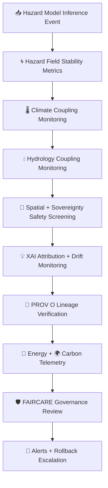

<div align="center">

# 📡🌪️🧠 **Hazard Model Monitoring — KFM v11.2.2 (MAX MODE)**  
`docs/pipelines/ai/models/hazards/mlops/monitoring.md`

**Purpose**  
Define the **continuous monitoring subsystem** for all Hazard AI models:

🌪️ Tornado  
🧊 Hail  
🌊 Flood  
🔥 Fire-Weather  
☀️ Heat  
❄️ Winter  

Monitoring enforces:  
**drift detection**, **cross-domain environmental coherence**,  
**XAI explainability integrity**, **sovereignty safety**,  
**FAIR+CARE compliance**, **STAC/PROV lineage correctness**,  
and **sustainability governance**.

</div>

---

## 🧬📡🌪️ **Hazard Monitoring Architecture (Mermaid-Safe)**



---

# 🔍 **Monitoring Components**

---

## 🌀 **1. Hazard Field Stability Metrics**

Monitoring tracks:

- Centroid drift  
- Tail risk expansion  
- Spatial pattern distortion  
- Probabilistic calibration drift  
- Physical consistency of hazard signatures  

Example:

```json
{
  "hazard_monitoring": {
    "centroid_drift": 0.0038,
    "tail_shift": 0.017
  }
}
```

---

## 🌡️ **2. Climate Coupling Monitoring**

Ensures hazard predictions remain consistent with:

- CAPE  
- CIN  
- Shear  
- LLJ  
- LCL  
- Temperature/dewpoint gradients  
- Climate anomalies  

Example:

```json
{
  "climate_coupling": {
    "cape_alignment": 0.91,
    "shear_alignment": 0.87,
    "llj_alignment": 0.89
  }
}
```

---

## 💧 **3. Hydrology Coupling Monitoring**

Tracks:

- Soil moisture → flood/humidity influence  
- Runoff → flood logic  
- Streamflow → flood/river logic  
- Drought index → fire-weather/heat logic  

Example:

```json
{
  "hydrology_coupling": {
    "soil_moisture_alignment": 0.79,
    "streamflow_alignment": 0.82,
    "runoff_alignment": 0.76
  }
}
```

---

## 🧭 **4. Spatial + Sovereignty Safety Screening**

Monitoring MUST ensure:

- H3 masking in all sovereignty-sensitive zones  
- No hyperlocal hazard signals  
- Terrain/landcover/watershed fidelity  
- Cultural-site masking  
- Sovereignty boundary respect  

```json
{
  "sovereignty": {
    "safe": true,
    "h3_masking": "h3-hazard-generalized"
  }
}
```

---

## 💡 **5. XAI Attribution + Drift Monitoring**

Tracks:

- Importance vector drift  
- CAM spatial displacement  
- Hazard-attention entropy  
- Hazard→climate/hydro misalignment  
- Narrative-coupled hazard attribution (Focus Mode)  

```json
{
  "xai_drift": {
    "importance_shift": {
      "climate": -0.03,
      "hydrology": +0.01,
      "spatial": +0.01,
      "hazard": +0.01
    },
    "cam_shift": 0.25
  }
}
```

---

## 📜 **6. PROV-O Lineage Verification**

Monitoring must confirm:

- Model-version correctness  
- Weight + STAC linkage integrity  
- XAI → STAC → PROV consistency  
- No broken provenance chains  

Example:

```json
{
  "prov_check": {
    "valid": true,
    "issues": []
  }
}
```

---

## 🔋🌍 **7. Sustainability Telemetry**

Tracks:

- Energy used (Wh)  
- Carbon emitted (gCO₂e)  
- FLOPs  
- CI-run telemetry  
- Inference-level energy budgets  

Example:

```json
{
  "energy": {
    "wh": 0.12,
    "carbon_gco2e": 0.02
  }
}
```

---

## 🛡️⚖️ **8. FAIR+CARE Governance Review**

Ensures:

- No culturally unsafe hazard outputs  
- No sensitive-region leakage  
- Proper CARE tagging  
- Tribal-territory hazard generalization  
- Adherence to Data Contract v3  

Example:

```json
{
  "care": {
    "masking": "h3-hazard-generalized",
    "scope": "public-generalized",
    "safe": true
  }
}
```

---

## 🚨 **9. Alerts + Rollback Escalation**

Alerts may be triggered for:

- Drift > threshold  
- Sovereignty violations  
- XAI anomalies  
- Climate/hydro/hazard decoupling  
- Telemetry irregularities  
- Governance veto  

Escalation path:

- Hazard MLOps Team  
- FAIR+CARE Council  
- Sovereignty Review Board  

---

# 🧪📏🔬 **CI Validation Requirements**

CI MUST validate:

- Deterministic monitoring metrics  
- XAI drift correctness  
- Hazard–climate–hydrology consistency  
- Sovereignty masking  
- FAIR+CARE compliance  
- Telemetry schema  
- STAC + PROV integrity  
- Sustainability audit fields  
- No sensitive region leakage  

Failure → ❌ CI BLOCK.

---

# 🕰️📜 Version History

| Version | Date       | Notes                                           |
|---------|------------|-------------------------------------------------|
| v11.2.2 | 2025-11-28 | Initial Hazard Monitoring Documentation (MAX MODE) |

---

<div align="center">

### 🔗 Footer  
[🌪️ Back to Hazard MLOps](../README.md) ·  
[🌀 Drift Detection](./drift-detection.md) ·  
[🏛 Governance](../../../../../../../standards/governance/ROOT-GOVERNANCE.md)

</div>

