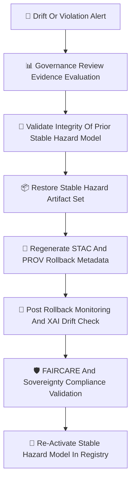

<div align="center">

# ⏪🌪️🧠 **Hazard Model Rollbacks — KFM v11.2.2 (MAX MODE)**  
`docs/pipelines/ai/models/hazards/mlops/rollbacks.md`

**Purpose**  
Define the **governance-controlled rollback system** for all Hazard AI models:  
🌪️ Tornado • 🧊 Hail • 🌊 Flood • 🔥 Fire-Weather • ☀️ Heat • ❄️ Winter  

Hazard rollbacks ensure **safety, stability, sovereignty compliance, cultural neutrality, drift correction,  
and environmental consistency** across all hazard predictions and downstream integrations (Focus Mode, StoryNode v3, etc.).

Rollbacks protect against:  
🌀 Drift → instability  
🌡️ Climate–hazard misalignment  
💧 Hydrology–hazard inconsistencies  
🧭 Geospatial risks in sovereignty zones  
💡 Unsafe XAI attribution  
🛡️ FAIR+CARE violations  

</div>

---

## 🧬⏪🌪️ **Hazard Rollback Architecture (Mermaid-Safe)**



---

# 🔍 **Hazard Rollback Triggers**

Rollback MUST occur when **any** violation happens:

---

## 🌪️ **1. Hazard Prediction Instability**
- Centroid drift > threshold  
- Tail-hazard expansion  
- Unrealistic spatial deformation  
- Temporal instability across inference windows  

---

## 🌡️ **2. Climate–Hazard Coupling Failure**
- CAPE/CIN/shear/LLJ decoupling  
- Climate anomaly over-amplification  
- Dewpoint gradient misalignment  

---

## 💧 **3. Hydrology–Hazard Coupling Failure**
- Soil-moisture → hazard mismatch  
- Runoff/streamflow inconsistency  
- Drought → fire-weather coupling breakdown  

---

## 🧭 **4. Spatial + Sovereignty Violations**
- Hazard over-localization in tribal regions  
- CAM hotspots in sovereignty zones  
- Terrain/landcover/watershed misalignment  

---

## 💡 **5. XAI Drift / Attribution Failure**
- Importance vector divergence  
- CAM displacement  
- Attention entropy spikes  
- Cross-domain attribution anomalies  

---

## 🛡️ **6. FAIR+CARE Violations**
- Cultural-safety violations  
- Sensitive-location leakage  
- Inference implying demographic/cultural risk  
- Failures in masking  

---

# 📦 **Rollback Process**

---

## 📁 **1. Evidence Collection**

All signals MUST be aggregated:

```
drift_report.json
climate_hazard_drift.json
hydrology_hazard_drift.json
geo_drift.json
xai_drift.json
sovereignty_drift.json
telemetry_snapshot.json
hazard_drift.json
```

---

## 🏛️ **2. Governance Review**

Rollback requires approval from:

- Hazard AI Working Group  
- FAIR+CARE Council  
- Sovereignty Review Board  

Produces:

```
rollback_decision.json
```

---

## 🔐 **3. Validate Prior Stable Model Integrity**

Must verify:

- SHA-256 hashes  
- Model-card correctness  
- STAC item correctness  
- Provenance chain intact  
- Telemetry completeness  
- Deterministic reproduction  

---

## 📦 **4. Restore Stable Hazard Model Artifacts**

Restore the *entire* bundle:

```
hazard_model.pt
hazard-item.stac.json
xai/
provenance/
telemetry/
model-card.json
```

Partial rollback is forbidden.

---

## 📜 **5. Regenerate Rollback Metadata (STAC + PROV)**

Example block:

```json
{
  "rollback": {
    "reason": "climate_hazard_drift_exceeded",
    "restored_version": "v11.2.1",
    "seed": 42
  }
}
```

Includes updated CARE + sovereignty metadata.

---

## 📡 **6. Post-Rollback Monitoring**

Must confirm:

- Stability restored  
- No drift or bias  
- Climate/hydro/hazard consistency  
- XAI attribution stability  
- Sovereignty protections intact  
- Telemetry normalized  

---

## 🛡️ **7. CARE + Sovereignty Verification**

Final check MUST ensure:

```json
{
  "care": {
    "masking": "h3-hazard-generalized",
    "scope": "public-generalized",
    "notes": ["Rollback applied due to sovereignty-zone drift"]
  }
}
```

---

## 🎯 **8. Reactivate Stable Hazard Model**

Registry entries become:

```
active = v11.2.1
rollback_of = v11.2.2
```

Enhanced monitoring runs for 48 hours.

---

# 🔒⚙️ **Determinism Requirements**

Rollback MUST ensure:

- Deterministic reproduction  
- Seed-locked behavior  
- STAC/PROV match prior stable version  
- Ordered JSON serialization  
- Hardware invariance  

---

# 🧪📏🔬 **CI Validation Requirements**

CI MUST validate:

- Correct rollback artifacts  
- Drift metrics  
- Climate/hydro/hazard coupling restoration  
- Sovereignty masking  
- XAI stability  
- STAC + PROV alignment  
- Telemetry correctness  
- No sensitive-region leakage  

Failure → ❌ CI BLOCK.

---

# 🕰️📜 **Version History**

| Version | Date       | Notes                                              |
|---------|------------|----------------------------------------------------|
| v11.2.2 | 2025-11-28 | Initial Hazard Model Rollback System (MAX MODE)     |

---

<div align="center">

### 🔗 Footer  
[🌪️ Back to Hazard MLOps](../README.md) ·  
[📡 Monitoring](./monitoring.md) ·  
[🏛 Governance](../../../../../../../standards/governance/ROOT-GOVERNANCE.md)

</div>

