<div align="center">

# 📡🌪️🧠 **Hazard MLOps Telemetry — KFM v11.2.2 (MAX MODE)**  
`docs/pipelines/ai/models/hazards/mlops/telemetry/README.md`

**Purpose**  
Define the **telemetry subsystem** that tracks all hazard model behavior, including:

🌪️ Tornado Risk  
🧊 Hail Severity  
🌊 Flood Risk  
🔥 Fire-Weather  
☀️ Heat  
❄️ Winter  

Telemetry covers:

🌐 OTel spans  
🌀 Drift detection signals  
💡 XAI drift + attribution  
🌡️ Climate coupling integrity  
💧 Hydrology coupling integrity  
🧭 Geospatial + sovereignty safety  
📜 PROV lineage  
🔋 Energy + 🌍 carbon sustainability  
🛡️ FAIR+CARE compliance  

This telemetry is consumed by governance review, CI/CD gates, rollout decisions, and Focus Mode integration.

</div>

---

## 🗂️📁📡 **Directory Layout (MAX MODE)**

```
docs/pipelines/ai/models/hazards/mlops/telemetry/
    📄 README.md
    📄 example-span.json
    📄 example-hazard-output-telemetry.json
    📄 example-xai-drift.json
    📄 example-climate-coupling.json
    📄 example-hydro-coupling.json
    📄 example-energy.json
    📄 example-carbon.json
    📄 example-provenance.json
```

---

## 🧬📡🌪️ **Hazard Telemetry Architecture (Mermaid-Safe)**

```mermaid
flowchart TD
    A[📥 Hazard Model Event] --> B[🌐 OTel Span]
    B --> C[🌡️ Climate Coupling Telemetry]
    C --> D[💧 Hydrology Coupling Telemetry]
    D --> E[🌀 Hazard Drift Signals]
    E --> F[💡 XAI Drift And Attribution Telemetry]
    F --> G[🧭 Geospatial And Sovereignty Screening]
    G --> H[📜 PROV O Lineage Assembly]
    H --> I[🔋 Energy And 🌍 Carbon Accounting]
    I --> J[📦 Telemetry Bundle Assembly]
    J --> K[💾 Persist Telemetry Artifacts]
```



---

# 🔍 **Telemetry Components**

---

## 🌐 **1. OTel Span Requirements**

Must include:

- Domain (tornado/hail/flood/fire/heat/winter)  
- Model version  
- STAC item reference  
- Latency  
- Fusion + climate + hydro context used  
- Seed for deterministic replay  

Example:

```json
{
  "otel": {
    "operation": "hazard_inference",
    "hazard_type": "tornado",
    "latency_ms": 18,
    "seed": 42
  }
}
```

---

## 🌡️ **2. Climate Coupling Telemetry**

Hazard models MUST report:

```json
{
  "climate_coupling": {
    "cape_alignment": 0.91,
    "shear_alignment": 0.88,
    "dewpoint_gradient_alignment": 0.84
  }
}
```

Tracks climate-driver → hazard consistency.

---

## 💧 **3. Hydrology Coupling Telemetry**

Important for flood, fire-weather (drought), and heat–humidity interactions.

```json
{
  "hydrology_coupling": {
    "soil_moisture_alignment": 0.77,
    "runoff_alignment": 0.82,
    "streamflow_alignment": 0.79
  }
}
```

---

## 🌀 **4. Hazard Drift Signals**

Telemetry MUST detect:

- Centroid drift  
- Tail hazard expansion  
- Overlocalization  
- Climate–hazard shift  
- Hydro–hazard shift  
- Sensitive-region anomalies  

Example:

```json
{
  "drift": {
    "centroid_shift": 0.004,
    "tail_risk_shift": 0.018
  }
}
```

---

## 💡 **5. XAI Drift Telemetry**

XAI telemetry MUST track:

- Importance drifts  
- CAM displacement  
- Hazard attention entropy  
- Cross-domain attribution anomalies  

```json
{
  "xai_drift": {
    "importance_shift": {
      "climate": -0.02,
      "hydrology": +0.01,
      "spatial": +0.01,
      "hazard": +0.00
    },
    "cam_shift": 0.22
  }
}
```

---

## 🧭 **6. Geospatial & Sovereignty Screening**

Hazard telemetry MUST ensure:

- H3 masking in sovereignty zones  
- Avoidance of hyperlocalized hazard signals  
- Terrain/landcover/watershed consistency  
- Cultural-safety screening  

```json
{
  "sovereignty": {
    "h3_masking": "h3-hazard-generalized",
    "safe": true
  }
}
```

---

## 📜 **7. PROV Lineage**

Every telemetry artifact MUST contain PROV:

```json
{
  "prov": {
    "wasGeneratedBy": "urn:kfm:activity:telemetry:hazard_inference_v11_2_2",
    "used": [
      "urn:kfm:model:hazard_tornado_v11_2_2",
      "urn:kfm:data:climate_item",
      "urn:kfm:data:hydrology_item"
    ],
    "agent": "urn:kfm:service:hazard-telemetry-engine"
  }
}
```

---

## 🔋🌍 **8. Sustainability Telemetry**

Tracks:

```json
{
  "energy": {
    "wh": 0.13,
    "carbon_gco2e": 0.02
  }
}
```

And hardware utilization.

---

## 📦 **9. Telemetry Bundle Assembly**

Bundles MUST include:

```
otel/
climate/
hydrology/
drift/
xai/
sovereignty/
energy/
carbon/
prov/
hazard_event.json
```

Deterministic and CI-auditable.

---

# 🧪📏🔬 **CI Validation Requirements**

CI MUST validate:

- Telemetry schema correctness  
- Climate/hydro coupling signals  
- Drift metrics determinism  
- XAI drift reproducibility  
- Sovereignty masking correctness  
- FAIR+CARE enforcement  
- STAC linkage  
- PROV lineage integrity  
- Sustainability telemetry validity  
- No sensitive-region leakage  

Failure → ❌ CI BLOCK.

---

# 🕰️📜 Version History

| Version | Date       | Notes                                                        |
|---------|------------|--------------------------------------------------------------|
| v11.2.2 | 2025-11-28 | Initial Hazard MLOps Telemetry Documentation (MAX MODE)       |

---

<div align="center">

### 🔗 Footer  
[🌪️ Back to Hazard MLOps](../README.md) ·  
[💡 XAI](../xai/README.md) ·  
[🏛 Governance](../../../../../../../standards/governance/ROOT-GOVERNANCE.md)

</div>

