<div align="center">

# 🧠🌪️🚀 **Hazard Model Training — KFM v11.2.2 (MAX MODE)**  
`docs/pipelines/ai/models/hazards/mlops/training.md`

**Purpose**  
Define the **deterministic, sovereignty-safe, FAIR+CARE–aligned training pipeline**  
for all KFM Hazard AI models across:

🌪️ Tornado  
🧊 Hail  
🌊 Flood  
🔥 Fire-Weather  
☀️ Heat  
❄️ Winter  

Hazard training must integrate **climate drivers**, **hydrology signals**, **embedding vectors**,  
**story/narrative safety constraints (Focus Mode)**, and **sovereignty protection rules**,  
while maintaining strict reproducibility and auditability (STAC + PROV).

</div>

---

## 🧬🚀🌪️ **Hazard Training Architecture (Mermaid-Safe)**

```mermaid
flowchart TD
    A[📥 Load Hazard Training Dataset] --> B[🧽 Preprocess Normalize Sovereignty Mask]
    B --> C[🧠 Train Hazard Model Deterministic Seed Locked]
    C --> D[🌡️ Climate Coupling Evaluation During Training]
    C --> E[💧 Hydrology Coupling Evaluation During Training]
    C --> F[🔡 Embedding Feature Integration]
    F --> G[📊 Compute Metrics Calibration Stability]
    G --> H[💡 Generate XAI Attribution CAM Attention]
    H --> I[📜 Build STAC + PROV Lineage]
    I --> J[🔋 Record Energy And 🌍 Carbon Telemetry]
    J --> K[🛡️ FAIRCARE And Sovereignty Review]
    K --> L[📦 Emit Hazard Training Artifacts]
```



---

# 🔍 **Training Components**

---

## 📥 **1. Training Dataset Requirements**

Hazard training MUST draw from multi-domain STAC-indexed datasets:

### Required Inputs:
- **Climate STAC Items**  
  - CAPE, CIN, LLJ, shear, LCL, temp, dewpoint, anomalies  
- **Hydrology STAC Items**  
  - Soil moisture, runoff, streamflow, drought index  
- **Spatial STAC Items**  
  - Terrain, landcover, watershed, H3-indexed regions  
- **Environmental Event STAC Items**  
  - Hail swaths, tornado paths (generalized), winter weather indices  
- **Embeddings**  
  - Climate/hydro/hazard/spatial embeddings for cross-domain learning  

### Governance MUST ensure:
- Sovereignty masking of sensitive regions  
- H3 generalization on hazard-impact areas  
- Strict filtering of culturally sensitive geographies  
- CARE metadata applied to all upstream training items  

---

## 🧽 **2. Preprocessing & Sovereignty Masking**

Preprocessing MUST:
- Normalize all climate/hydro/hazard predictors  
- Apply sovereignty masking (H3 generalization, downweighting)  
- Redact culturally sensitive environmental patterns  
- Ensure spatial alignment with DEM/landcover/watersheds  
- Store all operations in:

```
preprocessing_summary.json
normalization_params.json
sovereignty_mask_log.json
```

---

## 🧠 **3. Deterministic Hazard Model Training**

Training MUST be:
- Seed-locked (`seed: 42`)  
- Hardware-invariant  
- FP stable  
- Batch-order deterministic  

Outputs:

```
hazard_model.pt
hazard_training_metrics.json
hazard_metadata.json
```

Hazard models include:
- Tornado Risk Model  
- Hail Severity Model  
- Flood Risk Model  
- Fire-Weather Danger Model  
- Heat Risk Model  
- Winter Impact Model  

---

## 🌡️ **4. Climate Coupling Evaluation (During Training)**

Hazard training MUST continuously validate alignment between hazard signals and:

- CAPE  
- CIN  
- LLJ  
- Shear  
- Temperature & dewpoint gradients  
- Climate anomalies  

Climate–hazard misalignment is a **training failure**.

---

## 💧 **5. Hydrology Coupling Evaluation**

Critical for:
- Flood  
- Fire-weather (drought)  
- Heat/humidity stress  

Hydrology checks MUST confirm:
- Soil moisture → hazard relevance  
- Runoff consistency  
- Streamflow alignment  
- Drought index integrity  

---

## 🔡 **6. Embedding Feature Integration**

Training MUST use domain embeddings:

- Spatial embeddings  
- Climate embeddings  
- Hydrology embeddings  
- Hazard embeddings  
- Fusion embeddings (Focus Mode)  

Embedding integration MUST be:
- Deterministic  
- Sovereignty-aware  
- XAI-compatible  

---

## 📊 **7. Metrics & Calibration**

Training MUST compute:
- RMSE / MAE  
- Bias  
- Probability calibration  
- Reliability curves  
- Hazard-field stability  
- Cross-domain alignment scores  

Stored in:

```
metrics/
    hazard_training_metrics.json
    hazard_alignment.json
```

---

## 💡 **8. XAI Artifact Generation**

Training MUST produce:
- Feature-importance vectors  
- CAM maps (flood, tornado, snow bands, hail growth zones)  
- Climate-driver attribution  
- Hydrology-driver attribution  
- Hazard-driver attribution  

All XAI MUST be:
- Deterministic  
- CARE-screened  
- Sovereignty-generalized  
- STAC-XAI compatible  

---

## 📜 **9. STAC + PROV Lineage**

Required:

```json
{
  "prov": {
    "wasGeneratedBy": "urn:kfm:activity:training:hazard_tornado_v11_2_2",
    "used": [
      "urn:kfm:data:climate_item",
      "urn:kfm:data:hydrology_item",
      "urn:kfm:data:terrain_item"
    ],
    "agent": "urn:kfm:service:hazard-training-engine"
  }
}
```

STAC entries MUST include:
- Hazard type  
- Domain drivers  
- Embeddings  
- CARE block  
- Telemetry pointers  

---

## 🔋🌍 **10. Sustainability Telemetry**

Training MUST log:
- Wh  
- gCO₂e  
- FLOPs  
- GPU/CPU usage  
- Sustainability checkpoints  

Example:

```json
{
  "energy": {"wh": 2.91},
  "carbon": {"gco2e": 0.26}
}
```

---

## 🛡️⚖️ **11. FAIR+CARE + Sovereignty Governance**

Training MUST:
- Mask all sovereignty zones  
- Prevent hazard over-localization  
- Avoid deterministic hazard assertions  
- Maintain cultural safety  
- Apply CARE labels  
- Follow Data Contract v3  

CARE example:

```json
{
  "care": {
    "masking": "h3-hazard-generalized",
    "scope": "public-generalized"
  }
}
```

---

## 📦 **12. Final Hazard Training Artifacts**

Emitted artifacts:

```
hazard_model.pt
hazard_training_metrics.json
hazard_metadata.json
normalization_params.json
preprocessing_summary.json
xai/
provenance/
telemetry/
stac/hazard-item.json
model-card.json
```

All MUST be deterministic and CI-safe.

---

# 🧪📏🔬 **CI Validation Requirements**

CI MUST validate:
- Deterministic training reproduction  
- Hazard–climate–hydrology alignment  
- Sovereignty masking correctness  
- FAIR+CARE compliance  
- XAI output correctness  
- STAC & PROV lineage integrity  
- Sustainability telemetry presence  
- No sensitive-region leakage  

Failure → ❌ CI BLOCK.

---

# 🕰️📜 **Version History**

| Version | Date       | Notes                                            |
|---------|------------|--------------------------------------------------|
| v11.2.2 | 2025-11-28 | Initial Hazard Training Documentation (MAX MODE) |

---

<div align="center">

### 🔗 Footer  
[🌪️ Back to Hazard MLOps](../README.md) ·  
[📊 Validation](./validation.md) ·  
[🏛 Governance](../../../../../../../standards/governance/ROOT-GOVERNANCE.md)

</div>

