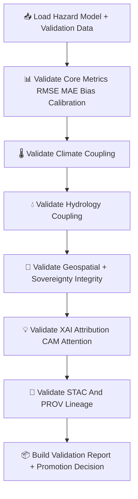

<div align="center">

# 📊🌪️🧠 **Hazard Model Validation — KFM v11.2.2 (MAX MODE)**  
`docs/pipelines/ai/models/hazards/mlops/validation.md`

**Purpose**  
Define the strict validation pipeline that all Hazard AI models must pass before deployment:

🌪️ Tornado  
🧊 Hail  
🌊 Flood  
🔥 Fire-Weather  
☀️ Heat  
❄️ Winter  

Validation enforces:  
**physical-law consistency**, **climate–hazard–hydrology alignment**,  
**XAI integrity**, **sovereignty protections**, **FAIR+CARE compliance**,  
**deterministic outputs**, and **complete STAC + PROV lineage**.

</div>

---

## 🧬📊🌪️ **Hazard Validation Architecture (Mermaid-Safe)**



---

# 🔍 **Validation Steps**

---

## 📊 **1. Core Hazard Metrics**

Check:

- RMSE / MAE  
- Bias  
- Spread / variance  
- Reliability curves  
- Score calibration  
- Hazard footprint stability  

Example:

```json
{
  "metrics": {
    "rmse": 1.81,
    "mae": 1.12,
    "bias": -0.02
  }
}
```

---

## 🌡️ **2. Climate Coupling Validation**

Hazard predictions MUST remain coherent with:

- CAPE  
- CIN  
- LLJ  
- Shear  
- LCL  
- Temperature / dewpoint gradients  
- Climate anomalies  

Example:

```json
{
  "climate_alignment": {
    "cape_ok": true,
    "shear_ok": true,
    "llj_ok": true
  }
}
```

---

## 💧 **3. Hydrology Coupling Validation**

Especially important for flood, fire-weather, and heat/humidity interplay.

Tracks:

- Soil moisture  
- Runoff  
- Streamflow  
- Drought index  

Example:

```json
{
  "hydro_alignment": {
    "runoff_ok": true,
    "drought_ok": true
  }
}
```

---

## 🧭 **4. Geospatial + Sovereignty Validation**

Ensures:

- No hyperlocal hazard concentration in sovereign territories  
- Terrain/landcover/watershed consistency  
- Proper H3 generalization  
- Cultural-site avoidance  
- No geospatial signature leakage  

Example:

```json
{
  "sovereignty": {
    "safe": true,
    "masking": "h3-hazard-generalized"
  }
}
```

---

## 💡 **5. XAI Attribution Validation**

Tracks:

- Importance vector correctness  
- Climate/hydro hazard attribution consistency  
- CAM focus stability  
- Hazard-attention entropy  
- Narrative-hazard alignment (Focus Mode interactions)  

Example:

```json
{
  "xai": {
    "importance": {
      "climate": 0.32,
      "hydrology": 0.20,
      "spatial": 0.15,
      "hazard": 0.33
    }
  }
}
```

---

## 📜 **6. STAC + PROV Validation**

Ensures:

- STAC Item matches model  
- All assets present  
- PROV lineage intact  
- Telemetry bundle aligned  
- XAI provenance intact  
- Dimension, domain, and seed metadata correct  

Example:

```json
{
  "stac_consistency": {
    "valid": true,
    "missing": []
  }
}
```

---

## 📦 **7. Final Validation Report + Promotion Decision**

Validation outputs:

```
validation_report.json
hazard_climate_alignment.json
hazard_hydro_alignment.json
hazard_sovereignty_safety.json
hazard_xai_validation.json
promotion_decision.json
```

Promotion allowed only if:

- All validation metrics pass  
- Hazard-field stable  
- Climate/hydro aligned  
- XAI safe  
- Sovereignty protections active  
- STAC/PROV references clean  
- Telemetry passes CI  

---

# 🔒⚙️ **Determinism Requirements**

Hazard validation MUST be:

- Seed-locked  
- Hardware-invariant  
- CI reproducible  
- Order-stable  
- Deterministic across all environmental inputs  

---

# 🧪📏🔬 **CI Validation Requirements**

CI MUST confirm:

- Metric correctness  
- Climate/hydro coupling  
- Sovereignty compliance  
- XAI validity  
- Telemetry correctness  
- STAC lineage  
- FAIR+CARE compliance  
- No sensitive-region leakage  

Failure → ❌ CI BLOCK.

---

# 🕰️📜 Version History

| Version | Date       | Notes                                           |
|---------|------------|-------------------------------------------------|
| v11.2.2 | 2025-11-28 | Initial Hazard Model Validation (MAX MODE)      |

---

<div align="center">

### 🔗 Footer  
[🌪️ Back to Hazard MLOps](../README.md) ·  
[🚀 Deployment](./deployment.md) ·  
[🏛 Governance](../../../../../../../standards/governance/ROOT-GOVERNANCE.md)

</div>

