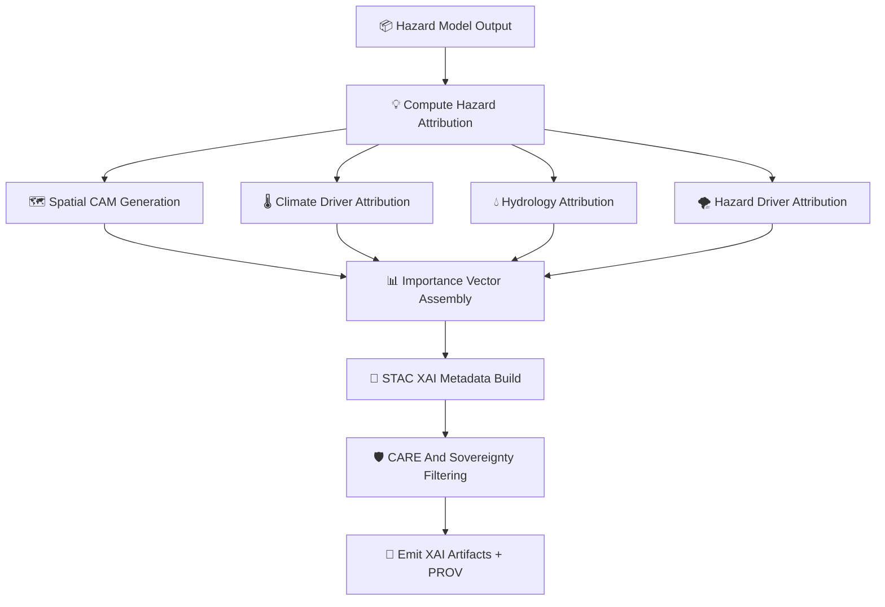

<div align="center">

# 💡🌪️🧠 **Hazard MLOps XAI Subsystem — KFM v11.2.2 (MAX MODE)**  
`docs/pipelines/ai/models/hazards/mlops/xai/README.md`

**Purpose**  
Define the **Explainability (XAI) subsystem** for all hazard models in the KFM ecosystem:  

🌪️ Tornado • 🧊 Hail • 🌊 Flood • 🔥 Fire-Weather • ☀️ Heat • ❄️ Winter  

The XAI layer ensures hazard inferences are:

- 🌡️ Climate-aware  
- 💧 Hydrology-aware  
- 🧭 Spatially grounded  
- 🛡️ FAIR+CARE compliant  
- ⚖️ Sovereignty-safe  
- 💡 Transparent & deterministic  
- 📜 Fully STAC + PROV traceable  

</div>

---

## 🗂️📁💡 **Directory Layout (MAX MODE)**

```
docs/pipelines/ai/models/hazards/mlops/xai/
    📄 README.md
    📄 example_importance.json
    📄 example_cam_spatial.json
    📄 example_cam_flood.json
    📄 example_attention_heat.json
    📄 example_cross_domain_attribution.json
    📄 example_provenance.json
```

---

## 🧬💡🌪️ **Hazard XAI Architecture (Mermaid-Safe)**



---

# 🔍 **XAI Components**

---

## 💡 **1. Core Hazard Attribution Layer**

Each hazard model MUST generate a deterministic cross-domain importance vector:

```json
{
  "xai": {
    "importance": {
      "climate": 0.33,
      "hydrology": 0.18,
      "spatial": 0.16,
      "hazard": 0.33
    },
    "seed": 42
  }
}
```

Domains:

- Climate drivers  
- Hydrology factors  
- Spatial features  
- Hazard-specific predictors  

---

## 🗺️ **2. Spatial CAM Layers**

Spatial CAM MUST reveal hazard-driving terrain patterns while being sovereignty-safe.

Examples:

- Topographic funneling for tornado risk  
- Drainage basin accumulation for flood risk  
- Vegetation dryness for fire-weather  

Outputs are typically **COG GeoTIFFs**.

---

## 🌡️ **3. Climate Attribution**

Hazard XAI MUST show alignment with:

- CAPE  
- CIN  
- Shear  
- LLJ  
- LCL  
- Temperature/dewpoint gradients  
- Climate anomalies  

Example:

```json
{
  "climate_attribution": {
    "cape": 0.44,
    "shear": 0.31,
    "llj": 0.15,
    "dewpoint_gradient": 0.10
  }
}
```

---

## 💧 **4. Hydrology Attribution**

Important for:

- Flood risk  
- Fire-weather (drought)  
- Heat index humidity effects  

Example:

```json
{
  "hydrology_attribution": {
    "soil_moisture": 0.27,
    "streamflow": 0.19,
    "runoff": 0.22
  }
}
```

---

## 🌪️🔥🌊❄️ **5. Hazard-Specific Attribution**

Must include:

- Tornado: SRH, shear, LLJ, low-level instability  
- Hail: MUHAIL, storm-top temperature  
- Flood: precip buckets, runoff, soil moisture  
- Fire-weather: humidity, wind, drought index  
- Heat: temp, dewpoint, synoptic regime  
- Winter: snow ratio, wind chill, thermal gradient  

---

## 📖 **6. Narrative-Coupled Hazard XAI**

For integration with Focus Mode + StoryNode v3.

XAI MUST expose:

- Environmental cues referenced in narratives  
- Cross-domain weighting used in contextual inference  

---

## ⚖️ **7. FAIR+CARE + Sovereignty Filtering**

Hazard XAI MUST:

- H3-generalize attribution maps in sovereignty zones  
- Remove hyperlocalized hazard cues  
- Prevent culturally unsafe narratives  
- Maintain CARE metadata inheritance  

Example:

```json
{
  "care": {
    "masking": "h3-hazard-generalized",
    "scope": "public-generalized",
    "notes": ["XAI generalized in sovereignty-sensitive areas"]
  }
}
```

---

## 📜 **8. PROV-O Lineage For XAI**

All XAI artifacts MUST embed full provenance:

```json
{
  "prov": {
    "wasGeneratedBy": "urn:kfm:activity:xai:hazard_v11_2_2",
    "used": [
      "hazard_model.pt",
      "normalization_params.json"
    ],
    "agent": "urn:kfm:service:hazard-xai-engine"
  }
}
```

---

## 🔒⚙️ **9. Determinism Requirements**

Hazard XAI MUST be:

- Seed-locked  
- Hardware-invariant  
- Order-stable  
- CI reproducible  
- Deterministic across domains & layers  

---

# 🧪📏🔬 **CI Validation Requirements**

CI MUST validate:

- Attribution vector correctness  
- CAM coverage + masking  
- Climate/hydro coupling  
- FAIR+CARE compliance  
- Sovereignty screening  
- XAI → STAC → PROV linkage  
- Telemetry correctness  
- Non-leakage of sensitive-region features  
- Determinism across runs  

Failure → ❌ CI BLOCK.

---

# 🕰️📜 Version History

| Version | Date       | Notes                                        |
|---------|------------|----------------------------------------------|
| v11.2.2 | 2025-11-28 | Initial Hazard MLOps XAI Subsystem (MAX MODE) |

---

<div align="center">

### 🔗 Footer  
[🌪️ Back to Hazard MLOps](../README.md) ·  
[📡 Telemetry](../telemetry/README.md) ·  
[🏛 Governance](../../../../../../../standards/governance/ROOT-GOVERNANCE.md)

</div>

