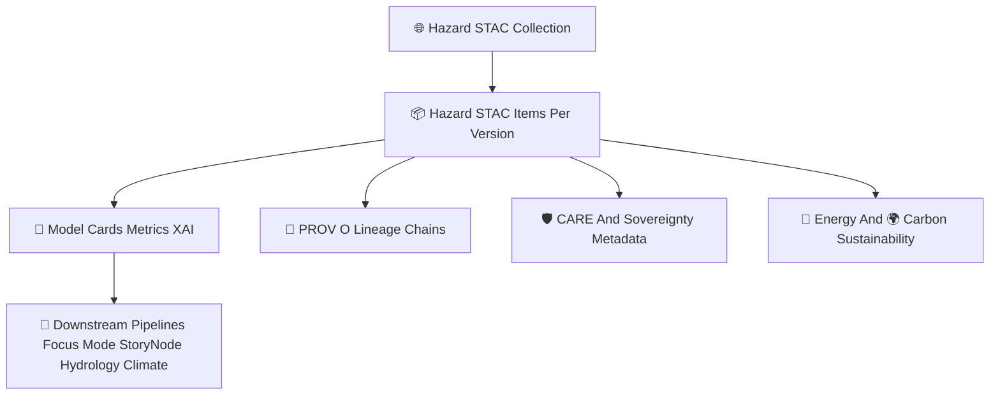

<div align="center">

# 🌐📦🌪️ **Hazard Models STAC Catalog — KFM v11.2.2 (MAX MODE)**  
`docs/pipelines/ai/models/hazards/stac/README.md`

**Purpose**  
Define the **STAC Catalog** governing metadata for all Hazard AI models:

🌪️ Tornado  
🧊 Hail  
🌊 Flood  
🔥 Fire-Weather  
☀️ Heat  
❄️ Winter  

The catalog enforces **FAIR+CARE ethics**, **sovereignty protection**,  
**STAC v1.x compliance**, **XAI linkage**, **PROV lineage**,  
**telemetry governance**, and **model registry discoverability**.

</div>

---

## 🗂️📁🌪️ **Directory Layout (MAX MODE)**

```
docs/pipelines/ai/models/hazards/stac/
    📄 README.md
    📁 collections/
        📄 tornado.json
        📄 hail.json
        📄 flood.json
        📄 fireweather.json
        📄 heat.json
        📄 winter.json
    📁 items/
        📄 hazard_tornado_v11.2.2.json
        📄 hazard_hail_v11.2.2.json
        📄 hazard_flood_v11.2.2.json
        📄 hazard_fireweather_v11.2.2.json
        📄 hazard_heat_v11.2.2.json
        📄 hazard_winter_v11.2.2.json
        📄 item_template.json
    📁 model-cards/
        📄 hazardcard_tornado_v11.2.2.json
        📄 hazardcard_hail_v11.2.2.json
        📄 hazardcard_flood_v11.2.2.json
        📄 hazardcard_fireweather_v11.2.2.json
        📄 hazardcard_heat_v11.2.2.json
        📄 hazardcard_winter_v11.2.2.json
        📄 hazardcard_template.json
    📁 provenance/
        📄 prov_hazard_tornado_v11.2.2.json
        📄 prov_hazard_template.json
    📁 telemetry/
        📄 telemetry_hazard_tornado_v11.2.2.json
        📄 telemetry_template.json
```

---

## 🧬🌐🌪️ **Hazard STAC Architecture (Mermaid-Safe)**



---

# 🔍 **STAC Components**

---

## 🗂️ **1. STAC Collections (Domain-Level)**

Each hazard type MUST have its own Collection:

- `tornado.json`  
- `hail.json`  
- `flood.json`  
- `fireweather.json`  
- `heat.json`  
- `winter.json`  

Each MUST define:

- Hazard domain  
- Spatial + temporal extents  
- Climate + hydrology driver metadata  
- FAIR+CARE + sovereignty metadata  
- Links to STAC Items  

Example:

```json
{
  "type": "Collection",
  "id": "hazard_tornado",
  "description": "Tornado hazard models for KFM v11"
}
```

---

## 📦 **2. STAC Items (Per Version)**

Required fields:

```json
{
  "type": "Feature",
  "id": "hazard_tornado_v11_2_2",
  "collection": "hazard_tornado",
  "stac_version": "1.0.0",
  "properties": {
    "hazard:type": "tornado",
    "hazard:version": "v11.2.2",
    "model:seed": 42,
    "care:masking": "h3-hazard-generalized"
  }
}
```

Required assets:

- weights  
- xai  
- telemetry  
- provenance  
- model-card  
- metrics  
- drift baselines  

---

## 📄 **3. Model Cards**

Each hazard model card MUST include:

- Training metadata  
- Hazard metrics  
- Climate/hydro coupling  
- XAI explainability  
- Stability metrics  
- CARE metadata  
- Sovereignty rules  
- Energy + carbon telemetry  
- STAC references  
- PROV lineage  

---

## 📜 **4. PROV-O Lineage**

Must document:

- Training activity  
- Upstream STAC items used  
- Embedding models used  
- Preprocessing & masking steps  
- XAI lineage  
- Telemetry lineage  

---

## 💡 **5. XAI Requirements**

Hazard models MUST document:

- Climate→hazard attribution  
- Hydrology→hazard attribution  
- Spatial CAM overlays  
- Hazard-driver scores  
- Narrative attribution (if part of Focus Mode)  
- XAI seed-lock + provenance  

---

## 🔋🌍 **6. Energy + Carbon Sustainability**

Every hazard STAC item MUST include:

- watt-hours used  
- gCO₂e emissions  
- FLOPs  
- hardware profiles  
- sustainability constraints  

---

## 🛡️⚖️ **7. FAIR+CARE + Sovereignty Metadata**

All hazard metadata MUST include:

```json
{
  "care": {
    "masking": "h3-hazard-generalized",
    "scope": "public-generalized",
    "notes": ["Metadata generalized to protect sovereignty-sensitive hazard regions"]
  }
}
```

Protections include:

- Tribal lands  
- Sensitive water features  
- Cultural regions  
- Any region requiring hazard-signal suppression  

---

# 🧪📏🔬 **CI Validation Requirements**

CI MUST validate:

- STAC schema correctness  
- XAI completeness  
- PROV lineage  
- CARE metadata  
- Sovereignty-safe metadata  
- Telemetry completeness  
- Drift baseline correctness  
- Climate/hydrology driver metadata  
- Consistent outputs across builds  
- No sensitive-region leakage  

Failure → ❌ CI BLOCK.

---

# 🕰️📜 Version History

| Version | Date       | Notes                                     |
|---------|------------|-------------------------------------------|
| v11.2.2 | 2025-11-28 | Initial Hazard STAC Catalog (MAX MODE)     |

---

<div align="center">

### 🔗 Footer  
[🌪️ Back to Hazard Models](../README.md) ·  
[📦 STAC Items](./items/README.md) ·  
[🏛 Governance](../../../../standards/governance/ROOT-GOVERNANCE.md)

</div>

