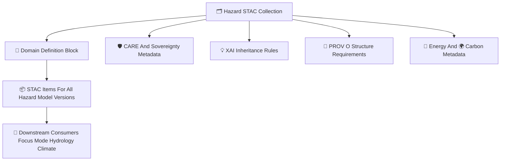

<div align="center">

# 🗂️🌐🌪️ **Hazard STAC Collections — KFM v11.2.2 (MAX MODE)**  
`docs/pipelines/ai/models/hazards/stac/collections/README.md`

**Purpose**  
Define the **STAC Collections** governing metadata for all Hazard AI domains:

🌪️ Tornado  
🧊 Hail  
🌊 Flood  
🔥 Fire-Weather  
☀️ Heat  
❄️ Winter  

Collections enforce **FAIR+CARE**, **sovereignty safety**, **XAI inheritance**, **STAC spec alignment**,  
and **cross-domain consistency** across hazard drivers.

</div>

---

## 🗂️📁🌐 **Directory Layout (MAX MODE)**

```
docs/pipelines/ai/models/hazards/stac/collections/
    📄 README.md
    📄 tornado.json
    📄 hail.json
    📄 flood.json
    📄 fireweather.json
    📄 heat.json
    📄 winter.json
```

---

## 🧬🌐🌪️ **Hazard Collections Architecture (Mermaid-Safe)**



---

# 🔍 **Collection Definitions**

Each hazard type has its own STAC Collection MUST include:

---

## 🌪️ **1. Tornado Collection (tornado.json)**  
Defines metadata for:

- CAPE/CIN/SRH/shear/LLJ  
- Terrain influence on supercells  
- Climate-driver inheritance  
- CAM spatial generalization  
- FAIR+CARE masking for sovereignty regions  

---

## 🧊 **2. Hail Collection (hail.json)**  
Specifies:

- MUHAIL/hail-proxy variables  
- Storm-top temperature domain  
- Thermodynamic depth metadata  
- Dryline/upslope patterns  

---

## 🌊 **3. Flood Collection (flood.json)**  
Defines:

- Precip buckets (1h/3h/6h)  
- Runoff + soil moisture  
- Streamflow + basin metadata  
- Hydrology-driven hazard constraints  

---

## 🔥 **4. Fire-Weather Collection (fireweather.json)**  
Includes:

- Temp/humidity/wind/drought index  
- Fuel moisture metadata  
- CAM dryness hotspots  
- Sovereignty-sensitive fire-weather patterns  

---

## ☀️ **5. Heat Collection (heat.json)**  
Covers:

- Heat index metadata  
- Synoptic patterns (ridge, trough)  
- Dewpoint/temp gradient metadata  
- Environmental health-safety metadata  

---

## ❄️ **6. Winter Collection (winter.json)**  
Specifies:

- Snow-liquid ratio  
- Wind chill / thermal gradient metadata  
- CAM snowband relevance  
- Terrain influence metadata  

---

# 🛡️⚖️ **FAIR+CARE + Sovereignty Requirements**

All Collections MUST include:

```json
{
  "care": {
    "masking": "h3-hazard-generalized",
    "scope": "public-generalized",
    "notes": ["Metadata generalized to protect sovereignty-sensitive hazard areas"]
  }
}
```

Protections include:

- Tribal territories  
- Cultural/ecological protected areas  
- Sensitive hydroclimate regions  
- Watersheds with restrictions  

---

# 🔋🌍 **Energy + Carbon Metadata**

Collections MUST define:

- Expected energy cost categories  
- gCO₂e emission expectations  
- Sustainability targets  
- Telemetry inheritance rules  

---

# 🧪📏🔬 **CI Validation Requirements**

CI MUST validate:

- STAC compliance  
- Deterministic serialization  
- XAI inheritance consistency  
- Sovereignty masking correctness  
- FAIR+CARE metadata  
- Link references to Items  
- Cross-domain alignment  
- No sensitive-region leakage  

Failure → ❌ CI BLOCK.

---

# 🕰️📜 Version History

| Version | Date       | Notes                                             |
|---------|------------|---------------------------------------------------|
| v11.2.2 | 2025-11-28 | Initial Hazard STAC Collections (MAX MODE)        |

---

<div align="center">

### 🔗 Footer  
[🌐 Back to Hazard STAC Root](../README.md) ·  
[📦 STAC Items](../items/README.md) ·  
[🏛 Governance](../../../../../../../standards/governance/ROOT-GOVERNANCE.md)

</div>

