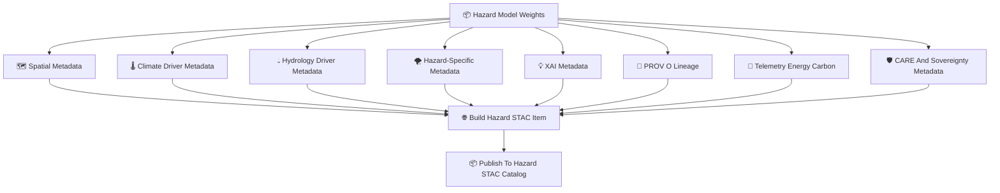

<div align="center">

# 📦🌪️🌐 **Hazard STAC Items — KFM v11.2.2 (MAX MODE)**  
`docs/pipelines/ai/models/hazards/stac/items/README.md`

**Purpose**  
Define the **per-version STAC Items** describing every Hazard AI model:  
🌪️ Tornado · 🧊 Hail · 🌊 Flood · 🔥 Fire-Weather · ☀️ Heat · ❄️ Winter  

Each STAC Item stores **model metadata**, **XAI explainability**,  
**PROV lineage**, **FAIR+CARE + sovereignty protections**, **telemetry**,  
and **deterministic hazard science outputs**.

</div>

---

## 🗂️📁📦 **Directory Layout (MAX MODE)**

```
docs/pipelines/ai/models/hazards/stac/items/
    📄 README.md
    📄 hazard_tornado_v11.2.2.json
    📄 hazard_hail_v11.2.2.json
    📄 hazard_flood_v11.2.2.json
    📄 hazard_fireweather_v11.2.2.json
    📄 hazard_heat_v11.2.2.json
    📄 hazard_winter_v11.2.2.json
    📄 item_template.json
```

---

## 🧬🌐🌪️ **Hazard STAC Item Architecture (Mermaid-Safe)**



---

# 🔍 **Required STAC Item Fields**

---

## 🧩 **1. Core STAC Fields**

```json
{
  "type": "Feature",
  "id": "hazard_tornado_v11_2_2",
  "collection": "hazard_tornado",
  "stac_version": "1.0.0"
}
```

---

## 🌪️ **2. Hazard Properties**

Required:

- `hazard:type` (tornado, hail, flood, fireweather, heat, winter)  
- `hazard:version`  
- `model:seed` (deterministic)  
- Hazard domain tags  
- CARE masking rules  

---

## 📦 **3. Required Assets**

```json
{
  "assets": {
    "weights": {"href": "hazard_model.pt"},
    "xai": {"href": "xai/"},
    "telemetry": {"href": "telemetry/"},
    "provenance": {"href": "prov_hazard_tornado_v11_2_2.json"},
    "model-card": {"href": "../model-cards/hazardcard_tornado_v11.2.2.json"},
    "metrics": {"href": "hazard_metrics.json"},
    "drift-baseline": {"href": "hazard_drift_baseline.json"}
  }
}
```

---

## 🌡️ **4. Climate Driver Metadata**

Includes:

- CAPE  
- CIN  
- Shear  
- LLJ  
- Temperature/dewpoint gradients  
- Climate anomalies  
- Coupling metrics  

---

## 💧 **5. Hydrology Driver Metadata**

Includes:

- Soil moisture  
- Runoff  
- Streamflow  
- Drought index  
- Hydrology–hazard coupling metrics  

---

## 🗺️ **6. Spatial Metadata**

Includes:

- H3 region  
- Landcover  
- Terrain class  
- Watershed ID  
- Spatial CAM availability  

---

## 🌪️ **7. Hazard-Specific Metadata**

Examples:

- Tornado: SRH, shear layers, LLJ, LCL  
- Hail: MUHAIL, storm-top temperature  
- Flood: precip buckets, runoff, streamflow  
- Fire-weather: humidity, fuel moisture  
- Heat: HI, synoptic patterns  
- Winter: snow ratio, wind chill  

---

## 💡 **8. XAI Metadata**

Must include:

- Feature importance vectors  
- CAM layers  
- Attention maps  
- XAI provenance  

---

## 🛡️ **9. CARE + Sovereignty Metadata**

Required:

```json
{
  "care": {
    "masking": "h3-hazard-generalized",
    "scope": "public-generalized",
    "notes": ["Hazard metadata generalized in sovereignty-sensitive zones"]
  }
}
```

---

## 📜 **10. PROV Lineage**

Must include:

```json
{
  "prov": {
    "wasGeneratedBy": "urn:kfm:activity:training:hazard_tornado_v11_2_2",
    "used": [
      "urn:kfm:data:climate_item",
      "urn:kfm:data:hydrology_item",
      "urn:kfm:data:terrain_item"
    ],
    "agent": "urn:kfm:service:hazard-training-engine"
  }
}
```

---

## 🔋🌍 **11. Sustainability Telemetry**

Must include:

```json
{
  "energy": {"wh": 2.91},
  "carbon": {"gco2e": 0.26}
}
```

---

# 🧪📏🔬 **CI Validation Requirements**

CI MUST confirm:

- STAC schema correctness  
- XAI linkage  
- PROV lineage  
- CARE + sovereignty metadata  
- Climate/hydro coupling  
- Hazard correctness  
- Drift baseline presence  
- Sustainability telemetry validity  
- No sensitive-region leakage  
- Deterministic reproducibility  

Failure → ❌ CI BLOCK.

---

# 🕰️📜 Version History

| Version | Date       | Notes                                          |
|---------|------------|------------------------------------------------|
| v11.2.2 | 2025-11-28 | Initial Hazard STAC Items Catalog (MAX MODE)   |

---

<div align="center">

### 🔗 Footer  
[🌐 Back to Hazard STAC Root](../README.md) ·  
[📄 Model Cards](../model-cards/README.md) ·  
[🏛 Governance](../../../../../../../standards/governance/ROOT-GOVERNANCE.md)

</div>

