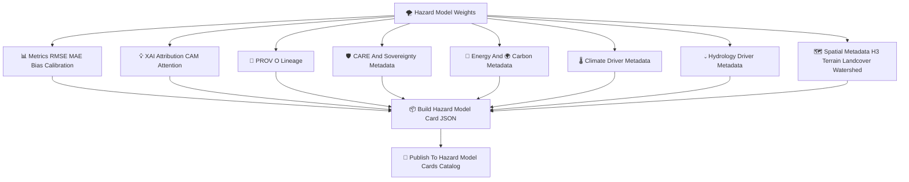

<div align="center">

# 📄🌪️🧠 **Hazard Model Cards Catalog — KFM v11.2.2 (MAX MODE)**  
`docs/pipelines/ai/models/hazards/stac/model-cards/README.md`

**Purpose**  
Define the **Model Card Catalog** that documents every Hazard AI model version in KFM:  
🌪️ Tornado • 🧊 Hail • 🌊 Flood • 🔥 Fire-Weather • ☀️ Heat • ❄️ Winter  

Model Cards provide **FAIR+CARE-aligned**, **sovereignty-safe**, **STAC-linked**, **PROV-traceable**,  
**XAI-complete**, and **governance-ready** metadata for hazard modeling.

</div>

---

## 🗂️📁📄 **Directory Layout (MAX MODE)**

```
docs/pipelines/ai/models/hazards/stac/model-cards/
    📄 README.md
    📄 hazardcard_tornado_v11.2.2.json
    📄 hazardcard_hail_v11.2.2.json
    📄 hazardcard_flood_v11.2.2.json
    📄 hazardcard_fireweather_v11.2.2.json
    📄 hazardcard_heat_v11.2.2.json
    📄 hazardcard_winter_v11.2.2.json
    📄 hazardcard_template.json
```

---

## 🧬📄🌪️ **Model Card Architecture (Mermaid-Safe)**



---

# 🔍 **Model Card Requirements**

---

## 1️⃣ **Model Overview**

Must include:

```json
{
  "model:version": "v11.2.2",
  "hazard:type": "tornado",
  "model:seed": 42,
  "fusion:dimension": 2048,
  "model:architecture": "transformer"
}
```

---

## 2️⃣ **Training Metadata**

Required:

- Epochs  
- Batch size  
- LR  
- Climate/hydro/spatial drivers used  
- Sovereignty masking steps  
- Preprocessing logs  
- Training STAC references  
- Normalization metadata  

---

## 3️⃣ **Hazard Metrics**

Include:

- RMSE  
- MAE  
- Bias  
- Calibration  
- Tail-risk stability  
- Accidentally amplified hazard fields (MUST be zero)  

Example:

```json
{
  "metrics": {
    "rmse": 1.82,
    "mae": 1.12,
    "calibration": 0.94
  }
}
```

---

## 4️⃣ **Climate Driver Alignment**

```json
{
  "climate_alignment": {
    "cape_ok": true,
    "cin_ok": true,
    "shear_ok": true,
    "llj_ok": true
  }
}
```

---

## 5️⃣ **Hydrology Driver Alignment**

```json
{
  "hydrology_alignment": {
    "streamflow_ok": true,
    "soil_moisture_ok": true,
    "runoff_ok": true
  }
}
```

---

## 6️⃣ **XAI Explainability**

Required:

- Importance vectors  
- CAM overlays  
- Climate/hydro/hazard attribution  
- Attention maps  
- XAI provenance  

Example:

```json
{
  "xai": {
    "importance": {
      "climate": 0.32,
      "hydrology": 0.19,
      "spatial": 0.17,
      "hazard": 0.32
    }
  }
}
```

---

## 7️⃣ **Spatial Metadata**

Include:

- H3 index  
- Terrain class  
- Landcover  
- Watershed  
- Spatial CAM map availability  

---

## 8️⃣ **FAIR+CARE + Sovereignty Metadata**

Required:

```json
{
  "care": {
    "masking": "h3-hazard-generalized",
    "scope": "public-generalized",
    "notes": ["Model generalized for sovereignty protection"]
  }
}
```

---

## 9️⃣ **Provenance (PROV-O)**

Must document:

```json
{
  "prov": {
    "wasGeneratedBy": "urn:kfm:activity:training:hazard_v11_2_2",
    "used": [
      "urn:kfm:data:climate_item",
      "urn:kfm:data:hydrology_item",
      "urn:kfm:data:terrain_item"
    ],
    "agent": "urn:kfm:service:hazard-training-engine"
  }
}
```

---

## 🔟 **Energy + Carbon Sustainability**

Include:

```json
{
  "energy": {"wh": 2.91},
  "carbon": {"gco2e": 0.26}
}
```

---

# 🧪📏🔬 **CI Validation Requirements**

CI MUST validate:

- Model-card schema correctness  
- Climate/hydro/hazard alignment  
- Deterministic metrics  
- XAI completeness  
- PROV lineage  
- CARE & sovereignty metadata  
- Telemetry completeness  
- STAC linkage correctness  
- No sensitive-region leakage  

Failure → ❌ CI BLOCK.

---

# 🕰️📜 Version History

| Version | Date       | Notes                                             |
|---------|------------|---------------------------------------------------|
| v11.2.2 | 2025-11-28 | Initial Hazard STAC Model Cards Catalog (MAX MODE) |

---

<div align="center">

### 🔗 Footer  
[🌐 Back to Hazard STAC Root](../README.md) ·  
[📦 STAC Items](../items/README.md) ·  
[🏛 Governance](../../../../../../../standards/governance/ROOT-GOVERNANCE.md)

</div>

