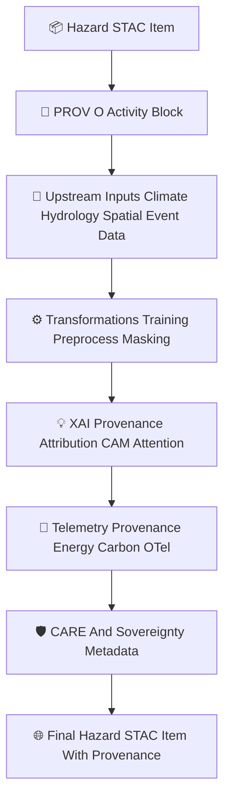

<div align="center">

# 📜🌪️🌐 **Hazard STAC Provenance Catalog — KFM v11.2.2 (MAX MODE)**  
`docs/pipelines/ai/models/hazards/stac/provenance/README.md`

**Purpose**  
Define the **complete PROV-O lineage system** for all Hazard AI models:  
🌪️ Tornado • 🧊 Hail • 🌊 Flood • 🔥 Fire-Weather • ☀️ Heat • ❄️ Winter  

This catalog ensures every hazard model version includes **transparent**, **deterministic**,  
**FAIR+CARE aligned**, **sovereignty-safe**, **STAC-compliant**, **XAI-linked** provenance.

</div>

---

## 🗂️📁📜 **Directory Layout (MAX MODE)**

```
docs/pipelines/ai/models/hazards/stac/provenance/
    📄 README.md
    📄 prov_hazard_tornado_v11.2.2.json
    📄 prov_hazard_hail_v11.2.2.json
    📄 prov_hazard_flood_v11.2.2.json
    📄 prov_hazard_fireweather_v11.2.2.json
    📄 prov_hazard_heat_v11.2.2.json
    📄 prov_hazard_winter_v11.2.2.json
    📄 prov_hazard_template.json
```

---

## 🧬📜🌪️ **Hazard Provenance Architecture (Mermaid-Safe)**



---

# 🔍 **Required PROV-O Components**

---

## 1️⃣ **prov:wasGeneratedBy**

Tracks training activity:

```json
{
  "prov": {
    "wasGeneratedBy": "urn:kfm:activity:training:hazard_tornado_v11_2_2"
  }
}
```

---

## 2️⃣ **prov:used**

Lists every upstream resource used in training + inference:

```json
{
  "prov": {
    "used": [
      "urn:kfm:data:climate_item",
      "urn:kfm:data:hydrology_item",
      "urn:kfm:data:terrain_item",
      "urn:kfm:data:event_hail_v11",
      "urn:kfm:model:embedding_climate_v11_2_2",
      "urn:kfm:model:embedding_spatial_v11_2_2",
      "urn:kfm:model:embedding_hydrology_v11_2_2",
      "urn:kfm:model:embedding_hazard_v11_2_2",
      "urn:kfm:preprocess:sovereignty_mask_v3"
    ]
  }
}
```

Must be deterministic ordering.

---

## 3️⃣ **prov:wasAssociatedWith**

Indicates the training agent:

```json
{
  "prov": {
    "agent": "urn:kfm:service:hazard-training-engine"
  }
}
```

---

## 4️⃣ **Deterministic Seed Declaration**

Stored in STAC `"properties.model:seed"`.

---

# 🔍 **XAI Provenance Requirements**

Hazard models MUST include XAI provenance:

```json
{
  "xai:prov": {
    "wasGeneratedBy": "urn:kfm:activity:xai:hazard_v11_2_2",
    "used": [
      "hazard_model.pt",
      "normalization_params.json"
    ],
    "agent": "urn:kfm:service:hazard-xai-engine"
  }
}
```

This ensures environmental drivers → hazard logic → attribution remain traceable.

---

# 🔍 **Telemetry Provenance**

Telemetry MUST include:

```json
{
  "prov": {
    "wasGeneratedBy": "urn:kfm:activity:telemetry:hazard_inference_v11_2_2",
    "used": [
      "hazard_tornado_v11_2_2.json",
      "embedding_climate_v11_2_2.json"
    ],
    "agent": "urn:kfm:service:hazard-telemetry-engine"
  }
}
```

---

# 🛡️⚖️ **FAIR+CARE + Sovereignty Provenance Requirements**

Each provenance file MUST include:

```json
{
  "care": {
    "masking": "h3-hazard-generalized",
    "scope": "public-generalized",
    "notes": ["Sovereignty-safe hazard model applied in STAC lineage"]
  }
}
```

---

# 📦📜🧾 **Provenance Templates**

Template JSON MUST be provided for all hazard domains.

---

# 🧪📏🔬 **CI Validation Requirements**

CI MUST validate:

- PROV-O schema correctness  
- Deterministic ordering  
- STAC linkage correctness  
- XAI provenance  
- Telemetry lineage  
- CARE + sovereignty metadata  
- No sensitive-region leakage  
- Reproducible provenance  

Failure → ❌ CI BLOCK.

---

# 🕰️📜 Version History

| Version | Date       | Notes                                                 |
|---------|------------|-------------------------------------------------------|
| v11.2.2 | 2025-11-28 | Initial Hazard STAC Provenance Catalog (MAX MODE)     |

---

<div align="center">

### 🔗 Footer  
[🌐 Back to Hazard STAC Root](../README.md) ·  
[📄 Model Cards](../model-cards/README.md) ·  
[🏛 Governance](../../../../../../../standards/governance/ROOT-GOVERNANCE.md)

</div>

