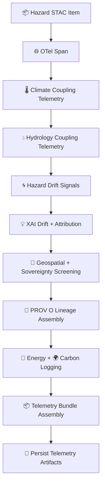

<div align="center">

# 📡🌪️🌐 **Hazard STAC Telemetry — KFM v11.2.2 (MAX MODE)**  
`docs/pipelines/ai/models/hazards/stac/telemetry/README.md`

**Purpose**  
Define the telemetry subsystem supporting Hazard STAC Items & Collections.  
Telemetry tracks:

🌡️ Climate–hazard coupling  
💧 Hydrology–hazard coupling  
🌀 Drift metrics  
💡 XAI attribution drift  
🧭 Spatial + sovereignty safety  
📜 PROV lineage  
🌍 Sustainability (energy & carbon)  
🌐 OpenTelemetry spans  

This enables CI/CD gates, governance review, Focus Mode reasoning audits,  
and historical hazard behavior interpretation.

</div>

---

## 🗂️📁📡 **Directory Layout (MAX MODE)**

```
docs/pipelines/ai/models/hazards/stac/telemetry/
    📄 README.md
    📄 telemetry_hazard_tornado_v11.2.2.json
    📄 telemetry_hazard_hail_v11.2.2.json
    📄 telemetry_hazard_flood_v11.2.2.json
    📄 telemetry_hazard_fireweather_v11.2.2.json
    📄 telemetry_hazard_heat_v11.2.2.json
    📄 telemetry_hazard_winter_v11.2.2.json
    📄 telemetry_template.json
```

---

## 🧬📡🌪️ **Hazard STAC Telemetry Architecture (Mermaid-Safe)**



---

# 🔍 **Telemetry Components**

---

## 🌐 **1. OpenTelemetry Spans**

Telemetry MUST include:

```json
{
  "otel": {
    "operation": "hazard_stac_event",
    "hazard_type": "tornado",
    "latency_ms": 14,
    "seed": 42
  }
}
```

---

## 🌡️ **2. Climate Coupling Telemetry**

Tracks:

- CAPE  
- CIN  
- Shear  
- LLJ  
- Temp/dewpoint gradients  
- Climate anomalies  
- Cross-domain hazard alignment  

Example:

```json
{
  "climate_coupling": {
    "cape_alignment": 0.91,
    "shear_alignment": 0.88
  }
}
```

---

## 💧 **3. Hydrology Coupling Telemetry**

Tracks:

- Soil moisture  
- Runoff  
- Streamflow  
- Drought index  

Example:

```json
{
  "hydrology_coupling": {
    "soil_moisture_alignment": 0.79,
    "runoff_alignment": 0.81
  }
}
```

---

## 🌀 **4. Hazard Drift Telemetry**

Tracks:

- Centroid drift  
- Tail-behavior drift  
- Spatial pattern deformation  
- Climate/hydro hazard-decoupling  

Example:

```json
{
  "drift": {
    "centroid_shift": 0.004,
    "tail_shift": 0.018
  }
}
```

---

## 💡 **5. XAI Drift & Attribution Telemetry**

Tracks:

- Importance vector drift  
- CAM displacement  
- Hazard attention entropy  
- Narrative/hazard alignment (Focus Mode)  

Example:

```json
{
  "xai_drift": {
    "importance_shift": {
      "climate": -0.02,
      "hydrology": +0.01,
      "spatial": +0.01,
      "hazard": +0.00
    },
    "cam_shift": 0.21
  }
}
```

---

## 🧭 **6. Geospatial & Sovereignty Screening**

Ensures:

- No hyperlocalized hazard signals  
- Sovereignty-zone hazard suppression  
- Spatial CAM masking  
- H3 generalization  
- Landcover/terrain/watershed fidelity  

Example:

```json
{
  "sovereignty": {"safe": true, "masking": "h3-hazard-generalized"}
}
```

---

## 📜 **7. PROV Lineage**

Telemetry MUST embed PROV:

```json
{
  "prov": {
    "wasGeneratedBy": "urn:kfm:activity:telemetry:hazard_inference_v11_2_2",
    "used": [
      "hazard_tornado_v11_2_2.json",
      "embedding_climate_v11_2_2.json"
    ],
    "agent": "urn:kfm:service:hazard-telemetry-engine"
  }
}
```

---

## 🔋🌍 **8. Energy + Carbon Sustainability**

Tracks:

- Wh energy  
- gCO₂e  
- FLOPs  
- hardware utilization  
- inference-level energy budgets  

Example:

```json
{
  "energy": {"wh": 0.12},
  "carbon": {"gco2e": 0.02}
}
```

---

## 📦 **9. Telemetry Bundle Assembly**

Bundles MUST include:

```
otel/
climate/
hydrology/
drift/
xai/
sovereignty/
energy/
carbon/
prov/
hazard_event.json
```

All bundles MUST be sovereignty-safe, deterministic, and CI-validated.

---

# 🧪📏🔬 **CI Validation Requirements**

CI MUST validate:

- Telemetry schema correctness  
- Deterministic values  
- Climate/hydro coupling signals  
- Hazard XAI drift  
- Sovereignty masking  
- FAIR+CARE compliance  
- STAC linkage  
- PROV lineage  
- Sustainability metadata  
- No sensitive-region leakage  

Failure → ❌ CI BLOCK.

---

# 🕰️📜 Version History

| Version | Date       | Notes                                             |
|---------|------------|---------------------------------------------------|
| v11.2.2 | 2025-11-28 | Initial Hazard STAC Telemetry Documentation       |

---

<div align="center">

### 🔗 Footer  
[🌐 Back to Hazard STAC Root](../README.md) ·  
[📦 STAC Items](../items/README.md) ·  
[🏛 Governance](../../../../../../../standards/governance/ROOT-GOVERNANCE.md)

</div>

