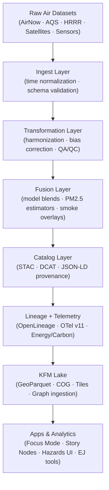

<div align="center">

# 🌬️ **Kansas Frontier Matrix — Air Domain Pipelines (v11.2.2)**  
`docs/pipelines/air/README.md`

**Purpose**  
Provide the authoritative overview of the **Air Domain pipelines** in KFM v11, including ingestion, transformation, STAC/DCAT cataloging, temporal normalization, atmospheric modeling, health-impact overlays, FAIR+CARE governance, lineage, and sustainability telemetry.

</div>

---

## 📘 1. Overview

The **Air Domain** integrates Kansas-wide environmental air-quality datasets, including:

- **AirNow** (real-time & historical AQ)  
- **EPA AQS**  
- **NOAA HRRR smoke & particulate forecasts**  
- **Satellite-derived aerosols** (Sentinel-5P / MODIS / VIIRS)  
- **Local/municipal sensors** (AQMesh, PurpleAir, low-cost sensor networks)  
- **Atmospheric chemistry models** (CMAQ, CAMx – v11.4 expansion)  

These pipelines support:

- Public health analysis  
- Hazard mapping (smoke, ozone, PM2.5)  
- Environmental justice assessments  
- Climate & hydrology cross-domain joins  
- Story Node v3 narratives (smoke events, ozone episodes)  
- Focus Mode v3 interpretability layers  

Every pipeline in this domain must follow **FAIR+CARE** standards and KFM’s reproducible, governed architecture.

---

## 🗂️ 2. Directory Layout (Emoji Style A, v11.2.2)

```text
docs/pipelines/air/
├── 📄 README.md
│
├── 📂 airnow/                      # AirNow ingest, UTC normalization, STAC/DCAT
│   ├── 📄 README.md
│   └── 📂 ingest/
│
├── 📂 aqs/                         # EPA AQS ingest & harmonization
│   └── 📄 README.md
│
├── 📂 hrrr/                        # HRRR smoke, particulate, & forecasts
│   └── 📄 README.md
│
├── 📂 satellite/                   # S5P / MODIS / VIIRS aerosols, AI fusion layers
│   └── 📄 README.md
│
├── 📂 sensors/                     # Low-cost sensor networks (AQMesh, PurpleAir)
│   └── 📄 README.md
│
└── 📂 stac/                        # Air domain STAC collections + metadata profiles
    └── 🌐 air-domain-collection.json
```

All submodules follow **KFM-MDP v11.2.2**, with enforced:

- Single H1  
- Required front-matter fields  
- Directory-diagram formatting  
- No broken boxes  
- STAC, DCAT, PROV-O, and CARE alignment  

---

## 🌬️ 3. Air Domain Architecture (v11.2.2)



Architecture pillars:

- **Temporal integrity**  
- **FAIR+CARE governance**  
- **Reproducibility & lineage**  
- **Atmospheric science correctness**  
- **Cross-domain join safety**  

---

## 🧩 4. Air Domain Modules (Summary)

### 4.1 AirNow (Ingest + Time Normalization)
- UTC normalization  
- Offset/DST explicit handling  
- Period alignment enforcement (period_begin)  
- STAC Item production  
- Validation + telemetry  

Location:  
`docs/pipelines/air/airnow/`

---

### 4.2 AQS (EPA) Integration
- Regulated monitoring station data  
- QA/QC flags  
- Harmonized pollutants (PM2.5, O₃, NO₂, SO₂)  
- Long-term trend joins  

Location:  
`docs/pipelines/air/aqs/`

---

### 4.3 HRRR Atmospheric Model
- Smoke (near-surface + vertically integrated)  
- PM2.5 forecast surrogates  
- Plume transport modeling  
- Raster → COG normalization  

Location:  
`docs/pipelines/air/hrrr/`

---

### 4.4 Satellite Aerosols (S5P / MODIS / VIIRS)
- NO2, SO2, AOD, UVAI  
- Orbital → Level-2 → gridded KFM tiles  
- AI super-resolution (v11.3+)  

Location:  
`docs/pipelines/air/satellite/`

---

### 4.5 Low-Cost Sensor Networks
- PurpleAir, AQMesh, Clarity  
- Calibration & bias-correction models  
- Neighborhood-scale AQ  

Location:  
`docs/pipelines/air/sensors/`

---

## 🌐 5. STAC & DCAT Integration (Air Domain)

Air domain STAC Collections MUST include:

- Spatial extent (Kansas full domain)  
- Temporal extent (dataset-level)  
- STAC fields:  
  - `datetime` / `start_datetime` / `end_datetime`  
  - Asset-level media types  
  - `kfm:airQualityVariable`  
  - `kfm:temporalNormalization`  

Root Air STAC Collection:  
`docs/pipelines/air/stac/air-domain-collection.json`

---

## 🔗 6. Provenance & Lineage (OpenLineage v2.5)

Air pipelines emit lineage for:

- Ingest steps  
- Time normalization  
- QA/QC stages  
- Harmonic blends  
- Forecast runs  
- AI aerosol estimates  

Facets emitted:

- TimeNormalizationFacet  
- AtmosphericVariableFacet  
- EnergyFacet  
- CarbonFacet  
- CAREFacet  

---

## 🌱 7. Telemetry & Sustainability

Metrics captured:

- `energy_wh`  
- `carbon_gco2e`  
- `runtime_sec`  
- `rows_processed`  
- anomaly counts (DST, missing data, extreme outliers)  

Telem bundles stored at:

```
../../../releases/v11.2.2/air-domain-telemetry.json
docs/reports/telemetry/air/air-domain-*.json
```

---

## ⚖️ 8. FAIR+CARE Considerations

- All datasets maintain license + usage rules  
- Environmental justice layers require correct AIR/HRRR/NOAA crosswalk  
- No sensitive health-related locations stored  
- CARE compliance for datasets intersecting culturally significant boundaries  

---

## 🕰️ 9. Version History

| Version | Date       | Summary |
|--------:|------------|---------|
| v11.2.2 | 2025-11-28 | Air domain index created; full emoji layout; STAC/DCAT integration; lineage + telemetry sections added. |

---

<div align="center">

© 2025 Kansas Frontier Matrix — MIT License  
🌬️ Air Domain Pipelines v11.2.2 · FAIR+CARE Certified · Temporal Integrity · Diamond⁹ Ω / Crown∞Ω  

[⬅️ Back to Pipelines Root](../README.md) •  
[🌬️ AirNow Module](airnow/README.md) •  
[🌀 AQS](aqs/README.md) •  
[🔥 HRRR](hrrr/README.md)  

</div>
~~~~markdown

