<div align="center">

# 🌬️ Kansas Frontier Matrix — Air Domain Pipelines (v11.2.4)  
`docs/pipelines/air/README.md`

**Purpose**  
Provide the authoritative overview of the **Air Domain pipelines** in KFM v11, including ingestion, transformation, STAC/DCAT cataloging, temporal normalization, atmospheric modeling, health-impact overlays, FAIR+CARE governance, lineage, and sustainability telemetry.

</div>

---

## 📘 Overview

The **Air Domain** integrates Kansas-wide environmental air-quality datasets, including:

- **AirNow** (real-time & historical air quality).  
- **EPA AQS** (regulatory-grade monitoring).  
- **NOAA HRRR smoke & particulate forecasts**.  
- **Satellite-derived aerosols** (e.g., Sentinel-5P, MODIS, VIIRS).  
- **Local/municipal sensors** (PurpleAir, AQMesh, other low-cost networks).  
- **Atmospheric chemistry models** (e.g., CMAQ, CAMx; v11.x expansion).

These pipelines support:

- Public health and exposure analysis.  
- Hazard mapping (smoke, ozone, PM₂.₅, NO₂, etc.).  
- Environmental justice assessments and cross-domain joins.  
- Climate & hydrology linkage (e.g., smoke + precipitation).  
- Story Node v3 narratives (smoke events, ozone episodes, AQ advisories).  
- Focus Mode v3 interpretability layers for air-quality contexts.

Every Air Domain pipeline must follow:

- **Core pipeline architecture** (queue-centric, deterministic, replayable).  
- **FAIR+CARE** and sovereignty governance.  
- **STAC/DCAT/PROV-O** metadata and lineage standards.  
- **Energy/carbon telemetry** and sustainability requirements.

---

## 🗂️ Directory Layout

```text
📂 docs/pipelines/air/
├── 📄 README.md                         # 🌬️ Air Domain index (this file)
│
├── 📂 airnow/                           # 🛰 AirNow ingest, UTC normalization, STAC/DCAT docs
│   └── 📄 README.md
│
├── 📂 aqs/                              # 🌀 EPA AQS ingest & harmonization docs
│   └── 📄 README.md
│
├── 📂 hrrr/                             # 🔥 HRRR smoke, particulate & forecast docs
│   └── 📄 README.md
│
├── 📂 satellite/                        # 🛰 Satellite aerosols (S5P / MODIS / VIIRS) docs
│   └── 📄 README.md
│
├── 📂 sensors/                          # 🧪 Low-cost sensor networks (PurpleAir, AQMesh, etc.)
│   └── 📄 README.md
│
└── 📂 stac/                             # 🌐 Air-domain STAC collections & metadata profiles
    └── 📄 air-domain-collection.json
```

Author rules:

- Each subdirectory MUST include a `README.md` with KFM-MDP v11.2.4-compliant front-matter.  
- Directory trees must use a fenced `text` code block with emoji-prefixed entries, as above.  
- Air module READMEs must link back to this index and to relevant standards (lineage, geoprivacy, energy).

---

## 🧭 Context

Within the KFM stack:

> External air data sources → Air Domain pipelines → STAC/DCAT/PROV catalogs → Neo4j → APIs → Frontend (maps, 3D, dashboards) → Story Nodes & Focus Mode

The Air Domain:

- Is the **canonical source** for air-quality, smoke, and atmospheric pollutant datasets in KFM.  
- Aligns with:
  - **STAC/DCAT** metadata for catalogs and discovery.  
  - **GeoSPARQL** and CRS standards for spatial correctness.  
  - **OWL-Time** for temporal normalization and event windows.  
  - **FAIR+CARE** for ethical governance and EJ-aware usage.  
- Feeds:
  - Focus Mode overlays (e.g., “AQ conditions during this Story Node’s time window”).  
  - Story Nodes that narrate smoke events, ozone episodes, and policy responses.  
  - Cross-domain analyses (e.g., AQ + health, AQ + wildfire, AQ + hydrology).

---

## 🧱 Architecture

### 1. Air Domain architecture (conceptual flow)

```mermaid
flowchart TD
    A["Raw Air Datasets\n(AirNow · AQS · HRRR · Satellites · Sensors)"]
        --> B["Ingest Layer\n(time normalization · schema validation)"]

    B --> C["Transformation Layer\n(harmonization · bias correction · QA/QC)"]

    C --> D["Fusion Layer\n(model blends · PM2.5 estimators · smoke overlays)"]

    D --> E["Catalog Layer\n(STAC · DCAT · JSON-LD provenance)"]

    E --> F["Lineage & Telemetry\n(OpenLineage · OTel · Energy/Carbon)"]

    F --> G["KFM Lake\n(GeoParquet · COG · tiles · graph ingestion)"]

    G --> H["Apps & Analytics\n(Focus Mode · Story Nodes · Hazards UI · EJ tools)"]
```



Architecture pillars:

- **Temporal integrity** — explicit UTC normalization, offset/DST handling, windowed aggregation.  
- **Spatial integrity** — CRS correctness, consistent grid definitions, sensor siting constraints.  
- **FAIR+CARE governance** — licensing, EJ-aware behavior, sovereignty for cross-boundary datasets.  
- **Reproducibility & lineage** — deterministic ETL, WAL-backed replays, OpenLineage + PROV-O.  
- **Cross-domain join safety** — clear assumptions when joining AQ with health, demographic, or sensitive data.

### 2. Air Domain modules (summary)

#### 2.1 AirNow (ingest + time normalization)

- UTC normalization and DST/offset handling.  
- Period alignment (`period_begin`, `period_end`, explicit interval semantics).  
- Station metadata alignment (location, type, pollutants).  
- STAC Item generation for gridded or station-level views.  

Location: `docs/pipelines/air/airnow/`

#### 2.2 AQS (EPA) integration

- Ingest regulated monitoring station data.  
- Interpret QA/QC flags and regulatory thresholds.  
- Harmonize pollutant fields (PM₂.₅, O₃, NO₂, SO₂, CO, etc.).  
- Support long-term trend analyses and EJ overlays.  

Location: `docs/pipelines/air/aqs/`

#### 2.3 HRRR atmospheric model

- HRRR smoke (near-surface, vertically integrated).  
- PM₂.₅ forecast surrogates and plume transport indicators.  
- Raster → COG normalization and tiling.  
- Time-ensemble and scenario products (where applicable).  

Location: `docs/pipelines/air/hrrr/`

#### 2.4 Satellite aerosols (S5P / MODIS / VIIRS)

- NO₂, SO₂, AOD, UVAI, and related aerosol/trace-gas measures.  
- Orbital → Level-2 → gridded tiles aligned with KFM grid conventions.  
- AI fusion layers and super-resolution (where governed and documented).  

Location: `docs/pipelines/air/satellite/`

#### 2.5 Low-cost sensor networks

- PurpleAir, AQMesh, Clarity, and other community sensors.  
- Calibration & bias-correction models vs. AQS/HRRR/S5P.  
- Neighborhood-scale AQ estimates for EJ assessments.  

Location: `docs/pipelines/air/sensors/`

---

## 📦 Data & Metadata

Air Domain pipelines MUST:

- Produce **STAC Items & Collections** for all geospatial outputs (grids, tiles, station datasets).  
- Provide **DCAT datasets** for catalog-level descriptions.  
- Attach **JSON-LD** contexts linking to atmospheric, health, and KFM ontologies.  
- Record:
  - Spatial extent (Kansas + relevant buffers).  
  - Temporal extent (dataset and item-level intervals).  
  - Pollutant metadata (variable names, units, standards).  
  - Measurement method (model, satellite, in-situ).  
  - License and usage constraints.

Key fields for STAC/metadata:

- `kfm:airQualityVariable` — e.g., `PM25`, `O3`, `NO2`.  
- `kfm:temporalNormalization` — e.g., `hourly-utc`, `daily-max`, `rolling-24h`.  
- `kfm:sourceType` — `regulatory`, `model`, `satellite`, `sensor-network`.  
- `kfm:evidenceLevel` — e.g., `regulatory-grade`, `model-derived`, `experimental`.

Metadata must support:

- Time-series queries (per station, grid cell, region).  
- EJ overlays (e.g., linking to demographic or health indicators).  
- Story Node & Focus Mode usage (e.g., air-quality context narratives).

---

## 🌐 STAC, DCAT & PROV Alignment

Air Domain pipelines must align to KFM-wide metadata and provenance standards:

- **STAC**
  - Air domain collection: `docs/pipelines/air/stac/air-domain-collection.json`.  
  - Items for:
    - Station datasets (vector/point).  
    - Gridded predictions (COGs, NetCDF, Zarr).  
    - Fusion/derived layers (e.g., AQ indices).  

- **DCAT**
  - Each major Air Domain dataset represented as `dcat:Dataset`:
    - `dct:title`, `dct:description`, `dct:license`, `dct:creator`.  
    - Distributions for raw, processed, and analyzed forms.  
  - Air Domain may appear as a **theme** or **sub-catalog** within broader KFM DCAT.

- **PROV-O / OpenLineage**
  - Ingest, transform, and fusion activities represented as:
    - `prov:Activity` entities with inputs, outputs, and agents.  
    - OpenLineage jobs/runs mapping cleanly into PROV-O bundles.  
  - Air-specific facets (e.g., `AtmosphericVariableFacet`, `TimeNormalizationFacet`) should be defined in alignment with lineage standards.

---

## 🧪 Validation & CI/CD

Air Domain pipelines must integrate with KFM validation and CI/CD patterns:

- **Schema & structural checks**
  - CSV/NetCDF/GRIB/COG structure validation.  
  - CRS and grid consistency checks.  
  - Station metadata schema validation (IDs, locations).

- **Semantic checks**
  - Plausibility ranges for pollutants.  
  - Temporal continuity (no impossible jumps, duplicate intervals).  
  - Cross-checks against reference datasets (e.g., regulatory vs. sensor network).

- **Lineage & governance checks**
  - OpenLineage events for key ETL stages.  
  - PROV-O compliance for major data products.  
  - Compliance with geoprivacy and geospatial masking standards where air data interacts with sensitive locations.

CI workflows:

- MUST run linting and schema checks for Air Domain configs and docs.  
- SHOULD run end-to-end validation for new ingestion sources or major transformations.  
- MUST fail if required metadata, lineage, or FAIR+CARE indicators are missing.

---

## ⚖ FAIR+CARE & Governance

Air-quality data is generally low-sensitivity but has important **justice and equity** implications. Air pipelines must:

- Maintain explicit license and usage notes for all sources.  
- Clearly document:
  - Limitations of low-cost sensor data (calibration, biases).  
  - Assumptions in model-based estimates (e.g., HRRR smoke, CMAQ outputs).  
- For EJ-related analyses:
  - Explain how AQ is joined with demographic/health data.  
  - Avoid singling out individuals or sensitive small-area aggregations where risk is high.  

Where Air Domain pipelines intersect with:

- Indigenous lands, tribal jurisdictions, or culturally significant areas:  
  - Apply sovereignty policies and CARE principles as appropriate.  
  - Ensure that cross-domain joins do not reveal sensitive information when combined with other layers.

Governance bodies:

- **Atmospherics Working Group** — domain correctness and model choices.  
- **FAIR+CARE Council** — ethical, EJ, and sovereignty implications.  
- **Reliability Board** — operational reliability, SLOs, and incident response.

---

## 🕰️ Version History

| Version | Date       | Status            | Summary                                                                 |
|--------:|------------|-------------------|-------------------------------------------------------------------------|
| v11.2.4 | 2025-12-05 | Active / Enforced | Aligned with KFM-MDP v11.2.4; updated telemetry paths; added governance & lineage integration detail. |
| v11.2.2 | 2025-11-28 | Superseded        | Initial Air Domain index; emoji layout; STAC/DCAT integration; lineage & telemetry sections. |

---

<div align="center">

🌬️ **Kansas Frontier Matrix — Air Domain Pipelines (v11.2.4)**  
Temporal Integrity · FAIR+CARE Governance · Deterministic Air-Quality Infrastructure  

<br/>

[📘 Docs Root](../..) · [🛠 Pipelines Index](../README.md) · [🧬 Lineage Standard](../../standards/lineage/openlineage-integration.md) · [⚖ Governance](../../standards/governance/ROOT-GOVERNANCE.md)

</div>