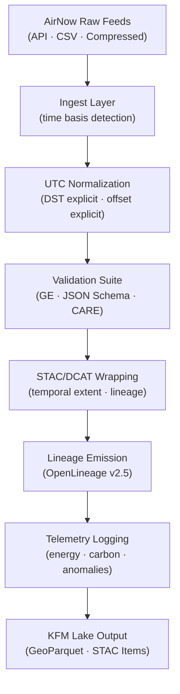

<div align="center">

# 🌬️ **Kansas Frontier Matrix — AirNow Pipeline Overview (v11.2.2)**  
`docs/pipelines/air/airnow/README.md`

**Purpose**  
Provide the authoritative **v11 AirNow pipeline overview**: ingest, normalization, schema rules,  
temporal governance, validation, STAC/DCAT integration, sustainability telemetry, and lineage standards  
for all AirNow datasets entering the Kansas Frontier Matrix.

</div>

---

## 📘 1. Overview

AirNow is a **critical environmental dataset** used across:

- Climate & atmospheric modeling  
- Public-health analysis  
- Hazard detection (smoke, ozone, particulates)  
- Environmental justice overlays  
- Story Node & Focus Mode environmental context  

KFM v11 requires **strict temporal normalization**, **FAIR+CARE governance**, and **full provenance** for all AirNow data streams.

This directory documents:

- AirNow ingest architecture  
- UTC normalization module  
- STAC/DCAT wrapping  
- Validation suite  
- Telemetry and sustainability monitoring  
- OpenLineage lineage events  
- Downstream integration expectations  

---

## 🗂️ 2. Directory Layout (Emoji Style A)

```text
docs/pipelines/air/airnow/
├── 📄 README.md                       # This file
│
├── 📂 ingest/                         # Ingest + UTC normalization module (full spec)
│   ├── 📄 README.md
│   ├── 📁 schemas/
│   ├── 🔁 transformers/
│   ├── 🧪 validators/
│   ├── 📜 lineage/
│   ├── 🧪 tests/
│   └── 🌐 stac/
│
├── 📂 transform/                      # (Optional v11.3) Derived AirNow transformations
│   ├── 🌫️ smoke_estimation.py
│   ├── 🌫️ pm25_bias_correction.py
│   └── 🧪 tests/
│
├── 📂 join/                           # Integration: AQS, Mesonet, HRRR, CMAQ
│   ├── 🔗 aqs_join.py
│   ├── 🔗 mesonet_join.py
│   ├── 🔗 hrrr_alignment.py
│   └── 🧪 tests/
│
└── 📂 stac/                           # High-level STAC Collection + Item templates
    ├── 🌐 airnow-collection.json
    └── 🌐 item-template.json
```

---

## 🔍 3. AirNow Pipeline Architecture (v11)



**Invariants:**

- No implicit DST inference  
- No timezone guesswork  
- No overwriting of raw timestamps  
- Provenance emitted for every run  
- STAC Items use **canonical UTC**  

---

## 🧩 4. Key Components

### 4.1 Ingest Layer  
Located in:  
`docs/pipelines/air/airnow/ingest/`

Responsible for:  
- Detecting time basis (LST/UTC/Unknown)  
- Applying deterministic AirNow normalization rules  
- Enforcing period-begin semantics  
- Emitting schema-validated rows  

### 4.2 Transform Layer  
*(Reserved for v11.3 expansion)*  
Includes:  
- smoke/PM₂.₅ corrections  
- trajectory estimation  
- harmonization for downstream models  

### 4.3 Join Layer  
Integrates AirNow with:  
- AQS  
- Mesonet  
- HRRR  
- CMAQ  
- Forecast models  

Ensures timestamp safety across domains.

### 4.4 STAC Layer  
Provides:  
- Collection template  
- Item template  
- Required temporal metadata (`datetime`, offsets, DST)  

---

## 📐 5. KFM v11 Time Rules for AirNow

AirNow timestamps must follow the **KFM UTC Truth Model**:

1. Preserve original station time (**never overwrite raw source time**)  
2. Convert to UTC using:  
   - reported offset  
   - explicit DST boolean  
   - verified timezone database  
3. Set `observed_time_utc` as authoritative  
4. Period alignment:  
   - Hourly AirNow → **period_begin**  
5. Metadata augmentation:  
   - `kfm:utcOffset`  
   - `kfm:isDST`  
   - `kfm:periodAlignment`  

---

## 🧪 6. Validation Suite

Validation implemented via **Great Expectations**, **custom predicates**, and **JSON Schema**.

Checks include:

- Timestamp completeness  
- Offset–DST alignment checks  
- ISO-8601 UTC validity  
- Period alignment checks  
- STAC/DCAT metadata generation  
- Provenance completeness  
- License + source metadata correctness  
- CARE compliance (AirNow is public data; verify correct usage)  

Validation files live under:

`docs/pipelines/air/airnow/ingest/validators/**`

---

## 🌐 7. STAC Integration

AirNow STAC Items must include:

- `datetime = observed_time_utc`  
- `start_datetime`, `end_datetime` (if aggregated)  
- `kfm:utcOffset`, `kfm:isDST`, `kfm:periodAlignment`  
- Links:
  - data file (GeoParquet)  
  - provenance record  
  - lineage file  

Collections defined under:

`docs/pipelines/air/airnow/stac/`

---

## 🔗 8. Provenance & OpenLineage

AirNow pipeline emits **OpenLineage v2.5** events containing:

- Job ID (`airnow_ingest_v11`)  
- Run ID (deterministic UUID)  
- Ingest inputs  
- Outputs (GeoParquet, STAC Items)  
- KFM Facets:
  - TimeNormalizationFacet  
  - CAREFacet  
  - EnergyFacet  
  - CarbonFacet  
  - QualityFacet  

Lineage templates:  
`ingest/lineage/airnow-ingest-lineage.json`

---

## 🌱 9. Telemetry & Sustainability (ISO 14064/50001)

All AirNow steps must log:

- `energy_wh`  
- `carbon_gco2e`  
- runtime duration  
- total rows processed  
- anomaly counts  

Telemetry flows into:

```
../../../../releases/v11.2.2/airnow-ingest-telemetry.json
docs/reports/telemetry/air/airnow-*.json
```

These feed dashboards and FAIR+CARE audits.

---

## 🛠️ 10. Downstream Dependencies

AirNow normalization flows into:

- Climate anomaly layers  
- Hazard smoke models  
- Air-quality Story Nodes (e.g., smoke days, AQ episodes)  
- Focus Mode v3 narratives  
- EJ overlays for public-health context  
- Predictive AQ models (v11.3+)  

Downstream systems assume **AirNow is normalized**, **UTC-safe**, and **schema-validated**.

---

## 🕰️ 11. Version History

| Version | Date       | Summary |
|--------:|------------|---------|
| v11.2.2 | 2025-11-28 | Created AirNow pipeline index; aligned with MDP v11.2.2; added emoji directory layout + STAC, telemetry, and lineage sections. |

---

<div align="center">

© 2025 Kansas Frontier Matrix — MIT License  
🌬️ AirNow Pipeline v11.2.2 · FAIR+CARE Compliant · Temporal Integrity · Diamond⁹ Ω / Crown∞Ω  

[⬅️ Back to Air Pipelines](../README.md) • [🌬️ Ingest Module](ingest/README.md) • [🛡 Governance](../../../standards/governance/ROOT-GOVERNANCE.md)

</div>
~~~~markdown

