<div align="center">

# 🌬️ **AirNow Ingest & Time Normalization Module (v11.2.2)**  
`docs/pipelines/air/airnow/ingest/README.md`

**Purpose**  
Define the authoritative, reproducible, FAIR+CARE-aligned ingest + UTC normalization rules for **AirNow air-quality datasets**, ensuring KFM-wide **temporal integrity**, **cross-dataset join safety**, **DST clarity**, and **provenance-correct timestamp lineage**.

</div>

---

## 📘 1. Overview

AirNow data arrives with **mixed timestamp semantics**, including:

- Local Standard Time (LST)  
- Local “wall-clock” time (with ambiguous DST)  
- UTC-reported feeds  
- Hourly period-begin conventions  

In KFM, **temporal correctness is mandatory** for atmospheric modeling, hydrology joins, epidemiology, hazards, and cross-agency analysis.

This module is the **governed standard** for:

- AirNow → canonical UTC ingest  
- Full offset/DST preservation  
- STAC/DCAT temporal metadata structuring  
- Provenance + OpenLineage event generation  
- Telemetry reporting (energy, carbon, anomalies)

---

## 🧩 2. Canonical Timestamp Schema (v11.2.2)

Every AirNow observation MUST include:

| Field                | Description                                        | Example                          |
|----------------------|----------------------------------------------------|----------------------------------|
| `observed_time_utc`  | Canonical ISO-8601 UTC timestamp                  | `2025-11-28T14:00:00Z`          |
| `station_local_time` | Reported local wall-clock time (verbatim string)  | `"2025-11-28 08:00"`            |
| `utc_offset_minutes` | Offset applied to derive UTC (minutes)            | `-360`                          |
| `is_dst`             | Explicit DST status (never inferred)              | `false`                         |
| `time_basis`         | `reported_LST`, `reported_UTC`, or `unknown`      | `"reported_LST"`                |
| `period_alignment`   | `period_begin` or `period_end`                    | `"period_begin"`                |
| `source_basis`       | How the time arrived from AirNow                  | `"AirNow-LST-Hourly"`           |
| `ingest_method_version` | Deterministic ingest version identifier        | `"v11.2.2"`                     |

### 2.1 Rules

- **DST MUST be explicit** (`is_dst`), not inferred from calendar/date alone.  
- **Offsets MUST be stored** (`utc_offset_minutes`).  
- AirNow hourly feeds are treated as **`period_begin`**; any deviation is flagged.  
- Ambiguous inputs MUST be represented as `time_basis: "unknown"` with a governance flag.

---

## 🔁 3. Ingest Workflow (v11)

```mermaid
flowchart TD
    A["Raw AirNow Feed"] --> B["Time Basis Detection\n(LST vs UTC vs ambiguous)"]
    B --> C["UTC Normalization\n(apply offset + DST rules)"]
    C --> D["Local Reconstruction\n(station time + offset + DST flag)"]
    D --> E["Period Alignment Enforcement\n(period_begin only)"]
    E --> F["Metadata Decoration\n(STAC · DCAT · JSON-LD · lineage)"]
    F --> G["Validation Layer\n(GE · schema · CARE checks)"]
    G --> H["Telemetry + OpenLineage\n(energy · carbon · anomalies)"]
    H --> I["KFM Lake Output\n(GeoParquet · STAC Items)"]
```



**Invariants:**

- Every output row has one—and only one—canonical `observed_time_utc`.  
- Local time, offset, and DST are preserved as first-class fields.  
- Period alignment is standardized to `period_begin`.

---

## 🧭 4. Scope & Responsibilities

The AirNow ingest module is responsible for:

- Normalizing all AirNow timestamp fields into a **single UTC timescale**  
- Ensuring **cross-join safety** between AirNow and:
  - AQS  
  - Mesonet  
  - Model outputs (e.g., HRRR, CMAQ)  
  - Historical climate records  
- Attaching:
  - STAC temporal metadata (`datetime`, `start_datetime`, `end_datetime`)  
  - DCAT temporal coverage (via JSON-LD)  
  - OpenLineage provenance for ingest jobs  
  - Telemetry (performance, energy, carbon)  

All pipelines needing **trusted air-quality timelines** MUST adopt this module.

---

## 🗂️ 5. Directory Layout (Emoji Style A)

```text
docs/pipelines/air/airnow/ingest/
├── 📄 README.md                            # This file
│
├── 📁 schemas/                              # Timestamp + ingest schemas
│   ├── 🧩 airnow-ingest-v11.json
│   └── 🕒 airnow-timestamps-v11.json
│
├── 🔁 transformers/                         # UTC normalization + DST logic
│   ├── ⏱️ time_normalizer.py
│   └── 📐 period_alignment.py
│
├── 🧪 validators/                           # Great Expectations + custom validators
│   ├── 🧪 temporal_integrity.yml
│   └── 🧪 dst_consistency.yml
│
├── 📜 lineage/                              # OpenLineage templates
│   └── 🔗 airnow-ingest-lineage.json
│
├── 🧪 tests/                                # Automated verification
│   ├── 🧪 test_timestamp_roundtrip.py
│   └── 🧪 test_airnow_period_alignment.py
│
└── 🌐 stac/                                 # STAC metadata templates
    ├── 🌐 airnow-collection.json
    └── 🌐 item-template.json
```

---

## ⚙️ 6. Validation Rules

### 6.1 Great Expectations (GE) Checks

- **Completeness**  
  - `observed_time_utc`, `station_local_time`, `utc_offset_minutes`, `is_dst` present.  

- **Consistency**  
  - `observed_time_utc` is valid ISO-8601.  
  - `utc_offset_minutes` matches station/timezone definitions.  
  - `is_dst` is consistent with offset and date.  

- **Period Alignment**  
  - `period_alignment == "period_begin"` for hourly AirNow outputs.  

### 6.2 Schema Validation

- Validate raw/transformed records against:
  - `schemas/airnow-timestamps-v11.json`  
  - `schemas/airnow-ingest-v11.json`  

### 6.3 CARE & Ethics Checks

Even though AirNow data is primarily environmental:

- Verify licensing, source terms, and public usage rights.  
- Confirm no unexpected sensitive attributes are present.  
- Ensure exports align with KFM’s **responsible environmental data handling** commitment.

---

## 📦 7. Output Formats (KFM v11)

### 7.1 GeoParquet

- Canonical time columns:
  - `observed_time_utc`  
  - `station_local_time`  
  - `utc_offset_minutes`  
  - `is_dst`  
  - `period_alignment`  
- Suitable for cross-joins with climate, hydrology, hazards, and health datasets.

### 7.2 STAC Items

Each STAC item should include:

- `datetime` = `observed_time_utc`  
- Optional temporal extent:
  - `start_datetime`, `end_datetime`  
- KFM-specific extensions:
  - `kfm:utcOffset`  
  - `kfm:isDST`  
  - `kfm:periodAlignment`  
- Link to provenance:
  - `kfm:provenance_ref` (OpenLineage run ID)

### 7.3 DCAT / JSON-LD

DCAT datasets generated from AirNow outputs MUST include:

- `dct:temporal` interval  
- `dct:issued` = release time  
- `dct:accrualPeriodicity` for typical observation cadence  

---

## 🔗 8. Provenance & Lineage (OpenLineage v2.5)

AirNow ingest jobs MUST emit OpenLineage events describing:

- `job` — canonical pipeline name, e.g. `airnow_ingest_v11`  
- `run` — unique run ID (GUID or timestamp combination)  
- `inputs` — raw AirNow source endpoints + station metadata  
- `outputs` — cleaned GeoParquet + STAC items  
- `facets` — KFM-specific:
  - `TimeNormalizationFacet` (basis, offset, DST, anomalies)  
  - `EnergyFacet` (`energy_wh`)  
  - `CarbonFacet` (`carbon_gco2e`)  

Lineage templates are stored under:

```text
docs/pipelines/air/airnow/ingest/lineage/airnow-ingest-lineage.json
```

---

## 🌱 9. Telemetry & Sustainability Metrics

Each AirNow ingest run MUST record:

- `energy_wh` — estimated ingest energy  
- `carbon_gco2e` — estimated CO₂e for the job  
- `runtime_sec` — ingestion runtime  
- `rows_processed` — number of AirNow records ingested  
- `offset_anomaly_count` — suspicious or inconsistent offsets  
- `dst_anomaly_count` — suspicious DST behavior  

Telemetry is written to:

```text
../../../../releases/v11.2.2/airnow-ingest-telemetry.json
docs/reports/telemetry/air/airnow-ingest-*.json
```

These are used for:

- Sustainability dashboards  
- Pipeline cost/benefit analysis  
- Governance & FAIR+CARE audits  

---

## 🕰️ 10. Version History

| Version | Date       | Summary                                                                                     |
|--------:|-----------:|---------------------------------------------------------------------------------------------|
| v11.2.2 | 2025-11-28 | Upgraded to KFM-MDP v11.2.2; applied emoji directory layout; expanded validation and telemetry sections. |
| v11.1.0 | 2025-11-28 | Initial AirNow ingest & time normalization reference for KFM v11.                           |

---

<div align="center">

© 2025 Kansas Frontier Matrix — MIT License  
🌬️ AirNow Ingest & Time Normalization Module · FAIR+CARE Compliant · Deterministic Time Normalization · Diamond⁹ Ω / Crown∞Ω  

[⬅️ Pipelines Index](../README.md) · [🌐 Air Pipelines](../../README.md) · [🛡 Governance](../../../standards/governance/ROOT-GOVERNANCE.md)

</div>
