<div align="center">

# 🌀 Kansas Frontier Matrix — Atmospheric Pipelines (v11.2.4)  
`docs/pipelines/atmo/README.md`

**Purpose:**  
Serve as the authoritative index for all **atmospheric ETL pipelines** in the Kansas Frontier Matrix.  
Covers HRRR and derivatives, climate-normalization routines, wind/smoke products, raster harmonization engines, and SNS→SQS validation gates leading to STAC/DCAT publication and graph ingestion.

</div>

---

## 📘 Overview

The **Atmospheric ETL subsystem** unifies meteorological and climate-related data for Kansas.  
All pipelines in this domain share the KFM pipeline guarantees:

- **Deterministic, seed-controlled ETL.**  
- **FAIR+CARE-aligned metadata** and governance hooks.  
- **KFM-STAC v11** dataset publication.  
- **Full PROV-O + OpenLineage lineage.**  
- **Energy + carbon telemetry** per run.  
- Harmonization to **EPSG:4326**, **UTC**, and **CF conventions** for atmospheric variables.

Supported atmospheric domains include:

- **HRRR (High-Resolution Rapid Refresh)** surface and upper-air variables.  
- **Wind fields & gust diagnostics.**  
- **Smoke, PM₂.₅, visibility and related derivatives.**  
- **Atmospheric subsetting and resampling** (smart subsetting by AOI and time).  
- **Climate normalization** and climatology fusion hooks.  
- **Validation gates** for SNS→SQS event-driven ingest (see `nodd-sns-sqs/validation`).  

These pipelines power:

- Real-time overlays and dashboards.  
- Historic change detection and scenario analyses.  
- Story Nodes tied to weather, smoke, or visibility events.  
- Focus Mode narratives that explain atmospheric context for KFM stories.

---

## 🗂️ Directory Layout

```text
📂 docs/pipelines/atmo/
├── 📄 README.md                         # 🌀 Atmospheric pipelines index (this file)
│
├── 📂 hrrr-smart-subsetting/            # 🧩 HRRR delta-aware ETL & AOI subsetting
│   └── 📄 README.md
│
├── 📂 climate-normalization/            # 🌡 UTC/unit & CF harmonization routines
│   └── 📄 README.md
│
├── 📂 wind-smoke-derivatives/           # 💨 Wind, smoke & visibility transforms
│   └── 📄 README.md
│
├── 📂 air-quality/                      # 🌬️ AQS / AirNow atmospheric joins (coordination with Air Domain)
│   └── 📄 README.md
│
├── 📂 raster-harmonization/             # 🗺️ Grid reprojection, alignment, COG conversion
│   └── 📄 README.md
│
└── 📂 nodd-sns-sqs/                     # 🛡️ SNS→SQS atmospheric validation gates
    └── 📂 validation/
        └── 📄 README.md                 # FAIR+CARE validation gates for SNS→SQS auto-updates
```

Additional CI workflows for these pipelines live under:

- `.github/workflows/atmo-*.yml` — atmospheric pipeline linting, tests, lineage audits, and telemetry checks.

All documents in this tree must follow **KFM-MDP v11.2.4** and link back to this index.

---

## 🧭 Context

Within the KFM pipeline stack:

> External atmospheric sources → **Atmo ETL** → STAC/DCAT/PROV catalogs → Neo4j → APIs → Frontend → Story Nodes & Focus Mode

The **Atmo** domain focuses on **meteorology and atmospheric modeling**, while the **Air Domain** (see `docs/pipelines/air/README.md`) focuses on **air-quality and aerosols**. They are coordinated but distinct:

- **Atmo**: HRRR, climate normalization, wind/smoke derivatives, raster harmonization, SNS→SQS validation gates.  
- **Air**: AQS, AirNow, satellite aerosols, low-cost sensors, air-quality collections.

Together they:

- Provide consistent **temporal and spatial reference frames** for all atmospheric analyses.  
- Feed story- and place-centric narratives with **weather and climate context**.  
- Maintain **provenance and sustainability metrics** for atmospheric data use.

---

## 🧱 Architecture

### 1. Atmospheric pipeline flow

```mermaid
flowchart TD
    A["Raw Atmospheric Sources\n(HRRR, model outputs, upstream catalogs)"]
        --> B["Ingest & Normalization\n(time, CRS, variable mapping)"]

    B --> C["Transform & Harmonize\n(CF units, resampling, bias correction)"]

    C --> D["Derivatives\n(wind stress, smoke/visibility, forecast products)"]

    D --> E["Validation Gates\n(SNS→SQS FAIR+CARE, schema, lineage checks)"]

    E --> F["Catalog & Export\n(STAC · DCAT · JSON-LD)"]

    F --> G["KFM Lake & Graph\n(GeoParquet · COG · Neo4j ingestion)"]

    G --> H["Applications\n(Frontends, Story Nodes, Focus Mode)"]
```



### 2. Pipeline index (current atmospheric suite)

| Pipeline                        | Description                                                         |
|--------------------------------|---------------------------------------------------------------------|
| **HRRR Smart Subsetting**      | AOI-aware HRRR clipping; delta-aware ingest; STAC v11 export.      |
| **Climate Normalization (UTC/CF)** | Harmonizes temporal axes, units, and metadata across models.  |
| **AQS / AirNow ETL (coord.)**  | Atmospheric-side coordination for AQS/AirNow ETL and joins.        |
| **Wind & Smoke Derivatives**   | HRRR post-processing for wind stress, smoke, and visibility.       |
| **Raster Harmonization Engine**| Grid reprojection, alignment, and COG conversion for atmo rasters. |
| **SNS→SQS Validation Gates**   | FAIR+CARE, STAC/DCAT, PROV-lineage gates for event-driven ingest.  |

Each concrete pipeline has its own README under `docs/pipelines/atmo/*/README.md` describing:

- DAG structure and queue usage.  
- Inputs/outputs and STAC/DCAT collections.  
- Lineage emission patterns.  
- Validation and governance hooks.

---

## 📦 Data & Metadata

Atmospheric pipelines must ensure:

- **Temporal normalization**
  - All times expressed in **UTC**, with clear interval semantics.  
  - Explicit handling of forecast valid times vs analysis times.

- **Spatial normalization**
  - CRS consistency (e.g., EPSG:4326 for canonical outputs).  
  - Clear documentation of native model grids and resampling methods.

- **CF-compliant metadata**
  - Use CF standard names where available.  
  - Define units, missing value conventions, and vertical coordinates.  

Key metadata expectations:

- Variables clearly identified (e.g., `u10`, `v10`, `T2`, `VIS`, `PM25`).  
- Grids documented (resolution, projection, staggered or not).  
- Provenance attributes linking to source models, runs, and input datasets.  
- Energy and carbon metrics linked to processing runs via telemetry schemas.

---

## 🌐 STAC, DCAT & PROV Alignment

Atmospheric pipelines must align to KFM’s metadata and provenance standards:

- **STAC**
  - Use Collections for each major product family (e.g., HRRR fields, derived gridded atmo products).  
  - Items represent specific model runs/times and spatial subsets.  
  - Include:
    - `datetime` / `start_datetime` / `end_datetime`.  
    - Asset media types (`application/x-netcdf`, `image/tiff; application=geotiff`, etc.).  
    - Atmo-specific properties (e.g., `kfm:atmoVariable`, `kfm:forecastLeadTime`).  

- **DCAT**
  - Register key atmospheric datasets as `dcat:Dataset` with:
    - `dct:title`, `dct:description`, `dct:license`, `dct:temporal`, `dct:spatial`.  
    - Distributions for raw model outputs, harmonized fields, and derivative products.

- **PROV-O / OpenLineage**
  - Ingest, transform, and export steps must:
    - Emit OpenLineage job/run/dataset events.  
    - Be convertible into PROV bundles with:
      - `prov:Activity` for pipeline runs.  
      - `prov:Entity` for atmospheric datasets and rasters.  
      - `prov:Agent` for orchestrators and maintainers.  

Atmospheric provenance should make it possible to answer:

- Which upstream model/version produced this field?  
- Which harmonization steps were applied?  
- How energy/carbon costs of a given product were computed?

---

## 🧪 Validation & CI/CD

Atmospheric pipelines participate in KFM’s validation and CI/CD framework:

- **Schema checks**
  - Validate netCDF/GRIB/COG structures.  
  - Confirm expected variables and dimensions.  

- **Semantic checks**
  - Assert physical plausibility (e.g., temperature ranges, wind limits).  
  - Validate spatial coverage overlaps Kansas and configured domains.  

- **Contract checks**
  - Use KFM-PDC v11 contracts to ensure consistent inputs/outputs.  
  - Confirm STAC/DCAT and lineage completeness.

- **CI workflows**
  - `.github/workflows/atmo-*.yml` should cover:
    - Linting and type checking.  
    - Unit and integration tests.  
    - STAC schema validation and lineage audits.  
    - Telemetry presence and basic sanity checks.

Any missing metadata, lineage, or FAIR+CARE flags should **block promotion** until remedied.

---

## 🧠 Story Node & Focus Mode Integration

Atmospheric pipelines enable:

- **Story Nodes** describing:
  - Significant weather events (storms, heat waves, cold snaps).  
  - Smoke and visibility conditions affecting historical or archaeological narratives.  
  - Climate and atmospheric context for multi-decade stories.

- **Focus Mode** overlays:
  - Atmo field snapshots (e.g., wind, precip, smoke) aligned with narrative time windows.  
  - Time sliders and maps showing how atmospheric conditions change around events.  
  - Links from atmo fields to their provenance, enabling “why” explanations.

Rules:

- Focus Mode **may** summarize atmo conditions, highlight fields, and provide interpretive context.  
- Focus Mode **must not** invent atmospheric events not supported by data or documents.  
- Story Nodes referencing atmo-derived context must link to:
  - STAC items or collections.  
  - Lineage records (OpenLineage/PROV).  
  - Relevant pipeline READMEs where applicable.

---

## ⚖ FAIR+CARE & Governance

Even though atmospheric data is generally low-sensitivity, its usage is governed:

- **FAIR**
  - Atmo datasets must be findable via STAC/DCAT index.  
  - Access patterns should respect licensing and service limits.  
  - Interoperability enforced via CF, STAC, DCAT, PROV, and KFM ontologies.  

- **CARE**
  - When atmospheric products are joined with EJ or health datasets, pipelines must:
    - Avoid overly granular or identifying outputs.  
    - Clearly document assumptions and limitations.  
  - Any cross-domain usage touching Indigenous lands or culturally significant areas must respect:
    - `sovereignty_policy` guidance.  
    - Additional governance review where required.

Governance hooks come from:

- `governance_ref`, `ethics_ref`, `sovereignty_policy` in front-matter.  
- Lineage and telemetry entries that flag critical atmo products for review.

---

## 🕰️ Version History

| Version | Date       | Status            | Summary                                                                 |
|--------:|------------|-------------------|-------------------------------------------------------------------------|
| v11.2.4 | 2025-12-05 | Active / Enforced | Updated to KFM-MDP v11.2.4; added SNS→SQS validation reference; aligned metadata, lineage, and directory layout with global pipeline standards. |
| v11.2.2 | 2025-11-28 | Superseded        | Atmospheric pipeline index with emoji directory tree and core ETL description. |
| v11.0.0 | 2025-11-20 | Superseded        | Initial atmospheric pipeline index for KFM v11.                         |

---

<div align="center">

🌀 **Kansas Frontier Matrix — Atmospheric Pipelines (v11.2.4)**  
Deterministic Meteorology · FAIR+CARE Governance · STAC/DCAT/PROV-Aligned Atmosphere Layer  

<br/>

[📘 Docs Root](../..) · [🛠 Pipelines Index](../README.md) · [🌬️ Air Domain Pipelines](../air/README.md) · [⚖ Governance](../../standards/governance/ROOT-GOVERNANCE.md)

</div>