<div align="center">

# 🔄 **KFM v11 — Conditional Ingestion Pipeline**  
`docs/pipelines/conditional-ingestion/README.md`

**Purpose:**  
Define the governed, deterministic, FAIR+CARE-aligned architecture for **Conditional Ingestion Pipelines** — data ingestion flows that activate only when specific **conditions**, **thresholds**, **metadata states**, or **governance rules** are satisfied.

Conditional ingestion ensures that **only safe, validated, contract-compliant, sovereignty-appropriate data** enters the Kansas Frontier Matrix.

</div>

---

## 📘 1. Overview

Conditional Ingestion Pipelines (CIPs) provide **governed, event-driven, rule-based ingestion** for KFM data domains:

- Hydrology  
- Climate  
- Ecology  
- Hazards  
- Heritage-sensitive datasets  
- Archives (OCR → metadata → ingest)  
- Raster/Vector GIS layers  

They are built using:

- **LangGraph v11 DAG engine**  
- **CrewAI cooperative agents (v3)**  
- **KFM-PDC v11 Data Contracts**  
- **FAIR+CARE & sovereignty enforcement**  
- **OpenLineage v2.5 provenance**  
- **Neo4j write-governance hooks**  

---

## 🧩 2. Why Conditional Ingestion?

CIPs only ingest when **explicit conditions** are met, such as:

### 📌 Data-State Conditions

- New upstream dataset version exists  
- Checksum changed  
- Metadata changed  
- Spatial/temporal coverage expanded  
- Raw file fully validated  

### ⚠ Governance Conditions

- Sovereignty flags satisfied  
- CARE classification accepted  
- Sensitive-site masking complete  
- License & attribution approvals verified  

### 🌦 Environmental Trigger Conditions

- New climate anomaly period detected  
- Flood/drought threshold crossed  
- New hazard alerts available  

### 📈 Pipeline Health & Reliability Conditions

- Error budget > threshold  
- SLOs met  
- CI/CD validation passes  
- No lineage corruption  

Ingestion is blocked if any required conditions fail.

---

## 🛠️ 3. Pipeline Architecture (v11)

```mermaid
flowchart TD
    A["Upstream Dataset / Event"] --> B["Trigger Evaluator (Conditions Engine)"]
    B -->|All Conditions Met| C["LangGraph v11 DAG"]
    B -->|Fail| Z["Halt · Notify · Governance Review"]

    C --> D["Data Contract Validation (KFM-PDC v11)"]
    D --> E["FAIR+CARE Screening"]
    E --> F["Sensitive-Site H3 Masking"]
    F --> G["Schema Harmonization + Metadata Enrichment"]
    G --> H["Neo4j Ingestion (Governed Writes)"]
    H --> I["STAC/DCAT Publishing"]
    I --> J["OpenLineage · Telemetry · Provenance"]
```



All stages emit lineage and telemetry.

---

## 🔍 4. Condition Types (v11 Standard)

### 4.1 Data Integrity Conditions

- Checksum delta  
- File availability  
- Format correctness (GeoTIFF, Parquet, Shapefile, GeoPackage, etc.)  
- Required fields present  

### 4.2 Schema Conditions

- STAC Item validates  
- DCAT Dataset conforms  
- Data Contract v11 satisfied  
- CRS integrity (EPSG:4326 or contract-specified CRS)  

### 4.3 Governance Conditions

- CARE classification set  
- Sovereignty flags approved  
- H3 generalization applied  
- License validated  

### 4.4 AI/ETL Conditions

- ML model versions match policy  
- AI inference checks (e.g., bias-check SOP results)  
- Explainability thresholds satisfied  
- Drift thresholds respected  

### 4.5 Reliability Conditions

- SLO checks:

  - Success ratio  
  - Latency  
  - Drift  
  - Error budget remaining  

### 4.6 Semantic Conditions

- Graph consistency  
- Temporal validity (OWL-Time)  
- Spatial validity (GeoSPARQL)  

---

## 📦 5. Directory Layout

```text
docs/pipelines/conditional-ingestion/
├── 📄 README.md                        # This document
├── 📁 conditions/                      # JSON/YAML files describing rules
│   ├── 📄 climate_conditions.yaml
│   ├── 📄 hydrology_conditions.yaml
│   └── 📄 README.md                    # Optional conditions index
├── 📁 triggers/                        # Event sources (files, API, time-based)
│   ├── 📄 s3_event.json
│   ├── 📄 climate_anomaly_trigger.yaml
│   └── 📄 README.md                    # Trigger documentation
├── 📁 validators/                      # Contract + schema validators
│   ├── 📄 pdc_v11_validator.py
│   ├── 📄 provenance_validator.py
│   └── 📄 README.md                    # Validation patterns & rules
└── 📁 examples/                        # Example ingestion flows
    ├── 📄 hydrology_ingest_example.md
    ├── 📄 climate_ingest_example.md
    └── 📄 README.md                    # Examples index
```

All directories in this layout **must** include their own `README.md` with KFM-MDP-compliant front-matter and a short purpose description.

---

## 🧬 6. Workflow Logic

### 6.1 Step 1 — Trigger Evaluation

Triggers include:

- S3 object created  
- API event (USGS update, NOAA product publish, etc.)  
- Climate anomaly detected  
- New STAC Collection or Item published  
- Time-based (nightly/monthly)  

Each trigger generates a **Condition Evaluation Report** stored at:

```text
data/work/conditional-ingestion/reports/<timestamp>.json
```

This report records:

- Trigger source and payload digest  
- Conditions evaluated and their pass/fail status  
- Governance flags (sovereignty, CARE, license)  
- Decision: `proceed` vs `halt` (with reasons)

### 6.2 Step 2 — Data Contract Validation

Validated against **KFM-PDC v11**:

- Domain-specific data contract (hydrology, climate, hazards, etc.)  
- CRS and unit expectations  
- Variable names & semantics  
- Spatial and temporal coverage  
- Required attributes and metadata  

### 6.3 Step 3 — FAIR+CARE Screening

Checks:

- License and usage constraints  
- CARE classification and labels  
- Sovereignty policy compliance  
- Sensitive-site H3 masking rules  

If CARE Tier A (or higher-risk classification) is detected, ingestion requires FAIR+CARE review.

### 6.4 Step 4 — Metadata Enrichment

CrewAI v3 (or equivalent governed agents) enrich:

- STAC Items  
- DCAT Datasets  
- PROV-O entities and activities  
- Keywords & domain tags  
- Temporal/seasonal summaries  

All agentic behavior must respect governance and be logged as PROV-O activities.

### 6.5 Step 5 — Neo4j Ingestion (Governed Writes)

Neo4j write-governance enforces:

- Graph schema validation (CIDOC-CRM, KFM ontologies)  
- OWL-Time interval consistency  
- GeoSPARQL geometry constraints  
- No raw coordinates when masking/generalization is required  

Writes are WAL-logged for deterministic replay and linked to OpenLineage runs.

### 6.6 Step 6 — Publishing

Outputs include:

- STAC Item/Collection updates  
- DCAT Dataset records  
- Provenance JSON-LD bundles  
- OpenLineage events (start/complete/fail)  
- Telemetry bundles (energy, carbon, runtime, data volume)  

---

## 🔐 7. Governance & Ethics

CIPs enforce:

- **CARE & sovereignty constraints** for all relevant datasets.  
- **No sensitive coordinates** where masking is required (e.g., H3 R7/8/9 or higher).  
- **FAIR metadata** (Findable, Accessible, Interoperable, Reusable).  
- **License compliance** including attribution and redistribution constraints.  
- **Narrative safety** for any AI-generated summaries (no speculative claims, no governance overrides).  
- **Provenance completeness** (PROV-O and OpenLineage).

If any governance rule fails, ingestion halts and:

- A governance incident is logged.  
- A review ticket is generated for FAIR+CARE / sovereignty boards.  
- No STAC/DCAT or graph updates are promoted from this run.

---

## 📊 8. Telemetry & Observability

Telemetry recorded for each conditional-ingestion run includes:

- Pipeline duration and per-step latencies.  
- Success/failure states and error categories.  
- SLO metrics (success rate, p95 latency, error budget burn).  
- Data contract compliance counts.  
- Energy and carbon footprints (using `energy_schema` and `carbon_schema`).  
- Governance events (e.g., sovereignty blocks, CARE escalations).  

Telemetry is stored at:

```text
releases/<version>/conditional-ingestion-telemetry.json
```

and may be mirrored under:

```text
docs/reports/telemetry/conditional-ingestion/conditional-ingestion-*.json
```

---

## 🧯 9. Failure Modes & Recovery

### Failure Mode Categories

- Data Contract violations  
- CRS mismatch or units mismatch  
- Missing mandatory metadata  
- Sovereignty violation  
- Sensitive-site masking missing or misapplied  
- STAC/DCAT schema invalid  
- Governance block (e.g., CARE review pending)  
- AI bias/drift detection failure  

### Recovery Steps

- Rerun metadata enrichment with corrected configs.  
- Apply or correct H3 masking and spatial generalization.  
- Request or complete FAIR+CARE review.  
- Fix data contract violations and re-validate.  
- Regenerate STAC/DCAT metadata with corrected fields.  
- Patch CRS/units and rerun harmonization.  
- Update dataset version links and lineage references.  

All recovery actions must:

- Emit their own OpenLineage runs.  
- Update PROV-O provenance chains.  
- Be reflected in governance and audit logs.

---

## 🕰 10. Version History

| Version | Date       | Summary                                                                    |
|--------:|------------|----------------------------------------------------------------------------|
| v11.0.0 | 2025-11-23 | Initial conditional ingestion pipeline overview (governed, contract-aligned). |

---

<div align="center">

© 2025 Kansas Frontier Matrix  
Diamond⁹ Ω / Crown∞Ω Certified · FAIR+CARE · MCP-DL v6.3  
Reliable Pipelines v11 · Sovereignty-Aware · Fully Governed  

[⬅ Back to Pipelines Index](../README.md) ·  
[⚖ Governance Charter](../../standards/governance/ROOT-GOVERNANCE.md) ·  
[📘 KFM Documentation Home](../../README.md)

</div>