<div align="center">

# 🔄 **KFM v11 — Conditional Ingestion Pipeline**  
`docs/pipelines/conditional-ingestion/README.md`

**Purpose:**  
Define the governed, deterministic, FAIR+CARE-aligned architecture for **Conditional Ingestion Pipelines** — data ingestion flows that activate only when specific **conditions**, **thresholds**, **metadata states**, or **governance rules** are satisfied.

Conditional ingestion ensures that **only safe, validated, contract-compliant, sovereignty-appropriate data** enters the Kansas Frontier Matrix.

</div>

---

## 📘 1. Overview

Conditional Ingestion Pipelines (CIPs) provide **governed, event-driven, rule-based ingestion** for KFM data domains:

- Hydrology  
- Climate  
- Ecology  
- Hazards  
- Heritage-sensitive datasets  
- Archives (OCR → metadata → ingest)  
- Raster/Vector GIS layers  

They are built using:

- **LangGraph v11 DAG engine**  
- **CrewAI cooperative agents (v3)**  
- **KFM-PDC v11 Data Contracts**  
- **FAIR+CARE & Sovereignty enforcement**  
- **OpenLineage v2.5 provenance**  
- **Neo4j write-governance hooks**  

---

## 🧩 2. Why Conditional Ingestion?

CIPs only ingest when **explicit conditions** are met, such as:

### 📌 Data-State Conditions
- New upstream dataset version exists  
- Checksum changed  
- Metadata changed  
- Spatial/temporal coverage expanded  
- Raw file fully validated  

### ⚠ Governance Conditions
- Sovereignty flags satisfied  
- CARE classification accepted  
- Sensitive-site masking complete  
- License & attribution approvals verified  

### 🌦 Environmental Trigger Conditions
- New climate anomaly period detected  
- Flood/drought threshold crossed  
- New hazard alerts available  

### 📈 Pipeline Health & Reliability Conditions
- Error budget > threshold  
- SLOs met  
- CI/CD validation passes  
- No lineage corruption  

Ingestion is blocked if any required conditions fail.

---

## 🛠️ 3. Pipeline Architecture (v11)

```mermaid
flowchart TD
    A["Upstream Dataset / Event"] --> B["Trigger Evaluator (Conditions Engine)"]
    B -->|All Conditions Met| C["LangGraph v11 DAG"]
    B -->|Fail| Z["Halt · Notify · Governance Review"]

    C --> D["Data Contract Validation (KFM-PDC v11)"]
    D --> E["FAIR+CARE Screening"]
    E --> F["Sensitive-Site H3 Masking"]
    F --> G["Schema Harmonization + Metadata Enrichment"]
    G --> H["Neo4j Ingestion (Governed Writes)"]
    H --> I["STAC/DCAT Publishing"]
    I --> J["OpenLineage · Telemetry · Provenance"]
```



All stages emit lineage and telemetry.

---

## 🔍 4. Condition Types (v11 Standard)

### 4.1 **Data Integrity Conditions**
- Checksum delta  
- File availability  
- Format correctness (GeoTIFF, Parquet, shapefile)  
- Required fields present  

### 4.2 **Schema Conditions**
- STAC Item validates  
- DCAT Dataset conforms  
- Data Contract v11 satisfied  
- CRS integrity (EPSG:4326 or contract-specified CRS)  

### 4.3 **Governance Conditions**
- CARE classification set  
- Sovereignty flags approved  
- H3 generalization applied  
- License validated  

### 4.4 **AI/ETL Conditions**
- ML model versions match  
- AI inference conditions (e.g., bias-check SOP results)  
- Explainability thresholds  
- Drift thresholds  

### 4.5 **Reliability Conditions**
- SLO checks:
  - Success ratio  
  - Latency  
  - Drift  
  - Error budget remaining  

### 4.6 **Semantic Conditions**
- Graph consistency  
- Temporal validity (OWL-Time)  
- Spatial validity (GeoSPARQL)  

---

## 📦 5. Directory Layout

```text
docs/pipelines/conditional-ingestion/
│
├── README.md                     # This document
├── conditions/                   # JSON/YAML files describing rules
│   ├── climate_conditions.yaml
│   ├── hydrology_conditions.yaml
│   └── ...
│
├── triggers/                     # Event sources (files, API, time-based)
│   ├── s3_event.json
│   ├── climate_anomaly_trigger.yaml
│   └── ...
│
├── validators/                   # Contract + schema validators
│   ├── pdc_v11_validator.py
│   ├── provenance_validator.py
│   └── ...
└── examples/                     # Example ingestion flows
    ├── hydrology_ingest_example.md
    ├── climate_ingest_example.md
    └── ...
```

---

## 🧬 6. Workflow Logic

### 6.1 Step 1 — Trigger Evaluation
Triggers include:

- S3 object created  
- API event (USGS update)  
- Climate anomaly detected  
- New STAC collection published  
- Time-based (nightly/monthly)  

Each trigger generates a **Condition Evaluation Report** stored at:

```
data/work/conditional-ingestion/reports/<timestamp>.json
```

### 6.2 Step 2 — Data Contract Validation
Validated against:

- KFM-PDC v11 domain contract  
- CRS  
- Units  
- Variable names  
- Spatial/temporal coverage  

### 6.3 Step 3 — FAIR+CARE Screening
Checks:

- License  
- CARE classification  
- Sovereignty policy compliance  
- Sensitive-site H3 masking  

If CARE Tier A → requires FAIR+CARE review.

### 6.4 Step 4 — Metadata Enrichment
CrewAI v3 enriches:

- STAC Items  
- DCAT datasets  
- Lineage references  
- Keywords & domain labels  
- Temporal summarization  

### 6.5 Step 5 — Neo4j Ingestion (Governed Writes)
Neo4j write-governance enforces:

- Graph schema validation  
- CIDOC-CRM alignment  
- OWL-Time interval checks  
- GeoSPARQL geometry constraints  

Writes are WAL-logged for deterministic replay.

### 6.6 Step 6 — Publishing
Outputs:

- STAC Item/Collection  
- DCAT Dataset  
- Provenance JSON-LD  
- OpenLineage event  
- Metrics → telemetry  

---

## 🔐 7. Governance & Ethics

CIPs enforce:

- **CARE + sovereignty constraints**  
- **No sensitive coordinates** (H3-R7/8/9)  
- **FAIR metadata**  
- **License compliance**  
- **Narrative safety for AI-generated summaries**  
- **Provenance completeness**  

If any governance rule fails → ingestion halts.

---

## 📊 8. Telemetry & Observability

Telemetry recorded:

- Pipeline duration  
- Success/failure states  
- SLO metrics  
- Contract compliance counts  
- Energy + carbon footprint  
- Governance events  

Stored at:

```
releases/<version>/conditional-ingestion-telemetry.json
```

---

## 🧯 9. Failure Modes & Recovery

### Failure Mode Categories
- Data Contract violations  
- CRS mismatch  
- Missing mandatory metadata  
- Sovereignty violation  
- Sensitive-site masking missing  
- Schema invalid  
- Governance block  
- AI bias/drift detection fail  

### Recovery Steps
- Rerun enriched metadata generator  
- Apply H3 masking  
- Request FAIR+CARE review  
- Fix contract violations  
- Regenerate STAC/DCAT metadata  
- Patch CRS/units  
- Update dataset version links  

---

## 🕰 10. Version History

| Version | Date | Summary |
|--------:|------|---------|
| v11.0.0 | 2025-11-23 | Initial conditional ingestion pipeline overview (governed, contract-aligned). |

---

<div align="center">

© 2025 Kansas Frontier Matrix  
Diamond⁹ Ω / Crown∞Ω Certified · FAIR+CARE · MCP-DL v6.3  
Reliable Pipelines v11 · Sovereignty-Aware · Fully Governed  

</div>