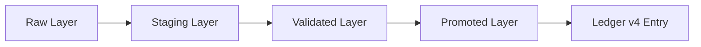
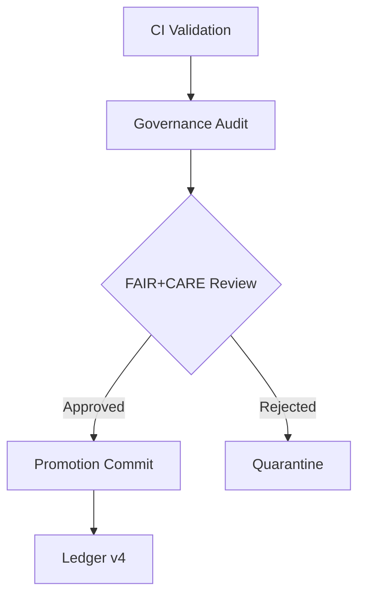

# 🚀 **Kansas Frontier Matrix — Data Promotion Protocol & Governance Guide (v11.0.0)**  
`docs/pipelines/data-promotion.md`

**Purpose:**  
Define the **complete v11 LTS specification** for dataset, entity, and model **promotion** within the KFM pipeline ecosystem.  
Describes how raw → staged → validated → promoted data transitions occur under FAIR+CARE governance, sovereignty-aware controls, STAC/DCAT metadata requirements, and PROV-O lineage enforcement.

---

# 📘 Executive Summary

Promotion in KFM v11 is a **governed, multi-phase, auditable workflow** ensuring that:

- Only validated, ethical, and sovereignty-compliant data reaches the **trusted graph**  
- All transformations are reproducible and lineage-complete  
- AI-assisted suggestions never bypass review  
- Sensitive cultural data is masked, generalized, or fully withheld  
- STAC/DCAT metadata is attached prior to promotion  
- Promotion is logged immutably in **Ledger v4**  
- Each promotion is auditable against **Pipeline Contracts v11**, CARE policies, and governance rules  

Promotion is **not automatic**. It is a deliberate, evidence-backed, policy-enforced process.

---

# 📦 1. Promotion Lifecycle Overview

Promotion has **four phases**, each required and validated by CI/Governance:

## 1. Raw Layer  
- Data is ingested, checksummed, and frozen  
- No transformations allowed  
- Stored under `data/raw/` or remote equivalent  
- Registered in STAC/DCAT source registry  

## 2. Staging Layer  
- Deterministic ETL + AI enrichment (provenance attached)  
- Intermediate STAC Items produced  
- CI validation required before proceeding  
- Stored under `data/staging/`  

## 3. Validated Layer  
- Passes **full validation suite**:
  - Schema
  - Ontology
  - FAIR+CARE  
  - Sovereignty rules  
  - Lineage completeness  
  - Drift/bias/failure checks  
- Stored under `data/validated/`  

## 4. Promoted Layer  
- Official, canonical representation inside:
  - **Neo4j knowledge graph**  
  - **STAC/DCAT catalogs**  
  - **Historical + narrative pipelines**  
- Immune to modification except through approved hotfix protocol  

---

# 🧪 2. Validation Gates Required for Promotion

Promotion requires all validation pipelines to pass:

### Structural  
- STAC v11 schema  
- DCAT v11 dataset schema  
- JSON-LD w/ KFM context  
- CRS + bbox checks  
- GeoJSON validation  

### Semantic  
- CIDOC-CRM mapping  
- GeoSPARQL compliance  
- OWL-Time reasoning  
- Entity uniqueness  
- Canonical ID enforcement  

### Ethical & Sovereignty  
- CARE rules applied  
- Indigenous sovereignty policy enforced  
- Mask sensitive coordinates (H3 r7 generalization)  
- Remove sensitive narrative or imagery  

### Lineage  
- Full PROV-O chain  
- OpenLineage event completeness  
- Deterministic re-run consistency  

### Sustainability  
- Energy usage  
- Carbon emissions  
- Data movement cost  

Promotion **fails** if any gate fails.

---

# 🔄 3. Promotion Workflows (Human + Automated)

Promotion combines **human signoff** + **automated rule enforcement**.

### Required Human Roles  
- FAIR+CARE reviewer  
- Sovereignty reviewer (if Indigenous-linked datasets)  
- Domain steward (hydrology, archaeology, climate, etc.)  

### Automated Roles  
- GovHooks v4  
- Pipeline Contract Enforcer  
- Lineage Auditor  
- STAC/DCAT metadata validator  

---

# 🧱 4. Hotfix, Rollback & Re-Promotion Protocol

Promotion errors are inevitable — KFM v11 supports:

### Hotfix  
- Fix a promoted dataset **without overwriting history**  
- Creates a *sibling* entity with `hotfix` flag  
- Leaves original lineage intact  

### Rollback  
- Invalidate a promoted dataset  
- Does **not** delete the entity  
- Marks as superseded, pushes update to Ledger v4  

### Re-Promotion  
- Requires full pipeline re-run  
- Must generate new lineage + new STAC/DCAT entries  

---

# 🛰️ 5. Promotion Metadata Requirements

Every promoted dataset/entity MUST contain:

- `promotion_version`  
- `promotion_timestamp`  
- `promotion_actor` (human + automated agents)  
- `promotion_reason`  
- Lineage bundles  
- Ethics + CARE labels  
- Sovereignty flags  
- STAC/DCAT Item + Collection links  

Promotion metadata is considered **immutable**.

---

# 🧭 6. Focus Mode & Story Node Interaction

Promotion affects:

### Focus Mode v3  
- Only promoted (trusted) graph entities may influence reasoning  
- Unvalidated or staging-layer entities are ignored  

### Story Nodes v3  
- Story Nodes may only reference **promoted entities**  
- Narrative generation must use canonical IDs  
- Temporal reasoning requires validated OWL-Time intervals  

---

# 🛡️ 7. Governance Plane Integration

Promotion is deeply tied to:

- **GovHooks v4** enforcement  
- **Ledger v4** immutability  
- **FAIR+CARE Council** oversight  
- **Sovereignty review** for culturally sensitive data  
- Automated compliance scoring  

Promotion is not just technical — it is ethical, legal, and community-centered.

---

# 🕰 Version History

| Version | Date       | Notes                                                                 |
|--------:|-----------:|-----------------------------------------------------------------------|
| v11.0.0 | 2025-11-20 | Initial Data Promotion Protocol & Governance Guide for KFM v11 LTS.   |

---

# 🔗 Footer

**Back to Root:** `../../README.md`  
**Back to Architecture:** `../architecture/system_overview.md`  
**Back to Standards:** `../standards/README.md`

