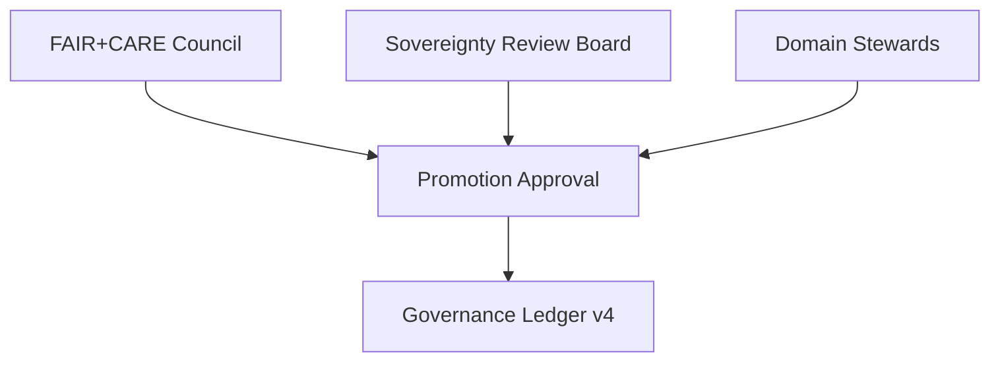

# 🏛️ **Kansas Frontier Matrix — Pipeline Governance Charter (v11.0.0)**  
`docs/pipelines/governance.md`

**Purpose:**  
Define the **full v11 governance framework** that regulates all KFM pipelines, including ETL, AI enrichment, validation, data promotion, lineage, sovereignty, FAIR+CARE ethics, sustainability telemetry, and rule-based authorization.  
This document establishes the **policy, authority, and safeguards** that ensure KFM remains reproducible, equitable, accountable, and aligned with tribal sovereignty requirements.

---

# 📘 Executive Summary

Pipeline governance in KFM v11 is a **multi-layered authority model** combining:

- FAIR+CARE ethical frameworks  
- Indigenous sovereignty rules  
- Automated enforcement (GovHooks v4)  
- Human oversight (FAIR+CARE Council, Sovereignty Board, Domain Stewards)  
- Lineage guarantees (PROV-O + OpenLineage v2.5)  
- STAC/DCAT metadata requirements  
- Promotion controls and rollback protocols  
- Sustainability instrumentation  
- AI governance constraints ensuring explainability, reproducibility, and non-speculation  

Governance is not passive — it is an **active and mandatory control plane**, embedded into all pipeline stages and enforced at runtime.

---

# 🏛️ 1. Governance Principles

KFM governance is built on:

### **1.1 FAIR Principles**
- **Findable:** All datasets must have discoverable metadata.  
- **Accessible:** Data must be openly retrievable with proper licensing.  
- **Interoperable:** Ontology-driven structure (CIDOC-CRM, OWL-Time, GeoSPARQL).  
- **Reusable:** Provenance, licensing, and documentation must support reuse.

### **1.2 CARE Principles**
- **Collective Benefit**  
- **Authority to Control**  
- **Responsibility**  
- **Ethics**  
Embedded especially for tribal datasets, culturally sensitive sites, and historical materials.

### **1.3 Sovereignty Rules**
- Tribal nations maintain authority over their data.  
- Masking, redaction, and H3 r7+ location generalization required for sensitive features.  
- No pipeline writes that violate sovereignty or cultural protections.

### **1.4 Safety & Accountability**
- Full lineage required  
- Zero silent failures  
- Machine + human review  
- Immutable governance logs  

---

# 📜 2. Governance Roles & Authorities

## 2.1 FAIR+CARE Council  
- Ensures global ethical compliance.  
- Oversees promotion, rollback, and governance audits.

## 2.2 Sovereignty Review Board  
- Approves/rejects culturally sensitive data releases.  
- Defines masking and redaction rules.  
- May override promotion decisions.

## 2.3 Domain Stewards  
- Hydrology, archaeology, climate, ecology, history, hazards, etc.  
- Validate accuracy and interpretive safety.

## 2.4 Automated Agents (GovHooks v4)  
- Enforce policy at runtime.  
- Block pipeline advancement upon violations.

---

# 🧰 3. Governance Gates

Governance gates exist at each stage of a pipeline:

### Gate 1 — Structural Validation  
### Gate 2 — Semantic Validation  
### Gate 3 — Sovereignty Enforcement  
### Gate 4 — FAIR+CARE Compliance  
### Gate 5 — Lineage Completeness  
### Gate 6 — Sustainability Budget Checks  
### Gate 7 — Promotion Approval  

Failure at *any* gate causes rollback/quarantine.

---

# 🔒 4. Access, Authorization & Audit

## 4.1 Access Control  
- Roles: Admin, Steward, Reviewer, Reader  
- Principle of least privilege  
- Sensitive datasets require dual approval

## 4.2 Governance Ledger v4  
Immutable log for:

- Promotions  
- Rollbacks  
- Model changes  
- Masking/redaction events  
- Ethical disputes or overrides  

## 4.3 Continuous Audit  
- Automated drift monitoring  
- Sustainability metrics  
- FAIR+CARE scoring  
- Ontology compliance audits  

---

# 🧭 5. AI Governance Integration

AI must obey:

- **Explainability**  
- **Confidence bounds**  
- **Non-speculation**  
- **Reproducibility**  
- **Model registry requirements**  
- **Sovereignty restrictions**  

### AI outputs must never:
- Overwrite authoritative fields  
- Introduce unverified claims  
- Reveal sensitive cultural data  
- Circumvent governance gates  

---

# 🔁 6. Promotion, Rollback & Hotfix Governance

Promotion rules:

- No entity becomes “trusted” until all governance gates pass  
- Sovereignty restrictions override all other approvals  
- Promotion triggers immutable log entries  

Rollback rules:

- Leaves prior versions intact  
- Creates `superseded_by` lineage  
- Requires FAIR+CARE Council approval  

Hotfix rules:

- Allowed only for:
  - Safety fixes  
  - Masking corrections  
  - Provenance corrections  

---

# 🌿 7. Sustainability & Stewardship Governance

Pipelines must track:

- Energy usage  
- Carbon output  
- Data movement impact  
- Compute-intensity budgets  

Governance rejects pipeline runs exceeding thresholds unless explicitly waived.

---

# 🕰 Version History

| Version | Date       | Notes                                                |
|--------:|-----------:|------------------------------------------------------|
| v11.0.0 | 2025-11-20 | Initial Pipeline Governance Charter for KFM v11 LTS. |

---

# 🔗 Footer

**Back to Root:** `../../README.md`  
**Back to Architecture:** `../architecture/system_overview.md`  
**Back to Standards:** `../standards/README.md`

