<div align="center">

# 📊 **KFM v11 — Release Pipeline Dashboards Overview**  
`docs/pipelines/release/dashboards/README.md`

**Purpose**  
Provide a unified index and governance overview for all **reliability, drift, lineage, and cost dashboards** used to monitor KFM v11 release pipelines.

Dashboards surface:
- **SLO attainment**  
- **Schema/data quality integrity**  
- **ETL/AI drift signals**  
- **Lineage completeness (PROV-O + OpenLineage)**  
- **Sustainability metrics (Energy/Carbon)**  
- **CARE/Sovereignty safeguards violations**  

</div>

---

# 📘 1. Overview

The KFM release pipeline dashboard suite provides **real-time and historical observability** for every promotion event across:

- ETL pipelines  
- AI/ML models (Story Node v3, Focus Mode v3)  
- Climate & hydrology processing  
- Hazard analytics  
- Spatial/temporal generalization workflows  
- STAC/DCAT publishing  
- Neo4j ingestion  

Dashboards are JSON-based, machine-readable, and CI/CD-generated.  
They form the **visual governance layer** for Reliability Engineering + FAIR+CARE Council.

---

# 🗂 2. Directory Layout (Option-B, KFM-MDP v11)

```text
docs/pipelines/release/dashboards/                 # Release pipeline dashboard suite
│
├── README.md                                      # This index overview (v11)
│
├── reliability.json                               # SLO attainment, error budgets, freeze signals
├── drift.json                                     # ML/ETL drift: PSI, KL, KS, feature deltas
├── lineage.json                                   # PROV-O lineage visualization + DAG health
└── cost.json                                      # Compute/storage/egress cost and sustainability dashboard
````

Each file is validated by:

* `telemetry_export.yml`
* `ci.yml`
* `faircare_validate.yml`
* `schema-lint-v11`
* Dashboard-specific JSON schemas

---

# 🧬 3. Dashboard Types (Deep-Dive)

## 3.1 `reliability.json` — SLO & Error Budget Dashboard

Tracks:

* SLI history (latency, dq-valid %, schema-valid %, drift-score)
* SLO attainment (daily/weekly/monthly)
* Error budget burn
* Freeze signals
* Recent incident timelines
* Canary progression health (1% → 100%)

**Consumers:**
Reliability Engineering, FAIR+CARE Council, Pipeline Owners

---

## 3.2 `drift.json` — Model & Data Drift Dashboard

Tracks:

* ML drift scores (PSI, KL divergence, KS tests)
* Feature-level drift
* Temporal pattern drift (OWL-Time)
* Spatial pattern drift (GeoSPARQL overlays)
* Story Node v3 narrative-grounding drift
* Focus Mode hallucination risk increase

**Triggers:**

* Alerts via governance dashboards
* Auto-freeze for > threshold drift

---

## 3.3 `lineage.json` — Release Lineage & DAG Health

Visualizes:

* PROV-O entities / activities / agents
* OpenLineage v2.5 DAG
* Upstream/downstream impact
* Completeness checks:

  * missing `wasGeneratedBy`
  * orphan datasets
  * missing STAC/DCAT descriptors

This dashboard is used by:

* Governance reviewers
* Neo4j graph team
* Release managers

---

## 3.4 `cost.json` — Sustainability, Cost, Energy & Carbon

Captures:

* Compute hours (CPU, GPU)
* Storage IO, network egress
* Estimated per-pipeline energy (Wh)
* Estimated carbon impact (gCO₂e)
* Cost deltas between releases
* Budget compliance indicators

This dashboard integrates with **KFM Sustainability Board** tracking.

---

# 🔁 4. Dashboard Generation Workflow

```mermaid
flowchart TD
  A["CI/CD Pipeline (ci.yml)"] --> B["Telemetry Collector"]
  B --> C["telemetry_export.yml"]
  C --> D["Dashboard Generator (pipeline-dashboards)"]
  D --> E["reliability.json · drift.json · lineage.json · cost.json"]
  E --> F["Governance Dashboards"]
```



Governance dashboards are refreshed:

* On every release
* On manual lineage rebuild
* Nightly (scheduled)

---

# ⚙️ 5. Governance + FAIR+CARE Integration

| Governance Area    | Dashboard Enforcement                                |
| ------------------ | ---------------------------------------------------- |
| **FAIR**           | provenance completeness, metadata integrity          |
| **CARE**           | sensitive-site masking drift, sovereignty violations |
| **Provenance**     | PROV-O entity/activity/agent chain validation        |
| **Licensing**      | source/steward/license completeness                  |
| **Sustainability** | energy/carbon metrics                                |
| **Security**       | SBOM parity & dependency drifts                      |

All dashboards must be:

* JSON-schema validated
* FAIR+CARE reconciled
* PROV-O correct
* Sovereignty compliant

---

# 🛠 6. Integration With Release Pipelines

Dashboards feed:

* `phased-rollout-playbook.md`
* Freeze decision logic
* Canary progression decisions
* Rollback & corrective action workflows
* Reliability retrospectives

Connections:

* **ETL pipelines:** drift, dq-valid, schema-valid
* **ML pipelines:** model drift + narrative grounding
* **Spatial pipelines:** H3 resolution drift, sensitive-site masking regressions
* **Story Nodes:** provenance completeness
* **Graph ingestion:** lineage DAG health

---

# 🧷 7. Validation & CI/CD Hooks

Dashboards are validated by:

* `schema-lint-v11`
* `telemetry_export.yml`
* `ci.yml` (structural validation)
* FAIR+CARE governance validators
* Sustainability checks (energy/carbon schema)

A dashboard that fails validation → **release blocked**.

---

# 🧭 8. Version History

| Version |       Date | Notes                                   |
| ------: | ---------: | --------------------------------------- |
| v11.0.0 | 2025-11-23 | First release of dashboard index (v11). |

---

[Back to Release Pipelines](../README.md) ·
[Root Pipelines Index](../../README.md) ·
[Governance Charter](../../../standards/governance/ROOT-GOVERNANCE.md)

```
