<div align="center">

# 🛡️ **KFM v11 — CARE, Sovereignty & Ethical Gates for Release Pipelines**  
`docs/pipelines/release/gates/care/README.md`

**Purpose**  
Provide a **full v11 governance architecture** for CARE, sovereignty, ethics, cultural-risk, and sensitive-data gates applied to *all* KFM release pipelines:  
ETL, AI/ML, Story Node v3, Focus Mode v3, STAC/DCAT publishing, hydrology/climate/hazards, and heritage datasets.

These gates ensure that the Kansas Frontier Matrix respects:  
- Indigenous data sovereignty  
- Cultural protection  
- Community consent  
- Ethical AI limits  
- Legal mandates (NHPA §304, NAGPRA, privacy laws)  
- FAIR+CARE principles

</div>

---

# 📘 1. Overview

CARE Gates represent the **strongest governance boundary** in the entire KFM pipeline ecosystem.  
They prevent releases that could:

- Expose culturally sensitive or sacred locations  
- Violate tribal or community sovereignty conditions  
- Publish disallowed or unsafe content in Story Nodes or Focus Mode  
- Re-identify Indigenous communities or protected ecological/cultural sites  
- Introduce biased or harmful AI model outputs  
- Omit required provenance, consent, or licensing metadata  

CARE gates run at **CI**, **ETL contract**, **shadow**, **canary**, and **promotion** stages.

NO dataset or model output passes into public release without explicit CARE compliance.

---

# 🗂 2. Directory Layout (Option-B, KFM-MDP v11)

```text
docs/pipelines/release/gates/care/                 # CARE/Sovereignty validation layer
│
├── README.md                                      # This file (v11)
│
├── care-screen.yml                                # Full CARE rule set (CB · AC · R · E)
├── sovereignty.yml                                 # Sovereignty protections & tribal governance rules
└── sensitive-site.yml                              # Sensitive-site, H3 masking, NHPA §304 spatial safety
````

Each file is:

* JSON-schema and SHACL validated
* Governance-checked by `faircare_validate.yml`
* Loaded by the **Promotion Gate** and **FAIR+CARE Council Tooling**
* Required for ALL cultural, heritage, Story Node, spatial, and ML datasets

---

# 🧬 3. CARE Gate Types (Deep-Dive)

## 3.1 `care-screen.yml` — CARE Rule Engine

Implements the **four CARE pillars**:

### **C — Collective Benefit**

Dataset or model must:

* Benefit involved communities
* Not enable harmful exploitation
* Align with stated purpose (`purpose_ref` required)

### **A — Authority to Control**

* Tribal/community decision authority respected
* Consent tokens must be valid (`consent.community_token`)
* Community override always supersedes technical decisions

### **R — Responsibility**

* Requires documented steward (`contacts.steward.*`)
* Requires takedown protocols
* Requires risk description & propagation notes

### **E — Ethics**

* Forbids datasets that enable extraction of sensitive knowledge
* Prevents publishing raw or unmasked sensitive coordinates
* Enforces ethical narrative rules on AI outputs (Story Node/Focus Mode)

Violation of ANY CARE dimension immediately → **promotion blocked**.

---

## 3.2 `sovereignty.yml` — Indigenous Data Sovereignty Gate

Ensures compliance with:

* Indigenous governance
* Tribal treaty obligations
* Community-managed knowledge stewardship
* Cultural safety requirements
* Geographic restrictions
* Use limitations (sharing rules, visibility, access tiers)

### Enforced Rules:

* No publication without governance approval token
* No re-identification of tribal communities
* No sharing beyond allowed scopes (internal vs public)
* No derivative datasets without explicit consent
* Non-negotiable review for:

  * heritage sites
  * ceremonial/sacred spaces
  * ethnographic, oral history, sensitive ecological data

Applies to ALL pipelines producing:

* Spatial layers
* Story Nodes
* Narrative outputs
* Cultural/archaeological datasets
* Model explanations touching culturally grounded features

---

## 3.3 `sensitive-site.yml` — Spatial Safety, H3 Masking, NHPA §304

Protects:

* Archaeological sites
* Burial sites
* Sacred/ceremonial spaces
* Cultural landscapes
* Goverened hydrology/ecology sites
* Restricted heritage places

### Required SAFETY Rules (v11)

* RAW coordinates **forbidden**
* Simplified geometries **forbidden**
* Minimum **H3 r7** for any sensitive heritage data
* Required metadata:

  * `privacy:h3_res_min`
  * `privacy:h3_res_actual`
  * `care:status`
  * `purpose_ref`
* Spatial reductions must be irreversible
* Must validate:

  * distance-to-nearest-sensitive-site buffers
  * multi-layer inference risks
  * temporal inference risks

### Legal Requirements

* **NHPA §304 secrecy** enforced
* Cultural safety > scientific curiosity
* Tribal override mandatory when flagged

---

# 🔁 4. CARE Gate Lifecycle (v11)

```mermaid
flowchart TD
  A["Candidate Dataset / Model Output"] --> B["CARE & Sovereignty Gates"]
  B --> C{"All CARE/SOV OK?"}
  C -->|No| D["STOP: Block Promotion · Trigger Governance Alerts"]
  C -->|Yes| E["Shadow Mode & H3 Safety Check"]
  E --> F["Canary Rollout (1 → 5 → 25 → 50 → 100%)"]
  F --> G["Promotion Gate (Requires Council Pass)"]
```



CARE failures **cannot be overridden** by engineers or reviewers;
only the **FAIR+CARE Council** or relevant **community/tribal authorities** may resolve exceptions.

---

# 📊 5. Telemetry Outputs

CARE gate metrics stream to:

```
releases/<version>/focus-telemetry.json
docs/pipelines/release/dashboards/reliability.json
docs/pipelines/release/dashboards/drift.json
```

### Emitted Fields:

* `care_collective_benefit_score`
* `care_authority_to_control_flags`
* `care_responsibility_risks`
* `care_ethics_flags`
* `sovereignty_violation_flags`
* `h3_masking_valid`
* `sensitive_site_errors`
* `spatial_safety_score`
* `consent_token_valid`
* `lineage_care_chain_complete`

---

# 🧭 6. Governance & Legal Integration

CARE gates ensure:

| Requirement                | Enforcement                                   |
| -------------------------- | --------------------------------------------- |
| **CARE Principles**        | Full CB/AC/R/E checks                         |
| **Indigenous Sovereignty** | Consent, masking, sharing rules               |
| **NHPA §304**              | Mandatory spatial concealment                 |
| **FAIR**                   | Metadata completeness                         |
| **PROV-O**                 | Full lineage requirements                     |
| **KFM Ethical AI**         | Prevent narrative harms & sensitive exposures |

CARE gates are the **central barrier** preventing cultural, ethical, and legal violations.

---

# 🛠 7. Promotion Gate Integration

Promotion requires:

* ALL CARE/Sovereignty gates green
* Sensitive-site masking confirmed
* Community consent tokens valid
* H3 spatial generalization validated
* No cultural-risk drift
* No ethical narrative red flags
* CARE lineage metadata added to release

Artifacts for release include:

```
data/releases/<pipeline-id>/<version>/care.json
```

---

# 🕊 8. Community Override & Takedown

CARE gates define override paths:

* Tribal authority can veto ANY release
* Takedown requests must be honored within SLA
* System must propagate changes to:

  * STAC catalogs
  * Neo4j graph
  * Story Nodes
  * Focus Mode
  * UI maps

All overrides logged in:

```
docs/reports/audit/governance-ledger.json
```

---

# 🕰 9. Version History

| Version |       Date | Notes                                      |
| ------: | ---------: | ------------------------------------------ |
| v11.0.0 | 2025-11-23 | First v11 CARE Gate documentation release. |

---

[Back to Release Gates](../README.md) ·
[Back to Drift Gates](../drift/README.md) ·
[Governance Charter](../../../../standards/governance/ROOT-GOVERNANCE.md)

```
