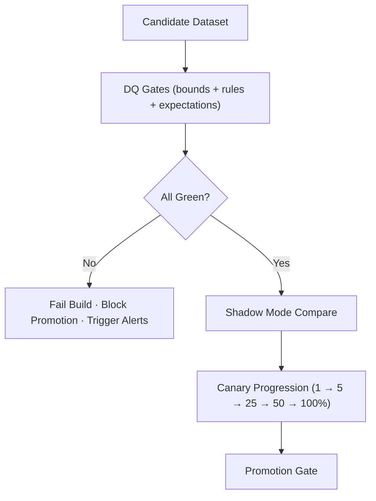

<div align="center">

# 🧮 **KFM v11 — Data Quality (DQ) Gates for Release Pipelines**  
`docs/pipelines/release/gates/dq/README.md`

**Purpose**  
Define all **Data Quality (DQ) validation gates** enforced during KFM v11’s release, promotion, and canary pipelines.  
DQ gates ensure correctness, stability, fairness, sovereignty safety, and reliability before **any** dataset or model output is promoted.

</div>

---

# 📘 1. Overview

DQ Gates are **mandatory guardrails** that prevent corrupted, incomplete, biased, or unsafe datasets from progressing into:

- Release artifacts  
- STAC/DCAT catalogs  
- Neo4j graph ingestion  
- Analytics pipelines  
- Story Node v3 and Focus Mode v3 narratives  
- AI/ML training and inference layers  

DQ gates run:

- In **CI** (`ci.yml`)  
- In **ETL contract tests** (`data_pipeline.yml`)  
- In **FAIR+CARE governance checks** (`faircare_validate.yml`)  
- In **promotion gates** (`phased-rollout-playbook.md`)  
- In **post-promotion audits** (24–72h windows)

**If DQ gates are not green → promotion halts, canary stops, rollback is triggered.**

---

# 🗂 2. Directory Layout (Option-B, KFM-MDP v11 Standard)

```text
docs/pipelines/release/gates/dq/                 # Data Quality gates
│
├── README.md                                    # This index
│
├── dq-bounds.yml                                # Null/dup bounds, referential integrity, outlier rules
├── dq-rules.yml                                 # Domain-specific quality rules (climate, hydro, hazards, culture)
└── dq-expectations.yml                          # Great Expectations / declarative DQ expectations
````

All YAMLs must pass:

* `schema-lint-v11`
* `faircare_validate.yml`
* `data_pipeline.yml`
* Domain-specific validators

---

# 🧬 3. DQ Gate Types (Deep-Dive)

## 3.1 `dq-bounds.yml` — Baseline Data Quality Bounds

These rules enforce *fundamental* integrity constraints.

### Required Checks

* Null thresholds
* Duplicate row thresholds
* Unique key validation
* Referential integrity (FK-like relationships)
* Min/max bounds on numeric fields
* CRS validation for spatial features
* GeoSPARQL geometry validity (no self-intersections, invalid rings)
* Temporal validation (timezone, monotonicity, OWL-Time compatibility)

### Failure Modes

* Missing primary identifiers
* Excessive null/duplication
* Impossible lat/lon values
* Temporal ordering breaks
* Geometry invalidation

Any failure → **DQ = RED**, promotion blocked.

---

## 3.2 `dq-rules.yml` — Domain-Specific DQ Rules

Domain rules ensure **semantic correctness** across all KFM sectors:

### Climate

* No negative precipitation
* Temperature units consistent (°C/°F → unified)
* No impossible extreme values

### Hydrology

* Flow rates non-negative
* Reservoir elevations within plausible ranges
* Stage/discharge correlations valid

### Hazards

* Valid wind/hail/tornado intensity ranges
* Spatial footprints adhere to hazard geometry standards

### Cultural & Archaeological (FAIR+CARE)

* No RAW coordinates for sensitive sites
* H3 masking required
* Attribute safety (e.g., site-specific info removed when required)

### Story Node / Focus Mode

* No text fields leaking sensitive coordinates
* Narrative grounding checks

Each domain rule integrates with:

* `faircare_validate.yml`
* `telemetry_export.yml`
* Domain dashboards (in `/dashboards/`)

---

## 3.3 `dq-expectations.yml` — Declarative Expectations (Great Expectations-Style)

Declarative expectations cover:

* Value distributions (percentile bands)
* Unique + composite keys
* Joinability across datasets
* Schema drift detection
* Data shape expectations (record counts by day, by AOI)
* Cross-dataset coherence:

  * climate ↔ hydrology
  * hazards ↔ territory
  * Story Node ↔ era/period ontologies

Expectations must be **fully deterministic**, **declared in YAML**, and accompanied by:

* Versioned expectation sets
* Thresholds
* Exception handling
* Review metadata

---

# 🔁 4. Validation Lifecycle (DQ Gate Pipeline)



Failing DQ gates produces:

* Governance alerts
* Reliability SLO violations
* Auto-freeze triggers
* Optionally automatic rollback

---

# 🧭 5. Governance Integration (FAIR+CARE v11)

DQ gates enforce:

| Area                   | Enforcement                                            |
| ---------------------- | ------------------------------------------------------ |
| **FAIR**               | Metadata, provenance, licensing consistency            |
| **CARE**               | Site masking, cultural sensitivity, sovereignty checks |
| **Legal Requirements** | NHPA §304 masking, privacy protections                 |
| **Provenance**         | STAC/DCAT + PROV-O checks                              |
| **Reproducibility**    | Deterministic expectations + signatures                |

DQ gates are often the **first** layer where Cultural/Indigenous data issues are flagged.

---

# 📊 6. Telemetry & Observability (OpenTelemetry + Lineage)

DQ results emit:

* `dq_valid_pct`
* `dq_bounds_failed`
* `dq_rules_failed`
* `dq_expectations_failed`
* `dq_spatial_errors`
* `dq_temporal_errors`
* `care_suppression_events`
* `lineage_integrity`

Telemetry routes to:

```
releases/<version>/focus-telemetry.json
docs/pipelines/release/dashboards/reliability.json
```

---

# 🛠 7. Promotion Integration

Promotion gate (`promotion_gate.py`) requires:

* DQ green
* No regressions from production
* All domain-specific rules satisfied
* No CARE sovereignty flags
* DQ expectation signature attached

Artifacts added to:

```
data/releases/<pipeline-id>/<version>/dq.json
```

---

# 🕰 8. Version History

| Version |       Date | Notes                                     |
| ------: | ---------: | ----------------------------------------- |
| v11.0.0 | 2025-11-23 | First v11 DQ gates documentation release. |

---

[Back to Release Gates](../README.md) ·
[Schema Gates](../schema/README.md) ·
[Governance Charter](../../../../standards/governance/ROOT-GOVERNANCE.md)

```
