<div align="center">

# 🌡️ **KFM v11 — Drift Gates for Release Pipelines**  
`docs/pipelines/release/gates/drift/README.md`

**Purpose**  
Define all **Data & Model Drift validation gates** required for safe promotion of ETL, AI/ML, hydrology, climate, hazards, Story Node v3, and Focus Mode v3 pipelines under the KFM v11 reliability & governance framework.

Drift Gates are the **core stability signals** that detect subtle regressions, concept drift, temporal drift, spatial drift, or narrative grounding drift before a release reaches production.

</div>

---

# 📘 1. Overview

Drift Gates enforce **temporal, spatial, statistical, and semantic stability** across all datasets and ML outputs in the Kansas Frontier Matrix.

They detect:

- Data distribution drift  
- Concept drift in ML models  
- Feature drift for ETL/AI pipelines  
- Spatial pattern changes (GeoSPARQL)  
- Temporal shifts (OWL-Time)  
- Narrative grounding drift (Story Node v3)  
- Focus Mode hallucination-risk drift  
- Cultural/CARE drift (governance violations increasing over time)

These gates run:

- During CI (`ci.yml`)  
- During ETL contract validation (`data_pipeline.yml`)  
- During **shadow** and **canary** stages  
- At promotion time (`promotion_gate.py`)  
- During post-promotion audits (24–72 hours)  

Any drift > threshold = **STOP**.

---

# 🗂 2. Directory Layout (Option-B, KFM-MDP v11 Standard)

```text
docs/pipelines/release/gates/drift/               # Drift validation definitions
│
├── README.md                                     # This file (v11)
│
├── psi.yml                                       # Population Stability Index thresholds
├── kl.yml                                        # KL divergence thresholds
├── ks.yml                                        # KS test rules
└── explainability.yml                            # SHAP/LIME drift & grounding drift checks
````

Each YAML file:

* MUST pass `schema-lint-v11`
* MUST declare thresholds, evaluation windows, and expected baselines
* MUST specify evaluation type (daily, rolling window, monthly)
* MUST include provenance fields for reproducibility
* MUST integrate with AI & ETL lineage via PROV-O

---

# 🧬 3. Drift Gate Types (Deep-Dive)

## 3.1 PSI Gate — `psi.yml`

The **Population Stability Index** measures distribution changes between:

* `current_production`
* `candidate_build`
* Historical baselines

### REQUIRED FIELDS

* feature list
* psi_threshold
* severity bands
* evaluation windows

**Red** if:

* PSI > threshold
* Multiple features exceed yellow band
* Feature-level drift clusters violate SLOs

---

## 3.2 KL Divergence — `kl.yml`

Tracks divergence of **probability distributions** for model outputs and key variables.

Used for:

* ML outputs
* Hydrology & climate transformations
* Hazard intensity distributions
* Story Node semantic scoring (embedding drift)

### REQUIRED:

* baseline distribution reference
* KL thresholds (soft & hard)
* minimum sample size guards

KL > threshold → **promotion blocked**.

---

## 3.3 KS Test — `ks.yml`

The Kolmogorov–Smirnov test validates **distributional parity**.

Used for:

* Hydrology flow sequences
* Seasonal climate patterns
* Hazard frequency distributions
* Temporal Story Node emission rates

If p-value < threshold → **drift detected**.

---

## 3.4 Explainability Drift — `explainability.yml`

Monitors feature importance drift:

* SHAP deltas
* LIME instabilities
* Narrative grounding drift
* Cultural risk drift (do explanations shift toward sensitive features?)
* Focus Mode knowledge pathway drift

### Checks:

* Feature importance rank deltas
* SHAP value distribution drift
* Allowed stability bands
* Focus Mode narrative-grounding shifts

This protects against:

* Silent ML regressions
* Models learning spurious correlations
* Cultural or bias-inducing drift

---

# 🔁 4. Drift Gate Lifecycle

```mermaid
flowchart TD
    A["Candidate Output"] --> B["Run Drift Gates (PSI / KL / KS / Explainability)"]
    B --> C{"All Green?"}
    C -->|No| D["STOP: Block Promotion · Trigger Alerts · Freeze Canary"]
    C -->|Yes| E["Shadow Compare"]
    E --> F["Canary Rollout (1 → 5 → 25 → 50 → 100%)"]
    F --> G["Promotion Gate"]
```



Failures automatically produce:

* Reliability alerts
* Governance warnings
* Drift reports
* Required reviewer notifications

---

# 📊 5. Telemetry & Observability

Drift gates emit:

| Metric                 | Purpose                               |
| ---------------------- | ------------------------------------- |
| `psi_score`            | distribution drift                    |
| `kl_divergence`        | probability drift                     |
| `ks_pvalue`            | distribution parity                   |
| `shap_drift_score`     | explainability drift                  |
| `semantic_drift_score` | Story Node/Focus Mode narrative drift |
| `care_drift_flags`     | sovereignty/ethics drift              |
| `lineage_integrity`    | PROV validity                         |

Telemetry routes to:

```
releases/<version>/focus-telemetry.json
docs/pipelines/release/dashboards/drift.json
```

---

# 🧭 6. Governance Integration (FAIR+CARE v11)

Drift impacts both **AI ethics** and **data governance**.

| Governance Area | How Drift Gates Enforce It                                         |
| --------------- | ------------------------------------------------------------------ |
| **FAIR**        | ensures consistent metadata, prevents drift-induced DQ failures    |
| **CARE**        | detects if outputs begin exposing risks (e.g., sensitive patterns) |
| **Sovereignty** | ensures culture-linked models do not drift into harmful space      |
| **Ethics**      | monitors bias risk, hallucination risk                             |
| **Provenance**  | attaches drift lineage to PROV chains                              |

Drift gates provide **early warning** for culturally sensitive regressions.

---

# 🛠 7. Promotion Integration

Promotion gate requires:

* PSI < threshold
* KL < threshold
* KS p-value > threshold
* SHAP drift within bands
* No CARE drift flags
* Drift signature written to `drift.json` in release artifacts

Promotion signature stored in:

```
data/releases/<pipeline-id>/<version>/drift.json
```

---

# 🕰 8. Version History

| Version |       Date | Notes                                        |
| ------: | ---------: | -------------------------------------------- |
| v11.0.0 | 2025-11-23 | First v11 Drift Gates documentation release. |

---

[Back to Release Gates](../README.md) ·
[Back to DQ Gates](../dq/README.md) ·
[Governance Charter](../../../../standards/governance/ROOT-GOVERNANCE.md)

```
