<div align="center">

# 📐 **KFM v11 — Schema Gates for Release Pipelines**  
`docs/pipelines/release/gates/schema/README.md`

**Purpose**  
Define all **schema-level validation gates** required for promoting any ETL/AI/data pipeline under the Kansas Frontier Matrix (KFM) v11 release governance system.

Schema gates are the *first line of defense* for correctness, stability, reproducibility, FAIR+CARE compliance, and downstream safety.

</div>

---

# 📘 1. Overview

Schema Gates enforce **structural integrity** of all data products produced in KFM before they enter:

- Release artifacts  
- STAC/DCAT catalogs  
- Neo4j graph ingestion  
- AI/ML models  
- Story Node v3 + Focus Mode v3 pipelines  

Schema validation is performed:

- In **CI (`ci.yml`)**
- In **data contract tests (`data_pipeline.yml`)**
- During release promotion gates (`phased-rollout-playbook.md`)
- By **KFM-PDC v11** contract validators
- Under FAIR+CARE oversight for cultural/Indigenous datasets

A pipeline **cannot** advance to canary or release without passing the schema gates.

---

# 🗂 2. Directory Layout (Option-B, KFM-MDP v11 Standard)

```text
docs/pipelines/release/gates/schema/              # Schema validation gates
│
├── README.md                                     # This index (v11)
│
├── column_parity.yml                             # Required column names, order, and change restrictions
├── constraints.yml                               # Nullability, uniqueness, ranges, required fields
└── stac-dcat.yml                                 # Spatial/temporal metadata parity + STAC/DCAT schema compliance
````

All YAML files:

* MUST be validated by `schema-lint-v11`
* MUST adhere to **KFM-PDC v11** schema contract patterns
* MUST avoid tab characters, untyped nulls, or ambiguous types
* MUST include full provenance metadata where required

---

# 🧬 3. Schema Gate Types (Deep-Dive)

## 3.1 Column Parity Gate — `column_parity.yml`

Ensures that **candidate outputs** retain structural compatibility with the **current production** schema:

### Enforced Rules

* Required column name list
* Column ordering (if downstream requirements demand it)
* Field type parity
* No destructive or silent removal of columns
* All new columns must:

  * Have explicit types
  * Contain default values or be nullable
  * Include metadata definitions (STAC/DCAT/FAIR fields where relevant)

### Purpose

Guarantee downstream stability for:

* Neo4j ingestion
* Story Node extraction
* Hydrology and climate analytics
* Long-term ML training pipelines
* External consumers of STAC/DCAT metadata

---

## 3.2 Constraint Gate — `constraints.yml`

Defines semantic guarantees of each field.

### Categories

* **Type constraints**
* **Nullability rules**
* **Range bounds**
* **Enumerations**
* **Unit constraints (CF conventions)**
* **Spatial CRS constraints (GeoSPARQL)**
* **Temporal precision (OWL-Time)**
* **Foreign-key / referential constraints**
* **Sensitive-field suppression** (e.g., raw coordinates prohibited)

### Spatial/Temporal Safety

If spatial fields exist:

* RAW geometries disallowed for sensitive domains (heritage, sacred sites)
* H3 generalization MUST be applied prior to publish
* CRS must be declared
* BBox MUST be correct

### Purpose

Prevents:

* Invalid geometries
* Range violations
* Accidentally exposing culturally sensitive coordinates
* Silent failures in downstream spatial models
* Story Node mis-grounding issues

---

## 3.3 STAC/DCAT Schema Gate — `stac-dcat.yml`

Ensures interoperability and FAIR alignment.

### Enforced Fields

* `stac_version`, `type`, `id`, `bbox`, `geometry`
* `datetime`, `start_datetime`, `end_datetime`
* `properties.license`, `properties.provenance`, `properties.care:*`
* `table:columns` / `dcat:distribution` / JSON-LD contexts
* Temporal resolution (OWL-Time)
* Spatial resolution, CRS
* H3 generalization metadata for sensitive datasets:

  * `privacy:h3_res_min`
  * `privacy:h3_res_actual`
  * `privacy:method = "h3_dynamic_res"` or `"h3_static_res"`

### Purpose

Guarantees:

* STAC compliance for geospatial datasets
* DCAT compliance for catalog-level datasets
* FAIR metadata completeness (F1-A1-I1-R1)
* CARE compliance when representing cultural datasets
* Proper linking to PROV-O lineage and license metadata

---

# 🧪 4. Validation Lifecycle (v11)

Schema gates run at multiple checkpoints:

```mermaid
flowchart TD
  A["Candidate Build"] --> B["Schema Gates (column/dq/stac-dcat)"]
  B --> C{"All Green?"}
  C -->|No| D["Fail Build · Block Promotion"]
  C -->|Yes| E["Shadow Mode"]
  E --> F["Canary Progression (1% → 5% → 25% → 50% → 100%)"]
  F --> G["Promotion Gate"]
```



Any failure:

* Stops canary progression
* Blocks release
* Records governance violation

---

# 🧭 5. Governance Integration (FAIR+CARE v11)

| Requirement               | How Schema Gates Enforce It                                               |
| ------------------------- | ------------------------------------------------------------------------- |
| **CARE** – Sensitive Data | Enforce masking/H3 rules; disallow RAW geometry; require consent metadata |
| **FAIR** – Metadata       | Require STAC/DCAT compliance; provenance; licensing                       |
| **Sovereignty**           | Enforce Indigenous governance rules (via CARE gates)                      |
| **Reproducibility**       | Require deterministic schema definitions & versioning                     |
| **Legality (NHPA §304)**  | Disallow precise heritage coordinates                                     |

Schema gates are often the **first point** where CARE or sovereignty violations are detected.

---

# 🔍 6. Telemetry & Observability

Schema gates emit:

* `schema_valid_pct`
* `failed_columns`
* `failed_constraints`
* `spatial_temporal_errors`
* `stac_dcat_validation_score`
* `care_masking_errors`
* `lineage_integrity`

Telemetry flows to:

```
releases/<version>/focus-telemetry.json
docs/pipelines/release/dashboards/reliability.json
```

---

# 🧰 7. Usage in Promotion Gates

Promotion requires:

* Schema = 100% valid
* No constraint violations
* STAC/DCAT fully compliant
* No CARE or sovereignty flags
* Reproducible schema signature

Promotion gate path:

```
src/pipelines/promote/promotion_gate.py
```

Schema metadata is also written to:

```
data/releases/<pipeline-id>/<version>/schema.json
```

---

# 🕰 8. Version History

| Version |       Date | Notes                                        |
| ------: | ---------: | -------------------------------------------- |
| v11.0.0 | 2025-11-23 | First v11 schema gate documentation release. |

---

[Back to Release Gates](../README.md) ·
[Back to Release Pipelines](../../README.md) ·
[Governance Charter](../../../../standards/governance/ROOT-GOVERNANCE.md)

```
