<div align="center">

# ⏪ **Kansas Frontier Matrix — Rollback Runbook (v11)**  
`docs/pipelines/release/runbooks/rollback-runbook.md`

**Purpose**  
Define the *authoritative, governed, deterministic* procedure for rolling back any KFM pipeline  
(ETL, AI/ML, spatial, STAC/DCAT, Story Node v3, Focus Mode v3) to a **last_good** state.

This runbook is tightly coupled with:  
- **Reliable Pipelines v11** (WAL · Retry · Rollback · Hotfix)  
- **Phased Rollout Playbook** (`docs/pipelines/release/phased-rollout-playbook.md`)  
- **Release Gates** (`docs/pipelines/release/gates/`)  
- **Governance & CARE** (`../../../standards/governance/ROOT-GOVERNANCE.md`, `../../../standards/faircare/FAIRCARE-GUIDE.md`)  

Rollback is a **governed action** and must be fully instrumented, auditable, and reversible.

</div>

---

# 🧭 1. Scope & Principles

This runbook applies to all release-bound pipelines:  
- ETL (ingestion, transformation, publishing)  
- AI/ML pipelines  
- Hydrology, climate, hazards, spatial/heritage  
- Story Node v3, Focus Mode v3  
- All release-environment pipelines (`main`, `release/*`, prod-like)

Artifacts covered:
- Data files: parquet/CSV/NetCDF  
- STAC/DCAT catalogs  
- Neo4j dumps & snapshots  
- ML models + configs  
- Config bundles

**Core principles:**  
- **Safety over speed**  
- **Determinism**  
- **Governance & FAIR+CARE**  
- **Fast feedback**  

---

# ✅ 2. Preconditions

Before rollback:  
- Rollback need **confirmed** (gates, telemetry, governance request).  
- Identify target run (`pipeline_id`, `run_id`, `release_version`).  
- Determine **last_good** artifacts.  
- Access orchestrator, storage, Neo4j admin, STAC/DCAT repos, monitoring dashboards.  
- Freeze pipeline (per Freeze Runbook):

```text
orchestrator/state/<pipeline_id>/freeze.flag = true
```

- Inform stakeholders.

---

# 🧬 3. Rollback Types & Decision Tree

**Config-only**  
**Model-only**  
**Data-only**  
**Full rollback**

Rules:  
- CARE/security/schema → always **Full rollback**.  
- Partial bad data → **Data-only**.  
- Model issues → **Model-only**.  
- Misconfig → **Config-only**.

---

# 🔀 4. High-Level Flow

```mermaid
flowchart TD
    A["Incident / Gate Failure / Governance Request"]
      --> B["Select Rollback Type (Config · Model · Data · Full)"]
      --> C["Confirm Preconditions"]
      --> D["Update Governance Ledger (rollback_initiated)"]
      --> E["Execute Rollback Actions"]
      --> F["Post-Rollback Validation (SLI/SLO · CARE · DQ · Drift)"]
      --> G{"Validation OK?"}
      G -->|Yes| H["Unfreeze & Resume via Phased Rollout"]
      G -->|No| I["Maintain Freeze · Escalate · Iterate Fix/Retry"]
```



---

# 📣 5. Communication & Governance

Notify:  
- Reliability on-call  
- Domain leads  
- FAIR+CARE Council (if applicable)  
- Product/operations owners  

Record all communications in the governance ledger.

---

# 🧾 6. Identify & Record Context

Append to governance ledger:

```text
{
  "event": "rollback_initiated",
  "pipeline_id": "<pipeline_id>",
  "failed_version": "<bad_version>",
  "last_good_version": "<good_version>",
  "trigger": "<trigger_type>",
  "severity": "<A/B/C/D>",
  "initiator": "<name/email>",
  "timestamp_utc": "<ISO8601>",
  "links": {
    "incident": "<link>",
    "dq_report": "<path_or_url>",
    "drift_report": "<path_or_url>",
    "care_form": "<path_or_url>"
  }
}
```

---

# 📂 7. Execute Rollback — Detailed Steps

## 7.1 Identify `last_good`

Use `manifest.json`:

```text
cat releases/<pipeline_id>/manifest.json | jq '.versions[] | select(.status=="last_good")'
```

Record version, artifacts, checksums.  
Update appropriate CHANGELOG.

---

## 7.2 Switch Serving Pointers

Update:

```text
UPDATE reference_table
SET active_version = '<good_version>'
WHERE pipeline_id = '<pipeline_id>';
```

Record in rollback-events log.

---

## 7.3 Data Rollback

- Disable writes  
- Restore or remap data  
- Re-run DQ checks  

---

## 7.4 Model Rollback

- Identify model artifact  
- Set active model  
- Refresh caches & feature stores  
- Re-run evals, drift checks, SHAP/LIME tests  

---

## 7.5 Config-Only Rollback

Revert with:

```text
git revert <bad_config_commit_sha>
```

Re-run CI + domain tests.

---

# ✔ 8. Post-Rollback Validation

Run shadow pipeline:

```text
orchestrator run <pipeline_id> --mode shadow --version <good_version>
```

Validate:  
- Schema  
- DQ  
- Drift  
- CARE/sovereignty  
- SLOs & performance  

Failures → freeze remains; escalate.

---

# 📓 9. Documentation & Governance Updates

Update:  
- CHANGELOG  
- README statuses  
- Governance ledger  

Append record:

```text
{
  "event": "rollback_completed",
  "pipeline_id": "<pipeline_id>",
  "from_version": "<bad_version>",
  "to_version": "<good_version>",
  "timestamp_utc": "<ISO8601>",
  "approved_by": ["<names>"],
  "notes": "<summary>"
}
```

---

# 📊 10. Telemetry & Metrics

Emit:  
- `rollback_initiated`  
- `rollback_duration_sec`  
- `rollback_type`  
- Post-rollback SLI/SLO + DQ + CARE + drift statuses  

Stored in telemetry JSONs.

---

# 🕰️ 11. Version History

| Version | Date | Notes |
|--------|------|--------|
| v11.0.1 | 2025-11-23 | Reformatted to KFM-MDP v11; fixed fences & governance references. |
| v11.0.0 | 2025-11-23 | Initial v11 rollback runbook. |

---
