```mermaid
flowchart TD
    A["Incident / Gate Failure / Governance Request"]
      --> B["Select Rollback Type (Config · Model · Data · Full)"]
      --> C["Confirm Preconditions"]
      --> D["Update Governance Ledger (rollback_initiated)"]
      --> E["Execute Rollback Actions"]
      --> F["Post-Rollback Validation (SLI/SLO · CARE · DQ · Drift)"]
      --> G{"Validation OK?"}
      G -->|Yes| H["Unfreeze & Resume via Phased Rollout"]
      G -->|No| I["Maintain Freeze · Escalate · Iterate Fix/Retry"]
```

<div align="center">

# ⏪ **Kansas Frontier Matrix — Rollback Runbook (v11)**  
`docs/pipelines/release/runbooks/rollback-runbook.md`

**Purpose**  
Define the *authoritative, governed, deterministic* procedure for rolling back any KFM pipeline  
(ETL, AI/ML, spatial, STAC/DCAT, Story Node v3, Focus Mode v3) to a **last_good** state.

This runbook is tightly coupled with:  
- **Reliable Pipelines v11** (WAL · Retry · Rollback · Hotfix)  
- **Phased Rollout Playbook** (`docs/pipelines/release/phased-rollout-playbook.md`)  
- **Release Gates** (`docs/pipelines/release/gates/`)  
- **Governance & CARE** (`../../../standards/governance/ROOT-GOVERNANCE.md`, `../../../standards/faircare/FAIRCARE-GUIDE.md`)  

Rollback is a **governed action** and must be fully instrumented, auditable, and reversible.

</div>

---

# 🧭 1. Scope & Principles

This runbook applies to:

- All **release-bound pipelines**:
  - ETL (data ingestion, transformation, publishing)  
  - AI/ML (models, inference pipelines)  
  - Hydrology, climate, hazards, spatial/heritage, Story Node v3, Focus Mode v3  
- All **environments with promotion gates** (`main`, `release/*`, prod-like environments)  
- All **artifacts**:
  - Data files (parquet/CSV/NetCDF/etc.)  
  - STAC/DCAT catalogs  
  - Neo4j dumps / graph snapshots  
  - ML models and configs  
  - Configuration bundles  

Core principles:

- **Safety over speed:** Rollback takes precedence when user impact, legal, or governance concerns exist.  
- **Determinism:** All rollback actions must be idempotent, scriptable, and reproducible.  
- **Governance & FAIR+CARE:** Rollback must *not* introduce new violations; all steps must be traceable via PROV-O and the governance ledger.  
- **Fast feedback:** Rollback is designed for **fast, safe reversion** with clear telemetry and alerts.

---

# ✅ 2. Preconditions

Before initiating rollback, verify:

- The need for rollback is **confirmed** (from gates, telemetry, incident response, or governance request).  
- The target run is clearly identified:
  - `pipeline_id`  
  - `run_id`  
  - `release_version`  
- **Last known good artifacts** are known and accessible (see Section 7.1).  
- You have access to:
  - Orchestrator UI/CLI  
  - Storage buckets / data lake  
  - Neo4j admin tools  
  - Model registry / artifact store  
  - STAC/DCAT repositories  
  - Monitoring dashboards  

- The pipeline is **frozen** per the Freeze Runbook:

  ```text
  orchestrator/state/<pipeline_id>/freeze.flag = true
````

* Stakeholders are informed that rollback is being initiated (see Section 5).

---

# 🧬 3. Rollback Types & Decision Tree

Determine which rollback path applies:

| Type              | When to Use                                                               | Typical Triggers                                    |
| ----------------- | ------------------------------------------------------------------------- | --------------------------------------------------- |
| **Config-only**   | Misconfiguration without data corruption or schema change                 | Wrong parameter, minor logic bug, feature toggles   |
| **Model-only**    | ML model performance/hallucination issues; data intact                    | Drift breach, wrong model version, bad weights      |
| **Data-only**     | ETL produced bad data but schema intact; model & config unchanged         | DQ failure, partial corruption, out-of-range values |
| **Full rollback** | Structural or multi-layer issue; schema/contract break, severe governance | schema drift, CARE violation, security incident     |

**Rule of thumb:**

* If **schema/CARE/security/sovereignty** is implicated → choose **Full rollback**.
* If only a **subset of rows/partitions** is affected and schema is stable → consider **Data-only rollback**.
* If the issue is limited to model behavior, not data → choose **Model-only rollback**.
* If only configuration is incorrect → choose **Config-only rollback**.

Document the chosen type in the incident record.

---

# 🔀 4. High-Level Rollback Flow



Rollback MUST be coordinated with:

* `freeze-runbook.md`
* `incident-response.md`
* `phased-rollout-playbook.md`

---

# 📣 5. Communication & Governance

## 5.1 Notify Stakeholders

At rollback initiation:

* Post in the relevant channels (e.g. `#kfm-incidents`, `#kfm-releases`)
* Notify:

  * Reliability Engineering on-call
  * Domain leads (Data, ML, Spatial, Story Node)
  * FAIR+CARE Council representative (if CARE/sensitive data impacted)
  * Product/operations owners (if user-facing impact exists)

Use the **incident response template** in:

```text
docs/pipelines/release/runbooks/incident-response.md
```

## 5.2 Governance & CARE Coordination

If incident is **Tier A** (CARE/sovereignty/legal):

* Immediately notify FAIR+CARE Council
* Engage relevant tribal/community liaisons per `INDIGENOUS-DATA-PROTECTION.md`
* Document all communications in the governance ledger:

```text
docs/reports/audit/governance-ledger.json
```

Include:

* Incident ID
* Rollback type
* Rationale
* Stakeholders
* Approvals

---

# 🧾 6. Identify & Record Context

In the governance ledger, append:

```text
{
  "event": "rollback_initiated",
  "pipeline_id": "<pipeline_id>",
  "failed_version": "<bad_version>",
  "last_good_version": "<good_version>",
  "trigger": "<trigger_type>",
  "severity": "<A/B/C/D>",
  "initiator": "<name/email>",
  "timestamp_utc": "<ISO8601>",
  "links": {
    "incident": "<link>",
    "dq_report": "<path_or_url>",
    "drift_report": "<path_or_url>",
    "care_form": "<path_or_url>"
  }
}
```

Ensure:

* Freeze state is active
* Stakeholders are aware of rollback context

---

# 📂 7. Execute Rollback — Detailed Steps

## 7.1 Confirm `last_good` Artifacts

Using `manifest.json`:

```text
cat releases/<pipeline_id>/manifest.json | jq '.versions[] | select(.status=="last_good")'
```

Capture:

* `version_id`
* Artifact URIs
* Timestamp
* Checksums

Add an entry to:

```text
docs/pipelines/<pipeline_id>/CHANGELOG.md
```

Example:

```text
## [<good_version>] - YYYY-MM-DD
- Marked as last_good for rollback
- Linked incident: <incident_id>
- Reviewer: <name>
```

---

## 7.2 Switch Read Pointers to `last_good`

Update all **serving endpoints** to point to `last_good`:

* Data lake / warehouse views
* Neo4j read replicas
* Model-serving endpoints
* STAC/DCAT “current” references

Example (warehouse pseudocode):

```text
UPDATE reference_table
SET active_version = '<good_version>'
WHERE pipeline_id = '<pipeline_id>';
```

Verify:

* Downstream jobs now read from `last_good`
* No new reads depend on `bad_version` artifacts

Log pointer changes in:

```text
docs/pipelines/release/runbooks/rollback-events/<timestamp>_<pipeline_id>.json
```

---

## 7.3 Data Rollback (Data-only / Full)

If data artifacts are corrupted:

1. **Disable new writes** to impacted tables/buckets:

   ```text
   analytics/<pipeline_id>/writes_enabled = false
   ```

2. **Restore or remap** data to `last_good`:

   * Object storage:

     * Swap prefixes or rewrite symlinks
     * Copy last_good data to the `current/` location
   * Databases:

     * Restore from backup or snapshot
     * Run down-migrations if required
   * Index/search:

     * Reindex from last_good data

3. **Re-run data checks**:

   * Row counts
   * Key distributions
   * Spatial coverage
   * DQ gates in **diagnostic** mode

---

## 7.4 Model Rollback (Model-only / Full)

If an ML model is implicated:

1. Identify last_good model artifact:

   ```text
   models/<pipeline_id>/<good_version>/model.tar.gz
   ```

2. Set active version in model registry:

   ```text
   kfmctl model set-active \
     --pipeline <pipeline_id> \
     --version <good_version>
   ```

3. Invalidate/refresh:

   * Embedding caches
   * Feature stores
   * Batch inference outputs (if necessary)

4. Run post-rollback tests:

   * Known-good eval set
   * SHAP/LIME sanity checks
   * Drift metrics

Confirm Story Node v3 and Focus Mode outputs are stable and safe.

---

## 7.5 Config-Only Rollback

For configuration-only errors:

1. Identify bad config change:

   ```text
   git log -p -- docs/pipelines/<pipeline_id>/config/*
   ```

2. Revert to last_known_good:

   ```text
   git revert <bad_config_commit_sha>
   ```

3. Re-run CI (`ci.yml`) and any domain-specific tests.

4. Document config rollback in:

   ```text
   docs/pipelines/<pipeline_id>/CHANGELOG.md
   docs/pipelines/<pipeline_id>/README.md
   ```

---

# ✔ 8. Post-Rollback Validation

After all rollback actions:

1. Run **shadow pipeline** on `last_good`:

   ```text
   orchestrator run <pipeline_id> --mode shadow --version <good_version>
   ```

2. Execute validation suite:

   * Schema gates (column parity, constraints, STAC/DCAT)
   * DQ gates (bounds, rules, expectations)
   * Drift gates (PSI/KL/KS/SHAP)
   * CARE/Sovereignty gates
   * Performance and cost checks

3. Update SLO dashboards:

   * Mark rollback window
   * Confirm SLI recovery

4. Confirm:

   * No active alerts
   * Downstream pipelines stable
   * User-facing systems healthy

If **any check fails**:

* Keep the pipeline frozen
* Escalate per `incident-response.md`
* Consider extended RCA, additional fixes, or deeper rollback.

---

# 📓 9. Documentation & Governance Updates

After a successful rollback:

* Update:

  * `docs/pipelines/<pipeline_id>/CHANGELOG.md`
  * `docs/pipelines/<pipeline_id>/README.md` (status, last_good)
  * Any related runbooks if procedure changed

* Append event to governance ledger:

  ```text
  {
    "event": "rollback_completed",
    "pipeline_id": "<pipeline_id>",
    "from_version": "<bad_version>",
    "to_version": "<good_version>",
    "timestamp_utc": "<ISO8601>",
    "approved_by": ["<names>"],
    "notes": "<summary_of_actions_and_rationale>"
  }
  ```

* If CARE/sovereignty involved, include:

  * Council decision references
  * Any follow-up obligations

---

# 📊 10. Telemetry & Metrics

Rollback events MUST emit:

* `rollback_initiated` (timestamp, pipeline_id, versions)
* `rollback_duration_sec`
* `rollback_type` (config/model/data/full)
* `post_rollback_sli_metrics`
* `post_rollback_care_status`
* `post_rollback_dq_status`
* `post_rollback_drift_status`
* `post_rollback_incident_closed` flag

Telemetry is written to:

```text
releases/<version>/focus-telemetry.json
docs/reports/telemetry/pipelines/rollback/<pipeline_id>.json
```

Used by:

* Reliability dashboards
* Governance / CARE reports
* Quarterly reliability reviews

---

# 🕰️ 11. Version History

| Version |       Date | Notes                                                                       |
| ------: | ---------: | --------------------------------------------------------------------------- |
| v11.0.1 | 2025-11-23 | Reformatted to KFM-MDP v11; fixed fences, paths, and governance references. |
| v11.0.0 | 2025-11-23 | Initial v11 rollback runbook based on Reliable Pipelines v11 playbook.      |

---

[Back to Runbooks Index](README.md) · [Release Pipelines Overview](../README.md) · [Governance Charter](../../../standards/governance/ROOT-GOVERNANCE.md)

```
