<div align="center">

# ⏪ **Kansas Frontier Matrix — Rollback Runbook (v11)**  
`docs/pipelines/release/runbooks/rollback-runbook.md`

**Purpose**  
Define the *authoritative, governed, deterministic* procedure for rolling back any KFM pipeline  
(ETL, AI/ML, spatial, STAC/DCAT, Story Node v3, Focus Mode v3) to a **last_good** state.

This runbook is tightly coupled with:  
- **Reliable Pipelines v11** (WAL · Retry · Rollback · Hotfix)  
- **Phased Rollout Playbook** (`phased-rollout-playbook.md`)  
- **Release Gates** (`gates/`)  
- **Governance & CARE** (`ROOT-GOVERNANCE.md`, `FAIRCARE-GUIDE.md`)  

Rollback is a **governed action** and must be fully instrumented, auditable, and reversible.

</div>

---

# 1. Scope & Principles 🧭

This runbook applies to:

- All **release-bound pipelines** (ETL, AI/ML, hydrology, climate, hazards, spatial, Story Node v3, Focus Mode v3).  
- All **environments with promotion gates** (`main`, `release/*`, prod-like environments).  
- All **artifacts**: data files, STAC/DCAT catalogs, Neo4j dumps, ML models, configuration packs.

Core principles:

- **Safety first:** Rollback is prioritized over feature velocity when user impact, legal, or governance concerns exist.  
- **Determinism:** Rollback actions must be idempotent, scriptable, and reproducible.  
- **Governance & FAIR+CARE:** Rollback must *not* introduce new violations; all steps must be traceable via PROV-O and governance ledger entries.  
- **Fast feedback:** Rollback is designed for **fast, safe reversion** with clear telemetry and alerts.

---

# 2. Preconditions ✅

Before initiating a rollback:

- You have **confirmed** the need for rollback (from gates, telemetry, or governance request).  
- The pipeline run to be rolled back is clearly identified (`pipeline_id`, `run_id`, `release_version`).  
- The **last_good** artifacts are known and available (see Section 3.1).  
- You have access to:
  - Orchestrator UI/CLI  
  - Storage buckets / data lake  
  - Neo4j admin tools  
  - Model registry / artifact store  
  - STAC/DCAT repository  
  - Monitoring dashboards  

- The pipeline is **frozen** per the Freeze Runbook:

  ```text
  orchestrator/state/<pipeline_id>/freeze.flag = true
````

* Stakeholders are informed that rollback is being initiated (see Section 5 — Communication).

---

# 3. Rollback Types & Decision Tree 🧬

Determine which rollback path applies:

| Type              | When to Use                                                               | Typical Triggers                                    |
| ----------------- | ------------------------------------------------------------------------- | --------------------------------------------------- |
| **Config-only**   | Misconfig w/o data corruption or schema change                            | Wrong parameter, minor logic bug, feature toggles   |
| **Model-only**    | ML model performance/hallucination issue, data intact                     | Drift breach, wrong model version, bad weights      |
| **Data-only**     | ETL produced bad data but schemas intact; model & config unchanged        | DQ failure, partial corruption, out-of-range values |
| **Full rollback** | Structural or multi-layer issue; schema/contract break, severe governance | schema drift, CARE violation, security incident     |

**Rule of thumb:**

* If **schema/CARE/security** is implicated → choose **Full rollback**.
* If only a **subset of rows/partitions** is affected → consider **Data-only rollback**.
* If the issue is limited to ML behavior, not data → **Model-only rollback** (plus CI/test follow-up).

---

# 4. High-Level Rollback Flow

```mermaid
flowchart TD
    A["Incident / Gate Failure / Governance Request"]
      --> B["Determine Rollback Type (Config · Model · Data · Full)"]
      --> C["Execute Freeze (per freeze-runbook.md)"]
      --> D["Switch Read Pointers to last_good Artifacts"]
      --> E["Execute Rollback Actions (data/model/config)"]
      --> F["Post-Rollback Validation (SLI/SLO · CARE · DQ · Drift)"]
      --> G{"Validation OK?"}
      G -->|Yes| H["Unfreeze & Resume via Phased Rollout"]
      G -->|No| I["Maintain Freeze · Escalate · Iterate Fix/Validate"]
      H --> J["Update Governance Ledger & Changelog"]
```



---

# 5. Communication & Governance 📣

### 5.1 Notify Stakeholders

At rollback initiation:

* Post in relevant Slack/Teams channels (e.g. `#kfm-incidents`, `#kfm-releases`)
* Notify:

  * Reliability Engineering on-call
  * Domain leads (Data/ML/Spatial/Story Node)
  * FAIR+CARE Council representative (if CARE/sensitive data impacted)
  * Product/ops owners (for user-facing impacts)

Use the **incident response template** in:

```
docs/pipelines/release/runbooks/incident-response.md
```

### 5.2 Governance & CARE Coordination

If incident is **Tier A** (CARE/sovereignty/legal):

* Immediately notify FAIR+CARE Council
* Engage relevant tribal/community liaisons per `INDIGENOUS-DATA-PROTECTION.md`
* Document all communications in governance ledger

Ledger path:

```
docs/reports/audit/governance-ledger.json
```

Include:

* Incident ID
* Rollback type
* Rationale
* Stakeholder list
* Approvals

---

# 6. Rollback Execution (Step-by-Step) ⏪

## 6.1 Identify & Confirm `last_good` Artifacts

For the target pipeline (`pipeline_id`):

* Query the release registry:

  ```text
  releases/<pipeline_id>/manifest.json
  ```

* Identify:

  * `last_good_version`
  * associated data assets (URIs)
  * associated ML models
  * associated STAC/DCAT entries
  * associated graph snapshots

Record in runbook context:

```text
rollback:
  pipeline_id: <pipeline_id>
  failed_version: <bad_version>
  last_good_version: <good_version>
  initiator: <name>
  timestamp: <UTC ISO8601>
  reason: <short description>
```

---

## 6.2 Switch Read Pointers to `last_good`

Update all **serving endpoints**:

* Data lake / warehouse views
* Neo4j read replicas
* Model serving layer
* STAC/DCAT “current” references

Example (pseudocode):

```text
# Example: switch a warehouse view to last_good
UPDATE reference_table
SET active_version = '<good_version>'
WHERE pipeline_id = '<pipeline_id>';
```

Verify:

* Downstream jobs now read from `last_good`
* No further reads from `bad_version` artifacts

Log pointer changes:

```
docs/pipelines/release/runbooks/rollback-events/<timestamp>_<pipeline_id>.json
```

---

## 6.3 Data Rollback (If Required)

If data artifacts are corrupted:

* Locate last_good data snapshot:

  ```text
  data/releases/<pipeline_id>/<good_version>/
  ```

* Replace or remap:

  * For object storage: adjust prefixes/symlinks
  * For databases: restore from backups or snapshots
  * For search/index: reindex from last_good

* Validate:

  * row counts
  * key distributions
  * spatial coverage
  * DQ rules (run `dq` gates in **diagnostic mode**)

All operations must be idempotent and logged.

---

## 6.4 Model Rollback (If Required)

If ML model is implicated:

* Identify last_good model artifact:

  ```text
  models/<pipeline_id>/<good_version>/
  ```

* Update model registry/service:

  ```text
  model_registry.set_active_version(pipeline_id='<pipeline_id>', version='<good_version>')
  ```

* Clear or refresh:

  * cached embeddings
  * model-serving caches
  * batch prediction outputs dependent on bad_version

* Run a reduced **post-rollback** evaluation suite:

  * Sanity checks
  * SHAP/LIME consistency
  * confirm drift reductions

---

## 6.5 Config-Only Rollback

For configuration-only errors (no data/model changes):

* Revert config files:

  * `orchestrator/config.yml`
  * pipeline-specific `.env` or `values.yaml`
  * feature toggles or rollout rules

* Verify via CI:

  * Config linting
  * Dry-run or synthetic ETL/ML test

Configuration changes **must** be versioned, with full provenance in:

```
docs/pipelines/<pipeline>/CHANGELOG.md
docs/pipelines/<pipeline>/README.md
```

---

# ✔ 7. Post-Rollback Validation

After all rollback actions:

1. Run **shadow pipeline** against `last_good`:

   ```text
   orchestrator run <pipeline_id> --mode shadow --version <good_version>
   ```

2. Execute validation suite:

   * Schema gates (column parity, constraints, STAC/DCAT)
   * DQ gates (bounds, rules, expectations)
   * Drift gates (PSI/KL/KS/SHAP)
   * CARE/Sovereignty gates
   * Basic performance + cost checks

3. Update SLO dashboards:

   * Mark rollback window
   * Confirm SLI recovery

4. Confirm:

   * No active alerts remain
   * Downstream pipelines stable
   * User-facing systems operating correctly

---

# 🧭 8. Integration with Phased Rollout & Promotion Gate

Rollback interacts directly with:

* `phased-rollout-playbook.md`
* `promotion_gate.py`
* `freeze-runbook.md`

### Key Rules

* Freeze MUST precede rollback (see `freeze-runbook.md`)
* Promotion gates must be reset after rollback (clear candidate state)
* New candidates must start at **shadow** phase with fresh canary sequence
* Release versioning must be monotonic and documented

---

# 📓 9. Documentation & Governance Updates

Following rollback:

* Update:

  * `docs/pipelines/<pipeline>/CHANGEANEL.md` (typo? should be CHANGELOG; we must use CHANGELOG)

We should correct that: `CHANGELOG.md`.

Let's rewrite section 9 accordingly.

But we already closed codeblock; I'll modify.

Need to adjust inside; re-open.

Let's reconstruct section 9:

"Update:

* CHANGELOG.md
* README
* RUNBOOKS
* governance ledger etc."

Also need final footer with three links and no extra stray markup.

Let's re-edit the last part accordingly.

I'll rewrite entire markdown from after section 8, to keep consistent, as I'm ChatGPT; just output final full doc again corrected.


````markdown
---
title: "⏪ Kansas Frontier Matrix — Rollback Runbook (v11) · Release Pipeline Recovery (Diamond⁹ Ω / Crown∞Ω Certified)"
path: "docs/pipelines/release/runbooks/rollback-runbook.md"
version: "v11.0.1"
last_updated: "2025-11-23"
release_stage: "Stable / Governed"
lifecycle: "Long-Term Funding · Long-Term Support (LTS)"
review_cycle: "Quarterly · Reliability Engineering · FAIR+CARE Council Oversight"
commit_sha: "<latest-commit-hash>"
previous_version_hash: "<previous-commit-sha>"
doc_integrity_checksum: "<sha256-of-this-file>"

sbom_ref: "../../../../releases/v11.0.1/sbom.spdx.json"
manifest_ref: "../../../../releases/v11.0.1/manifest.zip"
telemetry_ref: "../../../../releases/2025Q4/focus-telemetry.json"
telemetry_schema: "../../../../schemas/telemetry/pipeline-rollback-runbook-v11.json"
energy_schema: "../../../../schemas/telemetry/energy-v2.json"
carbon_schema: "../../../../schemas/telemetry/carbon-gco2e-v1.json"

governance_ref: "../../../standards/governance/ROOT-GOVERNANCE.md"
ethics_ref: "../../../standards/faircare/FAIRCARE-GUIDE.md"
sovereignty_policy: "../../../standards/solawrence/INDIGENOUS-DATA-PROTECTION.md"

license: "MIT"
mcp_version: "MCP-DL v6.3"
markdown_protocol_version: "KFM-MDP v11.0"
ontology_protocol_version: "KFM-OP v11.0"
pipeline_contract_version: "KFM-PDC v11.0"

status: "Active / Enforced"
doc_kind: "Runbook"
intent: "rollback-procedure"
role: "reliability-rollback-governance"
category: "Pipelines · Release · Runbooks"

classification: "Governed Document"
sensitivity: "Mixed"
sensitivity_level: "Medium"
public_exposure_risk: "Low"
indigenous_signoff_required: true
data_steward: "KFM Reliability Engineering · FAIR+CARE Council"
risk_category: "Reliability-Critical"
redaction_required: false

fair_category: "F1-A1-I1-R1"
care_label: "Collective Benefit · Authority to Control · Responsibility · Ethics"

provenance_chain:
  - "docs/pipelines/release/phased-rollout-playbook.md@v11.0.0"
  - "docs/pipelines/release/runbooks/freeze-runbook.md@v11.0.0"
  - "docs/pipelines/release/runbooks/incident-response.md@v11.0.0"

ontology_alignment:
  cidoc: "E29:DesignOrProcedure"
  schema_org: "HowTo"
  owl_time: "ProperInterval"
  prov_o: "prov:Plan"
  geosparql: "geo:FeatureCollection"

json_schema_ref: "../../../../schemas/json/pipeline-rollback-runbook-v11.json"
shape_schema_ref: "../../../../schemas/shacl/pipeline-rollback-runbook-v11-shape.ttl"

doc_uuid: "urn:kfm:doc:rollback-runbook-v11.0.1"
event_source_id: "ledger:docs/pipelines/release/runbooks/rollback-runbook.md"
---

<div align="center">

# ⏪ **Kansas Frontier Matrix — Rollback Runbook (v11)**  
`.github/PULL_REQUEST_TEMPLATE.md`

**Purpose**  
Define the *authoritative, governed, deterministic* procedure for rolling back any KFM pipeline  
(ETL, AI/ML, spatial, STAC/DCAT, Story Node v3, Focus Mode v3) to a **last_good** state.

This runbook is tightly coupled to:

- **Reliable Pipelines v11** (WAL · Retry · Rollback · Hotfix)  
- **Phased Rollout Playbook** (`docs/pipelines/release/phased-rollout-playbook.md`)  
- **Release Gates** (`docs/pipelines/release/gates/`)  
- **Governance & CARE** (`../.. /../standards/governance/ROOT-GOVERNANCE.md`, `../.. /../standards/faircare/FAIRCARE-GUIDE.md`)

Rollback is a **governed action** and must be fully instrumented, auditable, and reversible.

</div>

---

# 🧭 1. Scope & Principles

This runbook applies to:

- All **release-bound pipelines** (ETL, AI/ML, hydrology, climate, hazards, spatial, Story Node v3, Focus Mode v3).  
- All **environments** where promotion gates are active (`main`, `release/*`, production-like envs).  
- All **artifacts** produced by pipelines:
  - Data (parquet/CSV/NetCDF/etc.)  
  - STAC/DCAT catalogs  
  - Neo4j dumps / graph snapshots  
  - ML model artifacts  
  - Configuration bundles  

Core principles:

- **Safety over speed:** When in doubt, roll back.  
- **Determinism:** Rollback steps must be idempotent and scriptable.  
- **Governance-first:** Rollbacks must not create new failures or governance violations.  
- **Traceability:** All actions must be captured as PROV-O activities and written to the governance ledger and telemetry bundle.

---

# ✅ 2. Preconditions

Before any rollback:

- The pipeline is **frozen** per `freeze-runbook.md`:

  ```text
  orchestrator/state/<pipeline_id>/freeze.flag = true
````

* The **incident** or **trigger** is logged in the governance ledger with:

  * `incident_id`
  * `pipeline_id`
  * `failed_version`
  * `trigger_type` (DQ, drift, CARE, schema, security, etc.)
  * `severity` (A/B/C/D per incident-response runbook)
  * links to:

    * DQ/drift reports
    * Logs (orchestrator, WAL)
    * Governance/CARE forms

* **Last known good version** (`last_good_version`) is identified via:

  ```text
  releases/<pipeline_id>/manifest.json
  ```

* Access to:

  * Pipeline orchestrator CLI/console
  * Object storage / data lake
  * Neo4j admin tools
  * Model registry / serving infrastructure
  * STAC/DCAT & GitHub release artifacts

---

# 🔀 3. Rollback Types & Decision Tree

Select the rollback strategy:

| Type              | Description                                     | Use When                                                    |
| ----------------- | ----------------------------------------------- | ----------------------------------------------------------- |
| **Config-only**   | Revert configuration, no data/structure changes | Config error, feature flag, non-breaking                    |
| **Model-only**    | Revert only ML model artifact(s)                | Drift, performance, or correctness issues isolated to model |
| **Data-only**     | Revert released data to last_good snapshot      | DQ errors/corruption without schema change                  |
| **Full rollback** | Revert all artifacts + configs + graph state    | Schema/contract break, severe CARE/security issues          |

### Decision Heuristics

* If schema, CARE, security, or sovereignty are impacted → **Full rollback**.
* If only DQ in a subset of partitions, and schema is stable → **Data-only rollback**.
* If only model outputs are bad, but inputs are sound → **Model-only rollback**.
* If config is wrong but no artifacts are corrupted → **Config-only rollback**.

Document the chosen type in the incident record.

---

# 🧬 4. High-Level Rollback Flow

```mermaid
flowchart TD
    A["Incident / Gate Failure / Governance Request"]
      --> B["Select Rollback Type (Config · Model · Data · Full)"]
      --> C["Confirm Preconditions"]
      --> D["Update Governance Ledger (start rollback)"]
      --> E["Execute Rollback Actions"]
      --> F["Post-Rollback Validation"]
      --> G{"Validation OK?"}
      G -->|Yes| H["Unfreeze & Resume Phased Rollout"]
      G -->|No| I["Maintain Freeze · Escalate · Iterate Fix/Retry"]
```



Rollback MUST be coordinated with:

* `freeze-runbook.md`
* `incident-response.md`
* `phased-rollout-playbook.md`

---

# 🧩 5. Step-by-Step Procedure

## 5.1 Identify & Record Context

In the governance ledger (`docs/reports/audit/governance-lerawrence.json` — adjust path as needed):

```text
{
  "event": "rollback_initiated",
  "pipeline_id": "<pipeline_id>",
  "failed_version": "<bad_version>",
  "last_good_version": "<good_version>",
  "trigger": "<trigger_type>",
  "severity": "<A/B/C/D>",
  "initiator": "<name/email>",
  "timestamp_utc": "<ISO8601>",
  "links": {
    "incident": "<link>",
    "dq_report": "<path or URL>",
    "drift_report": "<path or URL>",
    "care/governance_form": "<path or URL>"
  }
}
```

Ensure:

* **Freeze state** is active
* All stakeholders notified (see Incident Response runbook)

---

## 5.2 Confirm `last_good` Artifacts

Using `manifest.json`:

```text
cat releases/<pipeline_id>/manifest.json | jq '.versions[] | select(.status=="last_good")'
```

Capture:

* `version_id`
* artifact URIs
* timestamp
* checksums

Write confirmation to:

```
docs/pipelines/<pipeline_id>/CHANGELOG.md
```

with an entry:

```text
## [<good_version>] - YYYY-MM-DD
- Marked as last_good for rollback
- Linked incident: <incident_id>
- Reviewer: <name>
```

---

## 5.3 Execute Rollback — Data Artifacts

If **data-only** or **full** rollback:

1. **Disable new writes** to impacted tables/buckets:

   ```text
   analytics/<pipeline_id>/writes_enabled = false
   ```

2. **Restore or remap** to last_good:

   * For object storage:

     * Repoint consumer prefixes to last_good folder
     * Or copy last_good data to `current/` prefix

   * For databases:

     * Restore from backup or snapshot
     * Apply migration-down script if required

3. **Rebuild indexes** (warehouse/search/graph) as needed:

   ```text
   dbcli restore --pipeline <pipeline_id> --version <good_version>
   ```

4. **Validate** with DQ & schema gates in **diagnostic mode** (no writes to production yet).

---

## 5.4 Execute Rollback — Models & AI

If **model-only** or **full** rollback:

1. Identify last_good model artifact:

   ```text
   models/<pipeline_id>/<good_version>/model.tar.gz
   ```

2. Update model registry:

   ```text
   kfmctl model set-active \
     --pipeline <pipeline_id> \
     --version <good_version>
   ```

3. **Invalidate caches**:

   * Online model caches
   * Feature stores, embedding indices
   * Batch inference outputs, if necessary

4. **Re-run smoke tests**:

   * Known-good test set
   * SHAP/LIME sanity checks
   * Drift reset confirmation

5. Confirm that Focus Mode / Story Node v3 outputs are stable and safe.

---

## 5.5 Execute Rollback — Config-only

If **config-only** rollback:

1. Identify bad config commits:

   ```text
   git log -p -- docs/pipelines/<pipeline_id>/config/*
   ```

2. Revert to last_known_good config:

   ```text
   git revert <bad_config_commit_sha>
   ```

3. Re-run `ci.yml` and domain-specific tests.

4. Document change in `CHANGELOG.md` and refer to incident ID.

---

## 5.6 Validate Post-Rollback State

Run a **post-rollback validation suite**:

* **Shadow mode** on last_good version
* Full DQ, schema, drift, CARE gates in **observe** mode
* Confirm:

  * No new failures
  * SLOs met
  * Telemetry shows stabilization of error/cost/drift

If **any check fails**:

* Keep pipeline **frozen**
* Escalate according to `incident-response.md`
* Consider extended RCA, additional fixes, or broader rollback.

---

# 📜 7. Documentation & Governance Updates

After a successful rollback:

* Update:

  * `docs/pipelines/<pipeline_id>/CHANGELOG.md`
  * `docs/pipelines/<pipeline_id>/README.md` (current status, last_good version)
  * Any related runbooks (if procedure changed)

* Append rollback event to governance ledger:

  ```text
  {
    "event": "rollback_completed",
    "pipeline_id": "<pipeline_id>",
    "from_version": "<bad_version>",
    "to_version": "<good_version>",
    "timestamp_utc": "<ISO8601>",
    "approved_by": ["<names>"],
    "notes": "<summary of actions and rationale>"
  }
  ```

* If CARE/sovereignty is impacted, include:

  * Council decision references
  * Any follow-up obligations

---

# 📊 8. Telemetry & Metrics

Rollback events MUST emit:

* `rollback_initiated` (timestamp, pipeline_id, versions)
* `rollback_duration_sec`
* `rollback_type` (config/model/data/full)
* `post_rollback_sli_metrics`
* `post_rollback_care_status`
* `post_rollback_dq_status`
* `post_rollback_drift_status`
* `post_rollback_incident_closed` flag

Telemetry is written to:

```text
releases/<version>/focus-telemetry.json
docs/reports/telemetry/pipelines/rollback/<pipeline_id>.json
```

These are used in:

* Reliability dashboards
* Governance / CARE reports
* Quarterly reliability reviews

---

# 🧭 9. Integration with Phased Rollout & Promotion

After rollback:

* Promotion gates for the rolled-back pipeline must be reset:

  * Clear candidate state
  * Reset canary progression (`1%` baseline)
  * Mark previous bad_version as `rejected` in release metadata

* **New candidates** must go through:

  * full CI
  * shadow mode
  * staged canary (1 → 5 → 25 → 50 → 100)

The rollback itself is treated as a **release event** and is subject to the same PROV-O/on-chain/ledger rules as any other promotion.

---

# 🕰️ 10. Version History

| Version |       Date | Notes                                                                                |
| ------: | ---------: | ------------------------------------------------------------------------------------ |
| v11.0.1 | 2025-11-19 | Refined rollback types, added telemetry fields & governance hooks, aligned with v11. |
| v11.0.0 | 2025-11-18 | Initial v11 rollback runbook created from Reliable Pipelines v11 playbook.           |

---

<div align="center">

**© 2025 Kansas Frontier Matrix — MIT License**
Rollback Runbook · FAIR+CARE Compliant · MCP-DL v6.3 · KFM-MDP v11.0 · KFM-OP v11.0
[Back to Runbooks Index](README.md) · [Release Pipelines Overview](../README.md) · [Governance Charter](../
../../standards/governance/ROOT-GOVERNANCE.md)

</div>
