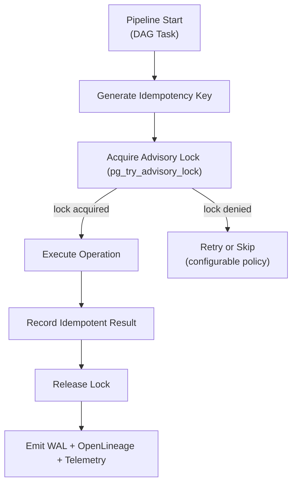

<div align="center">

# 🧩 **Idempotency Keys & Advisory Lock Concurrency Control (v11 LTS)**  
`docs/pipelines/reliability/idempotency-concurrency/README.md`

### **Diamond⁹ Ω / Crown∞Ω Ultimate Certified**

**Purpose**  
Provide the authoritative KFM v11.2.2 standard for **race-free, retry-safe, lineage-consistent**,  
FAIR+CARE-aligned ingestion and mutation control across all ETL, AI, and autonomous pipelines.  
This module prevents **duplicate writes, corruption, inconsistent lineage,** and **graph divergence**  
within KFM’s distributed multi-pipeline environment.

</div>

---

## 🗂️ Directory Layout

~~~text
docs/pipelines/reliability/idempotency-concurrency/
├── 📄 README.md                          # This file — module spec
├── 📄 patterns/logical-operation-lifecycle.md   # Detailed lifecycle patterns (expected)
├── 📄 patterns/retry-semantics.md               # Retry semantics & policies (expected)
└── 📄 patterns/lineage-safety.md                # WAL + lineage safety patterns (expected)
~~~

> If some pattern files do not yet exist, treat them as **expected structure** and align new content accordingly.

---

## 📘 1. Why KFM Requires Strong Concurrency Control

KFM v11 operates a **multi-agent, multi-pipeline, autonomous update environment**:

- LangGraph v11 autonomous DAGs  
- CrewAI v3 workers  
- Conditional ingestion pipelines  
- High-frequency ETL loops  
- Neo4j governed writes  
- STAC/DCAT publishing  
- Focus Mode v3 narrative generation

Without robust idempotency + locking, pipelines risk:

- Duplicate writes  
- Partial updates during retry  
- Conflicting lineage states  
- Out-of-order graph writes  
- Multi-agent overwrite conflicts  
- Data contract violations from concurrent ingestion  

KFM v11 solves this using **Idempotency Keys** + **PostgreSQL Advisory Locks**  
+ **OpenLineage WAL replay**, all governed under FAIR+CARE and sovereignty rules.

---

## 🧬 2. Architecture Overview



This guarantees **logical-operation serialization** while allowing **high global concurrency**.

---

## 🗝️ 3. Idempotency Keys (v11.2.2 Standard)

An idempotency key must uniquely represent the **logical mutation** being performed.

### 3.1 Required Fields

- `pipeline_id`  
- `task_id`  
- `dataset_id`  
- `operation_type`  
- `version`  
- `checksum_in` (raw input)  
- `params_hash` (transformation parameters)  
- `timestamp_bucket` (rounded; prevents unbounded key explosion)  

### 3.2 Construction Example

```text
idem_key = sha256(
  f"{pipeline}:{task}:{dataset}:{op}:{checksum}:{params}:{bucket}"
)
```

### 3.3 Guarantees

- Retries **do not duplicate work**  
- WAL replay is deterministic  
- Downstream lineage is stable  
- Partial writes never propagate into Neo4j or STAC/DCAT  

Results of idempotent tasks are recorded in the **`idempotency_log`** table.

---

## 🔒 4. Advisory Locks (pg_advisory_lock)

### 4.1 What They Guarantee

- **Per-dataset serialization**  
- **No cross-pipeline interference**  
- **No deadlocking** (when rules are followed)  
- **Parallel safety** across thousands of concurrent operations  

### 4.2 Lock Key Construction (v11)

```text
lock_key = hash64(dataset_id || operation_type)
```

### 4.3 Requirements

- MUST use `pg_try_advisory_lock` (non-blocking)  
- MUST log failure modes to OpenTelemetry  
- MUST NOT hold locks across network calls or long IO  
- MUST release in `finally` blocks  
- Locks MUST be paired with matching WAL checkpoints  

---

## 🧠 5. Logical Operation Lifecycle

**Defined in:** `patterns/logical-operation-lifecycle.md`

A **logical operation** is ANY step that:

- Mutates data  
- Updates lineage  
- Writes to Neo4j  
- Publishes STAC/DCAT items  
- Produces pipeline-visible artifacts  
- Updates a release bundle  

Each logical operation MUST include:

1. Idempotency key generation  
2. Advisory lock attempt  
3. Precondition checks (SLOs, CARE, sovereignty, contracts)  
4. Operation execution  
5. Postcondition validation (e.g., Great Expectations checkpoint)  
6. WAL entry  
7. Lineage event  
8. Lock release  
9. OTel telemetry + energy/carbon annotations  

---

## 🛠️ 6. Retry Semantics (v11.2.2)

**Defined in:** `patterns/retry-semantics.md`

### 6.1 Mandatory Rules

- Retries consult **`idempotency_log`** first  
  - If prior success exists → **return cached result**  
  - If partial failure exists → **rollback then retry**  
- If lock is held → obey configured retry policy (skip/backoff/escalate)  
- All retries must emit **OpenTelemetry retry counters**  
- Retries MUST NOT bypass CARE or sovereignty rules  
- Retries must respect SLO & error-budget guardrails  

---

## 🔗 7. Lineage & WAL Safety

**Defined in:** `patterns/lineage-safety.md`

### 7.1 Guarantees

- Every mutation emits:
  - PROV-O lineage  
  - OpenLineage events  
  - WAL entry for replay  
  - Data Contract compliance logs  

- WAL replay MUST NOT re-execute successful mutations  
- WAL replay MUST propagate the idempotent result  
- Neo4j graph writes MUST occur in deterministic order  
- Sovereignty events must be **explicitly marked** in WAL and lineage  

---

## 📦 8. Storage Schema (`idempotency_log`)

### 8.1 Table Definition (v11.2.2)

```sql
CREATE TABLE idempotency_log (
    idem_key        TEXT PRIMARY KEY,
    pipeline_id     TEXT NOT NULL,
    task_id         TEXT NOT NULL,
    dataset_id      TEXT NOT NULL,
    operation_type  TEXT NOT NULL,
    status          TEXT NOT NULL,
    result_hash     TEXT,
    created_at      TIMESTAMP NOT NULL DEFAULT now(),
    updated_at      TIMESTAMP NOT NULL DEFAULT now(),
    raw_checksum    TEXT,
    params_hash     TEXT,
    wal_pointer     TEXT
);
```

### 8.2 Notes

- `status` ∈ { 'success', 'failure', 'partial' }  
- `wal_pointer` links to WAL / OpenLineage IDs  
- Table MUST be replicated in multi-region clusters  
- Periodic archival allowed only if WAL and provenance remain intact  

---

## 📊 9. Telemetry Integration (OTel v11)

Emit metrics:

- `kfm.idempotent_replays`  
- `kfm.lock_acquire_failures`  
- `kfm.retry_events`  
- `kfm.lineage_rewrite_ops`  
- `kfm.idem_cache_hits`  
- `kfm.idem_cache_misses`  

Recommended labels:

- `pipeline`  
- `task`  
- `dataset_id`  
- `env`  
- `operation_type`  
- `sovereignty_event` (true/false)  

These metrics feed **Reliability SLO dashboards** and error-budget calculations.

---

## 🛡️ 10. Governance: FAIR+CARE & Sovereignty

Mutation control MUST respect:

### 10.1 CARE Requirements

- No duplication of transformations on culturally sensitive datasets  
- H3 masking required **before** writing archaeological/cultural geometries  
- No speculative “auto-fill” of missing data via retries  
- All changes to sensitive datasets logged with justification  

### 10.2 Sovereignty Requirements

- Advisory locks MUST serialize updates to:
  - tribal datasets  
  - heritage/archaeology datasets  
  - any sovereign assets  

- Lineage must mark `sovereignty_event = true` for these updates  
- Certain lock failures may trigger governance review rather than automatic retry  

### 10.3 FAIR Requirements

- Full, replayable provenance records  
- Reproducible WAL chains  
- Idempotent replay guarantees  
- Contract-aligned metadata outputs (STAC/DCAT/JSON-LD)  

---

## 🧯 11. Failure Modes & Recovery

### 11.1 Possible Failures

- Deadlock from incorrect lock usage  
- Stale idempotency keys  
- WAL mismatch vs lineage  
- Concurrent writes on sovereign datasets  
- Partial update replay loops  
- Lock starvation under high load  

### 11.2 Recovery Patterns

- Force-reset specific idempotency keys (governed)  
- Trigger rollback via WAL pointer + rollback registry  
- Governance escalation for sovereign datasets  
- Increase retry backoff / introduce jitter  
- Lock-sharding for high-volume datasets  
- CI job to validate idempotency table health and index coverage  

---

## 🕰️ 12. Version History

| Version | Date       | Summary                                                                 |
|--------:|------------|-------------------------------------------------------------------------|
| v11.2.2 | 2025-11-30 | Upgraded to KFM-MDP v11.2.2; added energy/carbon v2 + SLSA/telemetry wiring. |
| v11.0.1 | 2025-11-24 | Added WAL replay rules, sovereignty/CARE augmentation, telemetry contract.  |
| v11.0.0 | 2025-11-24 | Initial idempotency + advisory locking module for KFM pipelines.           |

---

<div align="center">

© 2025 Kansas Frontier Matrix — CC-BY 4.0  
Diamond⁹ Ω / Crown∞Ω · FAIR+CARE · MCP-DL v6.3  

[📚 Docs Home](../../../README.md) · [📏 Standards Index](../../../standards/README.md) · [🛡 Governance Charter](../../../standards/governance/ROOT-GOVERNANCE.md)

</div>
