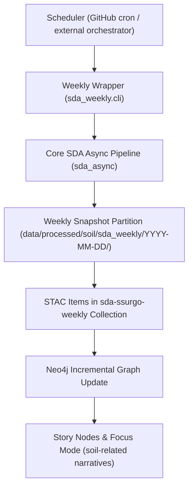

<div align="center">

# 📆 **Kansas Frontier Matrix — SDA Soil Ingestion (Weekly Refresh Pattern)**  
`docs/pipelines/soil/sda-weekly/README.md`

**KFM v11.2.4 · Scheduled ETL → STAC/DCAT/PROV → Neo4j → Focus Mode**


</div>

---

## 📘 Overview

### Purpose

This document defines the **weekly SDA soil refresh pattern** for the Kansas Frontier Matrix (KFM), built on top of the canonical **SDA Soil Ingestion (Async, Chunked, Deduped)** pipeline.

The weekly pattern:

- Schedules **regular SDA refresh runs** (e.g., weekly) using the existing async SDA ingestion core,  
- Ensures **deterministic, versioned snapshots** of soil data over time,  
- Emits **STAC/ DCAT / PROV-O artifacts** tagged by week,  
- Maintains **idempotent updates** to the KFM soil graph and Story Nodes, and  
- Provides a consistent backbone for monitoring soil-related changes in Focus Mode.

### Scope

This pattern governs:

- CI workflows and schedulers that trigger weekly SDA runs,  
- How weekly snapshots are **partitioned, named, and cataloged**,  
- How weekly runs relate to the **baseline/full SDA ingest** (`sda-async`),  
- How weekly soil data is exposed to hydrology, land-use, and ecology modules.

It does **not** redefine the core SDA ingestion logic; instead, it **wraps** the `sda-async` pipeline into a reproducible weekly schedule with clear provenance and telemetry.

---

## 🗂️ Directory Layout

### Documentation layout

```text
📁 docs/
└── 📁 pipelines/
    └── 📁 soil/
        ├── 📄 README.md                     # Soil pipelines index
        ├── 📁 sda-async/
        │   └── 📄 README.md                 # Core SDA async ingestion pattern
        └── 📁 sda-weekly/
            ├── 📄 README.md                 # ← This file (weekly refresh wrapper)
            ├── 📁 config/
            │   ├── 📄 schedule-policy.yaml  # Cron, windows, environment selection
            │   ├── 📄 snapshot-policy.yaml  # Retention, snapshot naming, partitions
            │   └── 📄 graph-update.yaml     # Incremental vs full graph update rules
            └── 📁 examples/
                ├── 📄 github-workflow-weekly.yml  # Canonical GitHub Actions example
                └── 📄 run-config-weekly.yaml      # Example pipeline config for weekly run
```

### Pipelines, data, catalogs, graph (conceptual)

```text
📁 src/
└── 📁 pipelines/
    └── 📁 soil/
        ├── 📁 sda_async/                     # Core async SDA ETL
        └── 📁 sda_weekly/                    # Weekly wrapper / scheduler integration
            ├── 📄 __init__.py
            ├── 📄 cli.py                     # Entry point for weekly runs
            ├── 📄 schedule.py                # Schedule + run-state handling
            ├── 📄 snapshot.py                # Partitioning & snapshot management
            └── 📄 graph_update.py            # Incremental graph update logic

📁 data/
└── 📁 processed/
    └── 📁 soil/
        ├── 📁 sda_baseline/                  # Long-lived baseline (from sda-async)
        │   ├── 📄 soil_mu.parquet
        │   ├── 📄 soil_co.parquet
        │   └── 📄 soil_ch.parquet
        └── 📁 sda_weekly/                    # Weekly snapshots
            ├── 📁 2025-12-07/
            │   ├── 📄 soil_mu.parquet
            │   ├── 📄 soil_co.parquet
            │   └── 📄 soil_ch.parquet
            ├── 📁 2025-12-14/
            │   └── ...
            └── 📁 latest/                    # Pointer or symlink to current snapshot

📁 data/
└── 📁 stac/
    └── 📁 soil/
        ├── 🛰️ sda-ssurgo-baseline/          # Baseline Collection & Items
        └── 🛰️ sda-ssurgo-weekly/            # Weekly snapshot Collection & Items

📁 dist/
└── 📁 provenance/
    ├── 📄 prov-sda-async-<run-id>.jsonld    # Core ingestion runs
    └── 📄 prov-sda-weekly-<run-id>.jsonld   # Weekly wrapper runs
```

---

## 🧭 Context

The **`sda-async`** pipeline defines how KFM ingests SDA soil data:

- Async, chunked retrieval via `soilDB`,  
- Deterministic deduplication and stratigraphic validation,  
- Canonical Parquet outputs and graph mapping.

The **weekly** pattern answers a separate question:

> “How do we keep KFM’s soil view up-to-date, reproducible, and comparable over time *without* constantly rebuilding everything from scratch?”

This pattern:

- Reuses the **same core SDA ingestion logic**,  
- Adds **temporal structure**: weekly snapshots and run metadata,  
- Adds **run-state and retention**: tracking which weeks are present and how long they’re kept,  
- Ensures **Story Nodes & Focus Mode** can reference:

  - A specific week’s snapshot, and  
  - The corresponding ETL + lineage run.

---

## 🧱 Architecture

### Weekly wrapper vs core SDA pipeline



**Core principles:**

- The weekly wrapper **never bypasses** the `sda-async` pattern; it configures and invokes it.  
- The wrapper is responsible for:
  - Run orchestration,  
  - Snapshot partition naming,  
  - Retention policy,  
  - Graph **update style** (incremental vs full refresh).

### Run-state & scheduling

The weekly pattern should follow the KFM run-state pattern (see `docs/pipelines/patterns/run-state/README.md`):

- Each weekly run has:
  - A **run ID**,  
  - A **scheduled window**,  
  - A **status** (`PENDING`, `RUNNING`, `SUCCESS`, `FAILED`).

- The run-state is stored in:
  - A small DB/JSON/graph registry keyed by `(pipeline_id = "soil.sda_weekly", scheduled_date)`.

Example schedule policy (pseudo-YAML):

```yaml
pipeline_id: "soil.sda_weekly"
cron: "0 6 * * 0"      # Sundays 06:00 UTC
retry_on_failure: true
max_retries: 1
allowed_environments:
  - "ci"
  - "prod"
snapshot_partition_format: "YYYY-MM-DD"
```

---

## 📦 Data & Metadata

### Baseline vs weekly snapshots

- **Baseline (`sda_baseline`)**:
  - Established by a **full SDA ingest** (sda-async).  
  - Used as a long-lived reference; updated rarely.

- **Weekly (`sda_weekly`)**:
  - Each run writes fully self-contained Parquet files for `mu`, `co`, `ch`.  
  - Partitioned by snapshot date (`YYYY-MM-DD`), plus a `latest` pointer.  
  - May be logically equivalent to “rebuild for AOI” but treated as a **new snapshot**.

Even if SDA doesn’t expose explicit “changed-only” data, the weekly snapshots:

- Provide **time slices** for analytical and governance purposes,  
- Enable **diffing** between weeks (e.g., newly added or modified `mukey` sets),  
- Feed Story Nodes about **soil dataset evolution** and data quality.

### Partition metadata

Each weekly snapshot should be annotated with metadata such as:

- `kfm:soil:snapshot_date` — e.g., `2025-12-07`,  
- `kfm:soil:baseline_version` — link to baseline run / snapshot,  
- `kfm:soil:etl_pattern` — `"sda-async-v1"`,  
- `kfm:soil:schedule_pattern` — `"sda-weekly-v1"`.

These may appear in:

- STAC Item properties, and  
- DCAT Dataset temporal coverage fields.

---

## 🌐 STAC, DCAT & PROV Alignment

### STAC Collections

Two main Collections are expected:

- `sda-ssurgo-baseline` — representing the long-lived baseline, and  
- `sda-ssurgo-weekly` — representing weekly snapshots.

For `sda-ssurgo-weekly`, each Item should:

- Represent **one snapshot** over a defined AOI,  
- Reference:
  - `soil_mu.parquet`, `soil_co.parquet`, `soil_ch.parquet` assets,  
  - The PROV-O bundle `prov-sda-weekly-<run-id>.jsonld`,  
  - Telemetry records for the run.

Example properties fragment:

```json
{
  "properties": {
    "kfm:source": "USDA-SDA",
    "kfm:soil:snapshot_date": "2025-12-07",
    "kfm:soil:baseline_version": "urn:kfm:run:sda-async:<baseline-run-id>",
    "kfm:etl:pattern": "sda-async-v1",
    "kfm:schedule:pattern": "sda-weekly-v1",
    "kfm:provenance_ref": "dist/provenance/prov-sda-weekly-<run-id>.jsonld"
  }
}
```

### DCAT datasets

Derived from STAC:

- A DCAT **Dataset** per weekly snapshot, or  
- A single Dataset with multiple temporal Distributions, depending on KFM catalog conventions.

Temporal coverage should represent:

- The **snapshot time** (when SDA was queried), and  
- Optionally the **effective period** if SDA metadata supports it.

### PROV-O integration

Weekly runs must produce PROV-O JSON-LD that:

- Links:
  - Weekly wrapper Activity → baseline and weekly sda-async Activities,  
  - Weekly Entities (snapshot Parquet files) → baseline Entities as `prov:wasDerivedFrom`, where appropriate.  
- Includes:
  - Run configuration (schedule, retention policy),  
  - Relationship to `sda-async` run IDs.

---

## 🧪 Validation & CI/CD

### Weekly validation requirements

For each weekly run:

- **Ingestion & schema checks** (delegated to `sda-async`):
  - Column presence & types for `mu`, `co`, `ch`,  
  - Key integrity and stratigraphy, as per the async pattern.

- **Snapshot-level checks**:
  - Row counts vs baseline: large deviations flagged for review,  
  - `mukey` coverage vs AOI expectation,  
  - No unexpected changes in schema.

- **Metadata checks**:
  - STAC Items valid against KFM STAC profile,  
  - PROV JSON-LD valid against KFM PROV profile,  
  - Telemetry entries valid against `telemetry_schema`.

### CI workflow example (conceptual)

Under `.github/workflows/`:

- `soil-sda-weekly.yml` should:
  - Resolve `snapshot_date` (e.g., run date),  
  - Invoke `src/pipelines/soil/sda_weekly/cli.py` with config,  
  - Run validations and linting,  
  - Upload:
    - Parquet outputs,  
    - STAC artifacts,  
    - PROV bundles,  
    - Telemetry.

Failure to generate valid STAC/PROV artifacts or passing validations must **fail the workflow**.

---

## 🧠 Story Node & Focus Mode Integration

Weekly SDA snapshots enable Story Nodes such as:

- **“Soil Data Stewardship Over Time”**
  - Focused on:
    - How soil maps and attributes evolve as data products improve,  
    - Data coverage and quality changes.

- **“Soil & Hydrology — Stable Baseline, Updating Context”**
  - Uses:
    - A fixed baseline for multi-decade hydrologic analyses,  
    - Weekly soil snapshots for “current conditions” overlays and quality checks.

Story Nodes must:

- Reference specific **snapshot dates** (`kfm:soil:snapshot_date`),  
- Be able to switch between:
  - Baseline soil view, and  
  - Latest weekly snapshot.

In **Focus Mode**, the weekly pattern should allow users to:

- Select a **snapshot date** and see the associated soils, Story Nodes, and provenance,  
- Inspect **differences** between snapshots (e.g., changed `mukey` coverage or attributes),  
- Trace from a map view → STAC Item → PROV bundle → SDA ingestion run.

---

## ⚖ FAIR+CARE & Governance

SDA soil data itself is **low-risk public data**, but governance matters when:

- Soil layers are **joined** with sensitive archaeology, ecological, or demographic data, or  
- Soil properties are used in models that may impact **land-use decisions**.

This pattern supports FAIR+CARE by:

- **FAIR**
  - F: Soil snapshots are discoverable in STAC/DCAT with clear temporal tags.  
  - A: Weekly datasets are accessible under open licenses.  
  - I: Uses standard formats (Parquet, JSON-LD, STAC, DCAT, PROV-O).  
  - R: Provenance and telemetry provide full reuse context.

- **CARE**
  - Weekly soil updates are **not** used to expose sensitive locations directly.  
  - When soil joins with sensitive layers, the **data-generalization** rules (e.g., H3 aggregation) apply, and are documented in associated PROV bundles and Story Nodes.

The Soil & Ecology Pipelines group and FAIR+CARE Council are responsible for:

- Reviewing this pattern when SDA changes interfaces or licensing,  
- Ensuring that soil-based analyses remain aligned with KFM’s ethical and sovereignty commitments.

---

## 🕰️ Version History

| Version  | Date       | Author / Steward        | Summary                                                        |
|----------|------------|-------------------------|----------------------------------------------------------------|
| v11.2.4  | 2025-12-07 | KFM Architecture        | Initial weekly SDA soil ingestion wrapper aligned to KFM-MDP.  |

---

<div align="center">

**Kansas Frontier Matrix (KFM v11)**  

[⬅️ Soil Pipelines Index](../README.md) · [⚒️ SDA Async Pattern](../sda-async/README.md) · [⚖️ Root Governance](../../../standards/governance/ROOT-GOVERNANCE.md)

</div>
y
