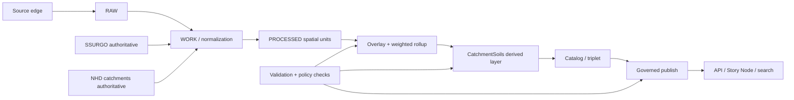
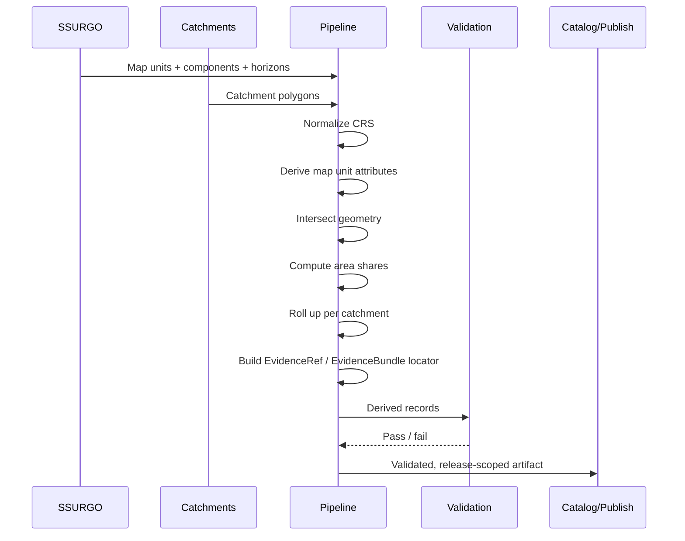

<!-- [KFM_META_BLOCK_V2]
doc_id: kfm://doc/<uuid-NEEDS-VERIFICATION>
title: SSURGO to NHD Catchment Overlay Pipeline
type: standard
version: v1
status: draft
owners: @bartytime4life
created: <YYYY-MM-DD-NEEDS-VERIFICATION>
updated: 2026-04-07
policy_label: public
related:
  - docs/pipelines/README.md
  - docs/architecture/TRUTH_PATH_LIFECYCLE.md
  - docs/architecture/TRUST_MEMBRANE.md
  - pipelines/soils/gssurgo-ks/README.md
  - examples/thin_slice/hydrology/README.md
  - schemas/contracts/v1/data/README.md
  - schemas/contracts/v1/evidence/README.md
  - schemas/contracts/v1/policy/README.md
  - policy/README.md
  - tests/README.md
tags:
  - kfm
  - pipelines
  - soils
  - hydrology
  - provenance
notes:
  - Current public /docs/ ownership is confirmed via .github/CODEOWNERS; narrower file ownership beyond that broad rule still needs review.
  - Exact machine contract filename, executable policy bundle, workflow gate depth, and runtime implementation path remain NEEDS VERIFICATION on current public main.
[/KFM_META_BLOCK_V2] -->

# SSURGO to NHD Catchment Overlay Pipeline

Area-weighted derivation of catchment-level soil attributes from SSURGO and NHD catchments for governed hydrologic, erosion, and Story Node use.

> [!IMPORTANT]
> **Truth posture:** This document is intentionally source-bounded. It is grounded in the current public repo surface, attached KFM doctrine, and the existing checked-in draft for this lane. Exact machine contract filenames, executable policy bundles, workflow YAML coverage, and runtime entrypoints still need explicit verification before this doc should be treated as implementation proof.

**Status:** draft  
**Owners:** `@bartytime4life` *(current public `/docs/` CODEOWNERS signal; narrower file ownership not separately verified)*  
**Path:** `docs/pipelines/ssurgo_to_catchment.md`  
**Repo fit:** focused child pipeline doc for a soil-to-catchment derivation lane inside KFM’s governed `docs/pipelines/` surface  
**Evidence posture:** evidence-first; fail-closed on missing provenance, insufficient spatial coverage, geometry failure, unresolved category handling, or unapproved release state  
**Current public-main snapshot:** this file is present on `main`; [`docs/pipelines/README.md`](README.md) names it as the focused child pipeline doc; adjacent visible public lanes include [`../../pipelines/soils/gssurgo-ks/README.md`](../../pipelines/soils/gssurgo-ks/README.md) and [`../../examples/thin_slice/hydrology/README.md`](../../examples/thin_slice/hydrology/README.md)


**Quick jumps:** [Scope](#scope) · [Repo fit](#repo-fit) · [Current public-main snapshot](#current-public-main-snapshot) · [Inputs](#accepted-inputs) · [Exclusions](#exclusions) · [Flow](#pipeline-flow) · [Stages](#pipeline-stages) · [Schema](#catchmentsoils-derived-record-shape) · [Evidence](#evidenceref--evidencebundle-pattern) · [Checks](#validation-and-fail-closed-gates) · [Usage](#review-first-quickstart)

---

## Scope

This pipeline produces a **catchment-level derived soil layer** by spatially overlaying:

- **SSURGO** soil map units and component/horizon attributes
- **NHD catchments** or an equivalent governed catchment polygon surface

The output is a rebuildable derived dataset that supports:

- catchment cards in Story Nodes
- hydrologic and erosion-oriented summaries
- drill-through provenance and evidence inspection
- downstream search, graph, and map experiences

The output is **not** an authoritative soil source and **not** a replacement for SSURGO or NHD. It is a governed projection that must remain downstream of authoritative data and publication policy.

---

## Repo fit

### Upstream anchors

- [`README.md`](../README.md) — docs-wide documentation posture
- [`../architecture/TRUTH_PATH_LIFECYCLE.md`](../architecture/TRUTH_PATH_LIFECYCLE.md) — truth-path law
- [`../architecture/TRUST_MEMBRANE.md`](../architecture/TRUST_MEMBRANE.md) — public/internal boundary logic
- [`../governance/README.md`](../governance/README.md) — review, stewardship, and release consequences
- [`../standards/README.md`](../standards/README.md) — shared documentation and standards posture

### Current verified local neighbors

- [`README.md`](README.md) — directory contract for pipeline-facing docs
- `ssurgo_to_catchment.md` — this focused child pipeline doc

### Adjacent repository surfaces

- [`../../pipelines/soils/gssurgo-ks/README.md`](../../pipelines/soils/gssurgo-ks/README.md) — visible public soils ingest recipe
- [`../../examples/thin_slice/hydrology/README.md`](../../examples/thin_slice/hydrology/README.md) — public-safe hydrology-first example lane
- [`../../schemas/contracts/v1/data/README.md`](../../schemas/contracts/v1/data/README.md) — dataset-version family boundary
- [`../../schemas/contracts/v1/evidence/README.md`](../../schemas/contracts/v1/evidence/README.md) — evidence-bundle family boundary
- [`../../schemas/contracts/v1/policy/README.md`](../../schemas/contracts/v1/policy/README.md) — decision-envelope family boundary
- [`../../policy/README.md`](../../policy/README.md) — executable policy surface
- [`../../tests/README.md`](../../tests/README.md) — repo-wide verification surface
- [`../../tests/contracts/README.md`](../../tests/contracts/README.md) — contract-facing proof lane

> [!NOTE]
> This file explains a lane and its burden. It is not the authoritative home for executable policy, machine-enforced schemas, workflow YAML, or runtime proof.

---

## Current public-main snapshot

The strongest current public reading is:

| Surface | Current visible state | Why it matters here |
| --- | --- | --- |
| `docs/pipelines/ssurgo_to_catchment.md` | present | this lane is a real checked-in child doc, not a hypothetical filename |
| `docs/pipelines/README.md` | present and names this file as a focused soil-to-catchment derivation lane | the directory contract already recognizes this doc |
| `pipelines/soils/gssurgo-ks/README.md` | present | a public soils ingest/packaging lane already exists beside this documentation lane |
| `examples/thin_slice/hydrology/README.md` | present | the repo already frames hydrology as the first illustrative thin slice |
| `schemas/contracts/v1/data/dataset_version.schema.json` | present but scaffold-state | dataset-version family is visible, but field law is not yet encoded there |
| `schemas/contracts/v1/evidence/evidence_bundle.schema.json` | present but scaffold-state | evidence-bundle family is visible, but still placeholder-only |
| `schemas/contracts/v1/policy/decision_envelope.schema.json` | present but scaffold-state | policy contract family is visible, but not yet enforcement-grade |
| `.github/workflows/` | README-only on public `main` | merge-blocking validation depth for this lane cannot be claimed from checked-in YAML |

> [!CAUTION]
> Public tree presence is not the same thing as proof of enforcement. Current public scaffolds under `schemas/contracts/v1/` are useful owner signals, but they do **not** settle canonical authority or prove that this lane already has live machine validation.

---

## Accepted inputs

This pipeline accepts only governed, versioned, provenance-bearing inputs.

| Input | Role | Expected granularity | Notes |
| --- | --- | ---: | --- |
| SSURGO map units | authoritative soil geometry | polygon | base spatial unit for overlay |
| SSURGO components | authoritative soil composition | per map unit | used for weighted derivation where needed |
| SSURGO horizons | authoritative depth/property detail | per component/horizon | optional depending on chosen rollups |
| NHD catchments | authoritative drainage unit geometry | polygon | target reporting unit |
| CRS metadata | spatial normalization control | dataset-level | must be explicit and validated |
| release/version identifiers | provenance anchor | dataset-level | required for EvidenceRef / EvidenceBundle resolution and publish proof |

### Expected attributes

The exact field names vary by extraction and normalization strategy, but typical derived candidates include:

- `hsg` or hydrologic soil group
- `k_factor`
- `awc`
- `ksat`
- `om_pct`
- `comppct_r`
- `MUKEY`
- a catchment identifier such as `catchment_id`, `ComID`, or equivalent

> [!WARNING]
> Field names above are **INFERRED**, not asserted as the live KFM schema. Normalize to canonical internal names in a governed processing step rather than leaking source-specific naming downstream.

---

## Exclusions

This pipeline excludes the following:

- direct publication of raw SSURGO or raw NHD intermediate joins
- undocumented manual GIS edits without preserved receipts
- irreversible enrichment that cannot be rebuilt from authoritative inputs
- policy truth, schema truth, or governance law embedded in convenience scripts
- client-side derivation that bypasses governed API or evidence resolution
- unsupported inference beyond the evidence carried in authoritative source data
- silent filling of missing soil coverage without an explicit confidence downgrade or block

---

## Why this exists

Users often reason about water, erosion, habitat, runoff, and upstream/downstream conditions at the **catchment** level, while soil truth is typically managed as **soil map units and components**. This pipeline creates a narrow, governed bridge between those units so downstream experiences can say things like:

- “This catchment is dominated by hydrologic soil group C.”
- “Mean K-factor suggests elevated erosion sensitivity.”
- “This statement is backed by these contributing MUKEYs and this overlay method.”

That bridge must remain:

- **rebuildable**
- **explainable**
- **auditable**
- **policy-gated**

It also fits the repo’s broader **hydrology-first thin-slice** posture: place-rich, time-rich, operationally legible work that can prove contracts, receipts, and evidence drill-through before broader lane expansion.

---

## Pipeline flow



### Truth path expression

**Source edge → RAW → WORK / QUARANTINE → PROCESSED → CATALOG / TRIPLET → PUBLISHED**

This pipeline lives primarily in the **WORK → PROCESSED → CATALOG** span. Publication is allowed only after validation, provenance, and policy gates pass.

---

## Processing model

### 1) Normalize spatial units

Bring SSURGO polygons and catchment polygons into a common, validated CRS appropriate for area-based analysis.

Recommended operator stance:

- reject missing CRS metadata
- reject incompatible or ambiguous geometry types
- compute areas only after CRS normalization
- preserve source identifiers throughout transformation

### 2) Harmonize SSURGO attribute derivation

Where SSURGO component or horizon detail is required:

- derive component-level values first
- use `comppct_r` or equivalent component weighting
- promote to map unit-level attributes before overlay when possible
- preserve the set of contributing MUKEYs and weights

### 3) Spatial overlay

Intersect SSURGO map unit geometry with catchment geometry.

For each `(catchment, map unit)` pair:

- compute overlap area
- compute share of catchment area covered by that overlap
- retain source identifiers for provenance

### 4) Catchment rollup

Produce catchment-level summaries using area weighting.

Typical rollup strategy:

- **continuous fields** → area-weighted mean
- **categorical fields** → area-dominant class
- **mixed outcomes** → explicit `Mixed` label when dominance is weak or ties remain unresolved

### 5) Evidence assembly

Emit provenance material per derived record that captures:

- authoritative inputs used
- method summary
- contributing source identifiers
- quality and coverage indicators
- release/version anchors where available

### 6) Validation and publish gating

Block or downgrade on:

- missing provenance
- low source coverage
- failed geometry integrity
- required field nulls
- unresolved category tie without explicit handling

---

## Heuristics and rollup rules

These are **PROPOSED** implementation heuristics consistent with the design intent of this lane. Treat them as doctrine-compatible defaults pending live repo confirmation.

| Case | Recommended handling | Truth posture |
| --- | --- | --- |
| multiple components per map unit | weight component-level values by `comppct_r` before promotion | PROPOSED |
| continuous soil attributes | area-weighted mean at catchment level | CONFIRMED (standard practice) |
| categorical soil group | dominant class by area share | CONFIRMED (common rollup approach) |
| weak dominance | emit `Mixed` if top share is `< 0.40` | PROPOSED |
| missing coverage | carry `soil_coverage_share` and downgrade confidence | CONFIRMED |
| sliver artifacts | threshold, filter, or dissolve tiny intersections with receipts | PROPOSED |
| seam-like discontinuity | optional neighbor-aware smoothing only as a downstream analytic layer | PROPOSED |

### Suggested thresholds

| Rule | Suggested value | Effect |
| --- | ---: | --- |
| low soil coverage | `< 0.15` | block or mark low confidence |
| weak primary category | `< 0.40` | emit `Mixed` |
| tiny sliver contribution | `< 0.01` of catchment share | candidate for suppression or dissolve |
| perfect balance tie | equal top category shares | emit explicit mixed / dual-class note |

> [!CAUTION]
> Thresholds above are **PROPOSED** defaults. They should not be treated as live KFM policy until verified in machine-readable contract, policy, or test surfaces.

---

## Pipeline stages

### Stage A — Ingest and normalize

**Purpose:** move authoritative source extracts into a deterministic, analysis-ready shape.

**Inputs:** RAW or PROCESSED SSURGO extracts, RAW or PROCESSED catchments  
**Outputs:** normalized GeoDataFrames/tables or equivalent persisted intermediates

**Required invariants:**

- CRS explicit and valid
- geometries non-empty
- source identifiers retained
- extraction/version metadata attached

### Stage B — Soil attribute derivation

**Purpose:** convert component/horizon detail into a stable map unit attribute surface.

**Inputs:** SSURGO map units + components + optional horizons  
**Outputs:** map unit attribute table keyed by `MUKEY` or normalized equivalent

**Required invariants:**

- weighting method explicit
- no hidden field renaming
- unit semantics preserved

### Stage C — Catchment overlay

**Purpose:** intersect map units with catchments and compute overlap shares.

**Inputs:** normalized map unit polygons, normalized catchment polygons  
**Outputs:** `(catchment_id, mukey, overlap_area, area_share, geometry?)`

**Required invariants:**

- area computed in valid projected CRS
- share calculation transparent
- topology anomalies captured or rejected

### Stage D — Derived record build

**Purpose:** produce one derived catchment record per catchment.

**Inputs:** overlay records + map unit attributes  
**Outputs:** `CatchmentSoils` rows + evidence object

**Required invariants:**

- provenance present
- coverage present
- confidence label derivable
- contract validation pass

### Stage E — Catalog and publish

**Purpose:** register the derived layer and expose it through governed surfaces.

**Inputs:** validated derived rows  
**Outputs:** catalog entry, API-serving artifact, Story Node payloads

**Required invariants:**

- release-scoped
- policy-checked
- drill-through evidence available

---

## Contract and proof-object fit

Current public repo context is strong enough to name the **families** this lane should eventually rely on, but not strong enough to claim that the exact catchment-soils file names already exist.

| Concern | Current public surface | Current state | How to read it |
| --- | --- | --- | --- |
| derived row shape | this doc only | prose-defined | review-bearing data shape exists here first |
| dataset version | `../../schemas/contracts/v1/data/` | scaffold visible | family exists, exact catchment-soils contract filename unresolved |
| evidence bundle | `../../schemas/contracts/v1/evidence/evidence_bundle.schema.json` | placeholder-only | bundle family exists, but machine body is not yet populated |
| decision envelope | `../../schemas/contracts/v1/policy/decision_envelope.schema.json` | placeholder-only | policy contract family exists, but executable gate details are not proven here |
| contract proof lane | `../../tests/contracts/` | directory visible | stronger repo-wide proof family exists, lane-local cases not surfaced here |
| policy proof lane | `../../tests/policy/` | directory visible | behavior verification family exists, lane-local cases not surfaced here |
| workflow enforcement | `../../.github/workflows/` | README-only on public `main` | merge-gate depth remains unproven from checked-in YAML |

> [!WARNING]
> Do **not** convert scaffold presence into an implementation claim. Current public machine-file families are useful owner signals, but they are still insufficient proof of live enforcement for this lane.

---

## Current public repo context

### Current verified context

```text
docs/
  pipelines/
    README.md
    ssurgo_to_catchment.md

pipelines/
  soils/
    gssurgo-ks/
      README.md

examples/
  thin_slice/
    hydrology/
      README.md

schemas/
  contracts/
    v1/
      data/
        README.md
        dataset_version.schema.json          # scaffold-state on current public main
      evidence/
        README.md
        evidence_bundle.schema.json          # scaffold-state on current public main
      policy/
        README.md
        decision_envelope.schema.json        # scaffold-state on current public main

policy/
  README.md

tests/
  README.md
  contracts/
  policy/
```

### Candidate eventual owner surfaces

The following are still **PROPOSED / NEEDS VERIFICATION**:

- an exact machine-readable row-shape contract for `CatchmentSoils`
- an exact lane-local execution entrypoint under `pipelines/` or `scripts/`
- lane-specific valid/invalid examples and integration tests
- lane-specific merge-gating workflow YAML
- an exact public route family for `/catchments/{id}/soils`

---

## CatchmentSoils derived record shape

Below is a **PROPOSED** logical shape for the derived record. The exact machine contract filename and canonical field names still need verification.

| Field | Type | Meaning |
| --- | --- | --- |
| `catchment_id` | string or integer | stable catchment identifier from the hydro source |
| `hsg_primary` | string | dominant hydrologic soil group |
| `hsg_share_primary` | number | share of catchment area held by primary class |
| `hsg_secondary` | string nullable | second-ranked soil group when useful |
| `hsg_share_secondary` | number nullable | share held by secondary class |
| `k_factor_mean` | number | area-weighted erodibility factor |
| `awc_mean` | number nullable | area-weighted available water capacity |
| `ksat_mean` | number nullable | area-weighted saturated conductivity |
| `om_mean_pct` | number nullable | area-weighted organic matter percent |
| `soil_coverage_share` | number | SSURGO-covered area divided by catchment area |
| `confidence_flag` | enum | `high`, `medium`, `low`, or equivalent |
| `provenance_ref` | string or JSON | serialized evidence locator or inline evidence object |
| `release_id` | string nullable | release-scoped publication anchor |
| `generated_at` | timestamp nullable | derivation timestamp |

### Example JSON shape

```json
{
  "catchment_id": 12345678,
  "hsg_primary": "C",
  "hsg_share_primary": 0.68,
  "hsg_secondary": "B",
  "hsg_share_secondary": 0.19,
  "k_factor_mean": 0.34,
  "awc_mean": 0.17,
  "ksat_mean": 12.4,
  "om_mean_pct": 2.9,
  "soil_coverage_share": 0.92,
  "confidence_flag": "high",
  "provenance_ref": "{\"source\":\"USDA-NRCS SSURGO + USGS NHDPlus HR\",\"method\":\"area-weighted overlay\"}"
}
```

---

## EvidenceRef / EvidenceBundle pattern

Every published derived catchment record should expose enough evidence for drill-through and audit. In current KFM language, that can be a compact `EvidenceRef` that resolves to a stronger `EvidenceBundle`, or an equivalent inline evidence object for low-risk summaries.

### Minimum expected content

| Key | Meaning |
| --- | --- |
| `source` | named authoritative datasets |
| `method` | concise derivation description |
| `inputs` | dataset families and key tables/fields |
| `ops` | ordered processing steps |
| `catchment.id` | target catchment identifier |
| `contributors` | contributing MUKEYs or normalized source units with shares |
| `qc` | quality indicators such as coverage, category tie, and confidence |

### Example

```json
{
  "source": "USDA-NRCS SSURGO 2023 + USGS NHDPlus HR",
  "method": "area-weighted overlay",
  "inputs": {
    "nhd": {
      "dataset": "NHDPlus HR",
      "feature": "catchment",
      "id_field": "ComID"
    },
    "ssurgo": {
      "tables": ["mapunit", "component", "chorizon"],
      "keys": ["MUKEY", "cokey"]
    }
  },
  "ops": [
    "join component to horizon with component weighting",
    "derive mapunit attributes",
    "intersect mapunit with catchment",
    "area-weighted rollup per catchment"
  ],
  "catchment": {
    "id": 12345678
  },
  "contributors": [
    { "mukey": "123456", "area_share": 0.52 },
    { "mukey": "789012", "area_share": 0.31 },
    { "mukey": "345678", "area_share": 0.17 }
  ],
  "qc": {
    "soil_coverage_share": 0.93,
    "category_tie": false,
    "confidence_flag": "high"
  }
}
```

> [!IMPORTANT]
> Story Nodes and other user-facing surfaces should never stop at the summary value. They should always allow drill-through to this evidence object or an equivalent evidence bundle.

---

## Validation and fail-closed gates

This pipeline should fail closed when trust-bearing conditions are not met.

### Minimum gates

| Gate | Condition | Action |
| --- | --- | --- |
| provenance gate | `provenance_ref` missing or malformed | block |
| coverage gate | `soil_coverage_share` below threshold | block or publish with explicit low-confidence policy |
| schema gate | required fields missing or wrong type | block |
| geometry gate | CRS missing, invalid geometry, or area failure | block |
| policy gate | unresolved rights/sensitivity or release mismatch | block |
| consistency gate | area shares outside expected range | block |

### Sanity checks

- `0 <= soil_coverage_share <= 1`
- per catchment, total `area_share` should approximately equal `soil_coverage_share`
- weighted numeric outputs should remain in plausible physical ranges
- category ties should be explicit, never silently resolved by unstable ordering

### Example policy sketch

```rego
package kfm.soils

deny[msg] {
  not input.provenance_ref
  msg := "missing EvidenceRef"
}

deny[msg] {
  input.soil_coverage_share < 0.15
  msg := "insufficient SSURGO coverage"
}

deny[msg] {
  input.hsg_primary == ""
  msg := "missing primary hydrologic soil group"
}
```

---

## API and publication posture

> [!NOTE]
> Exact public route families remain unverified on current public `main`. Treat the pattern below as an **illustrative publication shape**, not as current route inventory.

### Preferred access pattern

```text
GET /catchments/{id}/soils
```

### Example response

```json
{
  "catchment_id": 12345678,
  "hsg_primary": "C",
  "hsg_share_primary": 0.68,
  "k_factor_mean": 0.34,
  "soil_coverage_share": 0.92,
  "confidence_flag": "high",
  "evidence": {
    "method": "area-weighted overlay",
    "contributors": [
      { "mukey": "123456", "area_share": 0.52 },
      { "mukey": "789012", "area_share": 0.31 }
    ]
  }
}
```

### Publication rules

- derived responses must remain release-scoped
- evidence must be queryable or embedded
- no bypass to raw overlay tables from public client surfaces
- corrections, withdrawals, or superseding releases must be visible

---

## Story Node / UI behavior

A minimal Story Node experience for this layer should present:

- primary soil group summary
- key numeric rollups
- confidence badge
- a “View evidence” expansion showing contributors and method
- drill-through links to source units where policy allows

### Example card behavior

| Element | Example |
| --- | --- |
| headline | `Hydrologic soil group: C` |
| support metric | `K-factor mean: 0.34` |
| quality line | `Coverage: 92% · Confidence: high` |
| evidence toggle | contributors, method, release context |

> [!NOTE]
> The Story Node should never imply this layer is sovereign truth. It should clearly behave as a derived interpretive view backed by authoritative source references.

---

## Review-first quickstart

### 1) Re-read the current public directory contract

```bash
sed -n '1,240p' docs/pipelines/README.md
sed -n '1,240p' docs/architecture/TRUST_MEMBRANE.md
sed -n '1,240p' docs/architecture/TRUTH_PATH_LIFECYCLE.md
```

### 2) Inspect adjacent visible public lanes

```bash
sed -n '1,240p' pipelines/soils/gssurgo-ks/README.md
sed -n '1,240p' examples/thin_slice/hydrology/README.md
sed -n '1,220p' schemas/contracts/v1/data/README.md
sed -n '1,220p' schemas/contracts/v1/evidence/README.md
sed -n '1,220p' schemas/contracts/v1/policy/README.md
```

### 3) Widen this lane in the right order

1. confirm the source descriptor and dataset-version story
2. confirm the evidence-bundle and decision-envelope owner surfaces
3. add valid/invalid examples and negative-path checks
4. add contract, policy, and integration proof
5. only then document or add execution entrypoints

---

## Illustrative execution skeleton

> [!WARNING]
> The sketch below is **illustrative only**. It is not proof that these exact field names, helper functions, or package choices already exist on current public `main`.

```python
import json
import geopandas as gpd
import pandas as pd

TARGET_CRS = 5070  # illustrative projected CRS for area calculations

def weighted_mean(df: pd.DataFrame, col: str) -> float:
    x = df[col].fillna(0.0)
    w = df["area_share"].fillna(0.0)
    denom = w.sum()
    if denom == 0:
        return float("nan")
    return float((x * w).sum() / denom)

def dominant_class(df: pd.DataFrame, col: str) -> tuple[str, float]:
    grouped = (
        df.groupby(col, dropna=True)["area_share"]
        .sum()
        .sort_values(ascending=False)
    )
    if grouped.empty:
        return ("UNKNOWN", 0.0)
    label = grouped.index[0]
    share = float(grouped.iloc[0])
    if share < 0.40:
        return ("Mixed", share)
    return (str(label), share)

def build_evidence(catchment_id, contributors, coverage, confidence):
    return json.dumps({
        "source": "USDA-NRCS SSURGO + USGS NHD catchments",
        "method": "area-weighted overlay",
        "catchment": {"id": catchment_id},
        "contributors": contributors,
        "qc": {
            "soil_coverage_share": coverage,
            "confidence_flag": confidence
        }
    })

def derive_catchment_soils(ssurgo_path: str, catchments_path: str, out_path: str) -> None:
    ssurgo = gpd.read_parquet(ssurgo_path).to_crs(TARGET_CRS)
    catchments = gpd.read_parquet(catchments_path).to_crs(TARGET_CRS)

    overlay = gpd.overlay(ssurgo, catchments, how="intersection")
    overlay["overlap_area"] = overlay.geometry.area

    catchment_area = catchments[["catchment_id", "geometry"]].copy()
    catchment_area["catchment_area"] = catchment_area.geometry.area
    catchment_area = catchment_area.drop(columns=["geometry"])

    overlay = overlay.merge(catchment_area, on="catchment_id", how="left")
    overlay["area_share"] = overlay["overlap_area"] / overlay["catchment_area"]

    rows = []
    for catchment_id, df in overlay.groupby("catchment_id"):
        hsg_primary, hsg_share = dominant_class(df, "hsg")
        coverage = float(df["area_share"].sum())

        if coverage < 0.15:
            confidence = "low"
        elif coverage < 0.75:
            confidence = "medium"
        else:
            confidence = "high"

        contributors = [
            {"mukey": str(mukey), "area_share": float(share)}
            for mukey, share in (
                df.groupby("mukey")["area_share"].sum().sort_values(ascending=False).items()
            )
        ]

        rows.append({
            "catchment_id": catchment_id,
            "hsg_primary": hsg_primary,
            "hsg_share_primary": hsg_share,
            "k_factor_mean": weighted_mean(df, "k_factor"),
            "awc_mean": weighted_mean(df, "awc"),
            "ksat_mean": weighted_mean(df, "ksat"),
            "om_mean_pct": weighted_mean(df, "om_pct"),
            "soil_coverage_share": coverage,
            "confidence_flag": confidence,
            "provenance_ref": build_evidence(
                catchment_id=catchment_id,
                contributors=contributors,
                coverage=coverage,
                confidence=confidence,
            ),
        })

    pd.DataFrame(rows).to_parquet(out_path, index=False)
```

### Processing logic at a glance



---

## Known uncertainties

| Item | Status |
| --- | --- |
| exact creation date for this doc | NEEDS VERIFICATION |
| canonical `doc_id` value | NEEDS VERIFICATION |
| exact machine contract filename for `CatchmentSoils` | NEEDS VERIFICATION |
| exact policy bundle path and live deny logic for this lane | NEEDS VERIFICATION |
| exact execution entrypoint under `pipelines/` or `scripts/` | NEEDS VERIFICATION |
| exact API path and response envelope | INFERRED |
| exact field names in normalized soil tables | NEEDS VERIFICATION |
| exact thresholds used in CI/runtime | NEEDS VERIFICATION |
| public workflow YAML coverage for this lane | NEEDS VERIFICATION |
| final schema-home authority between root `contracts/` and `schemas/contracts/v1/` | NEEDS VERIFICATION |

---

## Change guidance

When revising this document:

1. preserve the trust-membrane language
2. keep authoritative-versus-derived distinctions explicit
3. do not upgrade proposed thresholds to confirmed policy without machine-readable evidence
4. do not upgrade scaffold-state schema families to live enforcement without proof
5. keep drill-through provenance requirements intact
6. verify relative links, owner signals, and workflow depth against the live repo before publication

---

## Appendix: compact operator notes

<details>
<summary>Open for compact operator notes and implementation reminders</summary>

### Suggested canonical names

- `catchment_id`
- `mukey`
- `hsg`
- `k_factor`
- `awc`
- `ksat`
- `om_pct`
- `soil_coverage_share`
- `provenance_ref`

### Recommended confidence derivation

- **high:** coverage ≥ 0.75 and no major tie or anomaly
- **medium:** coverage between 0.15 and 0.75 or mild ambiguity
- **low:** coverage < 0.15 or unresolved quality issue

### Minimal test cases

- single map unit fully covering one catchment
- multiple map units with known weighted means
- category tie producing `Mixed`
- partial catchment overlap lowering confidence
- malformed geometry causing fail-closed block

### Safe reviewer questions

- Is the doc naming a real checked-in surface or a future one?
- Does any example command imply a runtime that is not actually verified?
- Is the evidence drill-through story still explicit?
- Are proposed thresholds still clearly marked as proposed?
- Are schema-side scaffold files being described honestly as placeholder-state?

</details>

---

[Back to top](#ssurgo-to-nhd-catchment-overlay-pipeline)